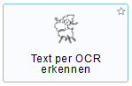
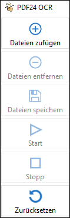
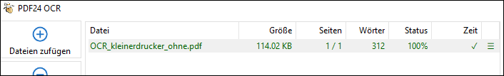
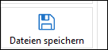
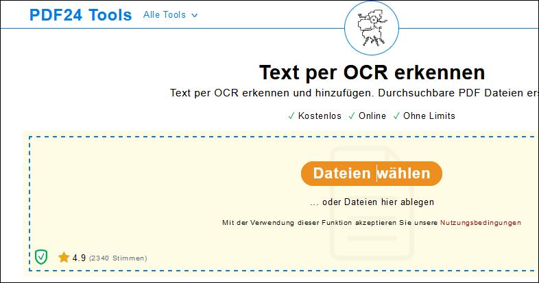
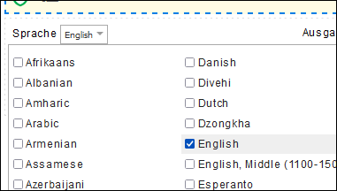

# Texterkennung

Manchmal ist es notwendig, einen als Bild gescannten Abschnitt aus einem Buch oder anderen Medien als Text bearbeiten zu können. Hierfür wird die Texterkennung (Optical Character Recognition, kurz **OCR** genannt) benötigt.

Grundsätzlich stehen zwei Varianten für die Texterkennung zur Verfügung:

  * Die Texterkennung direkt beim Scan
  * Die nachträgliche Texterkennung mit Hilfe eines Programms. Hierbei wird der Text zuerst als PDF gescannt und anschliessend kann der Text erkannt und weiterverarbeitet werden.

:::warning <i class="mdi mdi-alert"></i> Wichtig
Die Ergebnisse der Texterkennung sind, gerade bei Texten mit älterem Schriftsatz, besser, wenn **PDF24** verwendet wird, als wenn die OCR-Funktion der Kopiergeräte genutzt wird 
:::

## Texterkennung direkt beim Scan

Für die **Multifunktionsgeräte** (Eingangshalle, Kopierraum, Mediothek, etc.) _DruckerAllgemein_ und _DruckerKopierraum_ sind die entsprechenden Anleitungen hier zu finden:

[für Schüler*innen](/infra/geraete/drucker/druck_sus/#scan-mit-texterkennung-per-mail-oder-in-home-verzeichnis)

[für Lehrer*innen](/infra/geraete/drucker/druck_lul/#scan-mit-texterkennung-per-mail-oder-in-home-verzeichnis)

Für die **Fachschaftsdrucker** in den Lehrerarbeitszimmern kann wie folgt vorgegangen werden:

  * Am Gerät die Option _Scan_ wählen
  * Die entsprechende Scanoption (per Mail, USB-Speicher, Datei) wählen und ggf. die Empfängermailadresse eingeben
  * Im nun erscheinenden Menü als _Dateiformat_ die Option _PDF (OCR)_ wählen
  * Die so gescannte Datei kann in einem PDF-Editor geöffnet werden. Der Text kann markiert und in ein Textverarbeitungsprogramm (z.B. Word) kopiert werden.

## Texterkennung mit der lokalen PDF24-App

  * [PDF24 auf dem PC installieren](/anderesoftware/PDF/PDF24/)
  * Die PDF24-Toolbox öffnen
  * Die Option _Text per OCR erkennen_ wählen

  

  * _Dateien hinzufügen_ anklicken

  

  * Das PDF auswählen, von dem der Text ausgelesen werden soll

  * _Start_ klicken

  * Warten, bis unter _Status_ die Meldung _100%_ erscheint

  

  * Auf _Dateien speichern_ klicken

  

  * Die Datei wird im entsprechenden Pfad als PDF abgelegt
  
  * Das PDF kann nun in einem PDF-Editor geöffnet werden. Den Text mit __Ctrl__ + __A__ markieren, mit __Ctrl__ + __C__ zwischenspeichern und mit __Ctrl__ + __V__ in einer beliebigen Datei (z.B. Word) einfügen

## Texterkennung mit der PDF24-Browserapp

  * Die PDF24-Browsertools auf [https://tools.pdf24.org/](https://tools.pdf24.org/) öffnen

  * Die Option _Text per OCR erkennen_ wählen

  

  * Auf _Dateien wählen_ klicken

    

  * Das PDF auswählen, von dem der Text ausgelesen werden soll

  * Die Sprache des Dokuments wählen

    

  * _OCR starten_ klicken

  * Sobald der Prozess abgeschlossen ist, auf __Download__ klicken

  * Das heruntergeladene PDF enthält selektierbaren Text

  * Das PDF kann nun in einem PDF-Editor geöffnet werden. Den Text mit __Ctrl__ + __A__ markieren, mit __Ctrl__ + __C__ zwischenspeichern und mit __Ctrl__ + __V__ in einer beliebigen Datei (z.B. Word) einfügen
