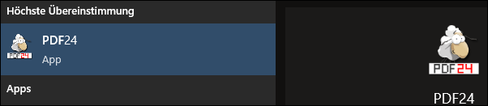
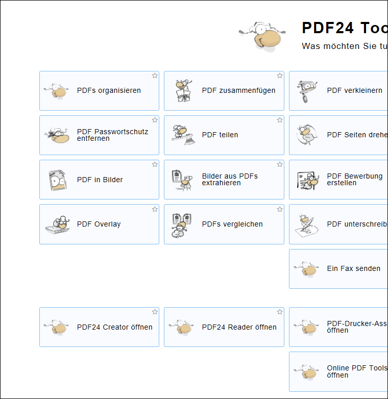
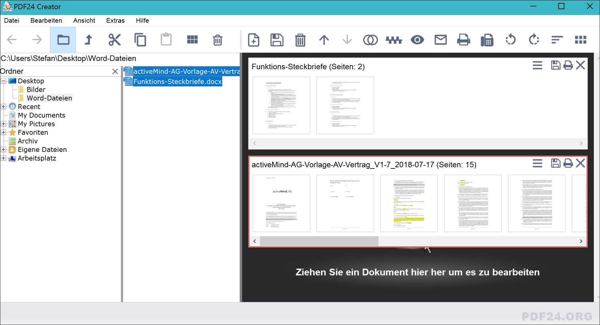

# PDF24

PDF24 ist eine vielseitig einsetzbare Sammlung an Werzeugen zum Bearbeiten und Erstellen von PDF-Dateien. Es stehen eine Reihe an Online-Tools zur Verfügung, die in einem Browser verwendet werden können: https://de.pdf24.org/
Die Onlinetools können mit einem beliebigen Betriebssystem (macOS, Linux, Windows) genutzt werden. Für Windows-Nutzer gibt es zudem eine lokale App, die auf dem eigenen Gerät installiert werden kann. 

## PDF24-App für Windows installieren

1. Auf https://de.pdf24.org/ gehen und die entsprechende Installationsdatei (_PDF24 Creator_) herunterladen

2. Die heruntergeladene Installationsdatei ausführen und das Programm installieren

## PDF24-App öffnen

Die PDF24-Toolbox kann geöffnet werden, indem man im Windows-Startmenü nach _PDF24_ sucht. 

Wenn man bei der Installation den entsprechenden Haken gesetzt hat, wurde auch ein Shortcut auf den Desktop erstellt. 

## PDF erstellen, Seiten einfügen und löschen

  * Das PDF24-Tool öffnen

  * Auf _PDF24 Creator öffnen_ klicken
  
   

  
  * Es können nun alle Word-Dateien und/oder pdfs, die bearbeitet werden sollen, in die rechte Fensterhälfte gezogen werden. Alle Dateien werden dabei automatisch in PDFs umgewandelt und entsprechend dargestellt

   

  * Einzelne Seiten können innerhalb der Dateien angeklickt werden. Welche Seiten aktuell gewählt sind, ist anhand des roten Rahmens erkennbar. 

  * Seiten können mit __Del__ gelöscht werden oder per Drag&Drop in eine andere Datei oder innerhalb der Datei verschoben werden. Ebenso können Seiten markiert und mit __Ctrl__+C (kopieren) und __Ctrl__+V (einfügen) zusammengestellt werden

  * Zum Zusammenfügen von mehreren PDFs hier die Anleitung von PDF24: https://help.pdf24.org/de/pdf-dateien-mit-pdf24-zusammenfuegen/
