# Drawboard PDF

Mit Drawboard PDF können Texte und Bilder in PDF-Dateien ergänzt werden durch Markierungen, Unterstreichungen sowie handschriftliche und getippte Notizen. Besonders geeignet ist das Programm für die Verwendung mit einem Stylus (= Stift). Jedoch kann es auch mit der Maus und dem Keyboard verwendet werden. 

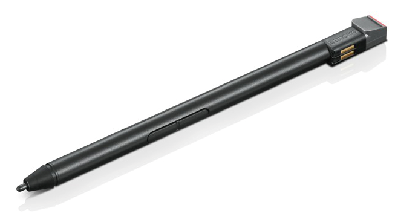

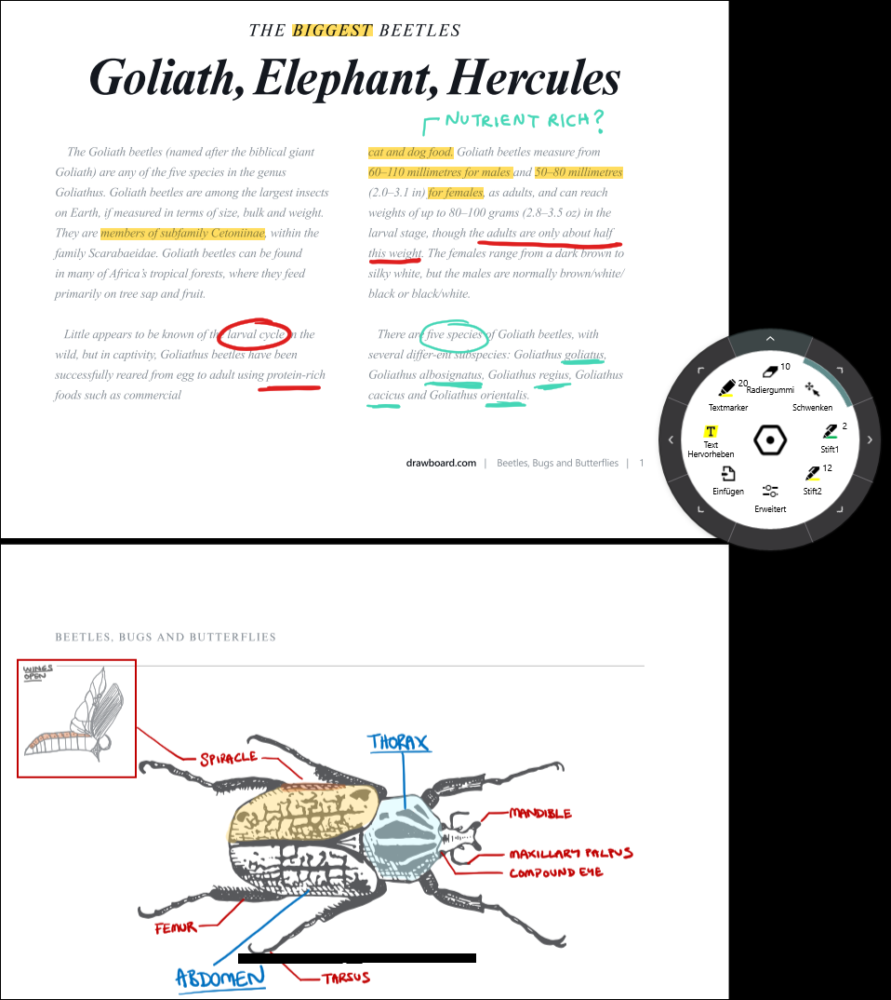

## Drawboard PDF installieren

1. Die Windows-Taste [[:mdi-microsoft-windows:]] drücken.

2. Auf dem Keyboard _Microsoft Store_ tippen - die App _Microsoft Store_ sollte vorgeschlagen werden

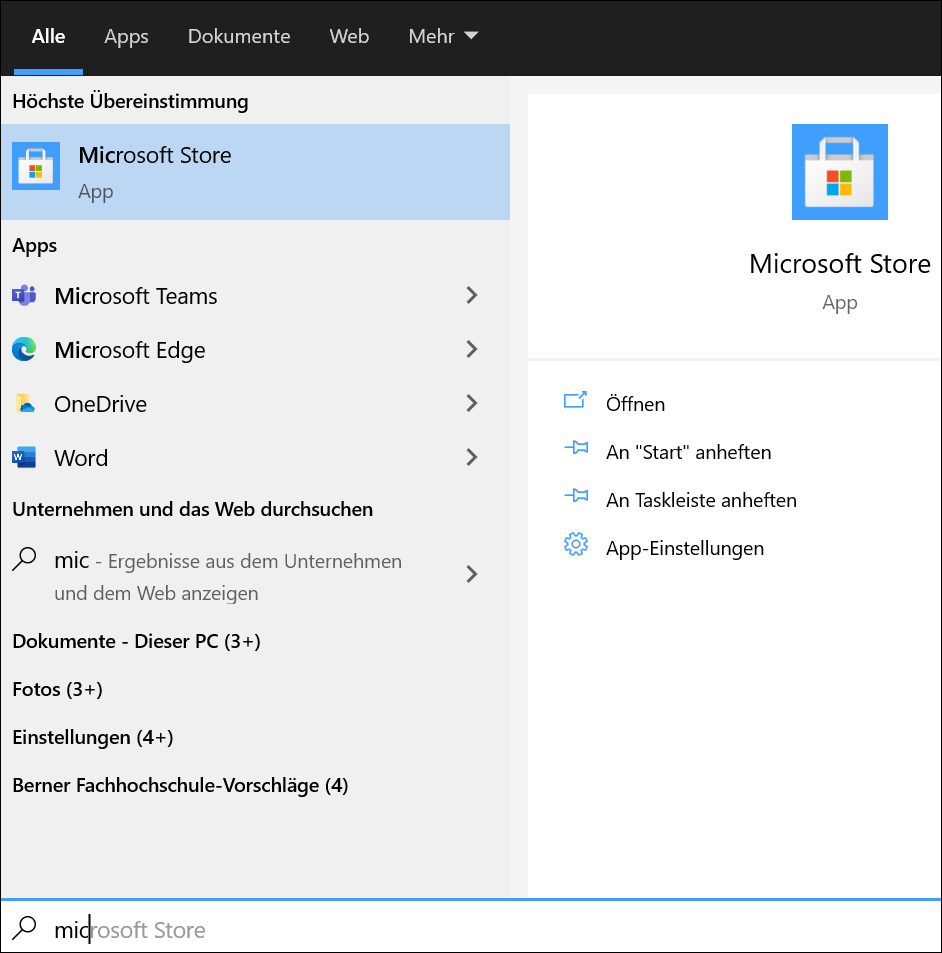

3. Microsoft Store öffnen

4. Nach _Drawboard PDF_ suchen und auf __Installieren__ klicken

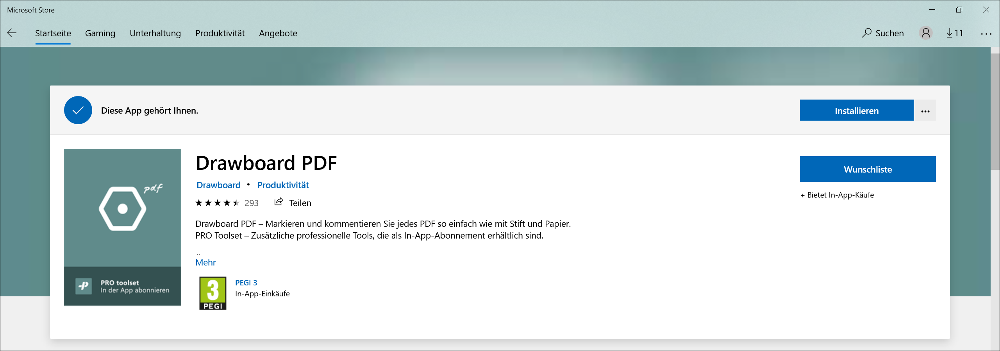

## Drawboard PDF verwenden

Wenn das Originaldokument ohne Markierungen erhalten bleiben soll, so muss vorgängig eine Kopie des PDFs erstellt werden, da es keine _Speichern unter_-Option in Drawboard PDF gibt. Das heisst, dass alle Änderungen, die man abspeichert, direkt im Originaldokument gespeichert werden.

### Menüleiste einrichten und verwenden

Im Standardlayout (Radmenu siehe weiter unten) findet man rechts im Fenster eine Menüleiste. Diese lässt sich individuell einrichten. Mit einem Klick auf das _+_-Symbol kann das Kontextmenü mit den unterschiedlichen Tools geöffnet werden. 

Wenn man beim entsprechenden Tool auf das _+_-Symbol klickt, wird dieses der Menüleiste hinzugefügt.

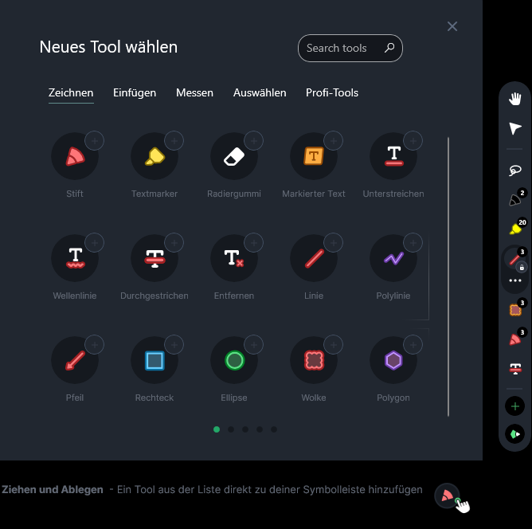

Um ein solches Tool aus der Menüleiste zu entfernen, klickt man darauf und anschliessend auf die darunter erscheinenden drei Punkte.

Im nun geöffneten Toolmenü wählt man _Entfernen_

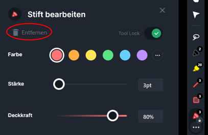

#### Tools in der Menüleiste verwenden

Durch einen Klick auf das Tool in der Menüleiste erscheinen darunter drei Punkte. Wenn man auf diese klickt, öffnet sich das Menü mit verschiedenene Optionen zu diesem Tool (z.B. Farbe, Liniendicke, Deckkraft).

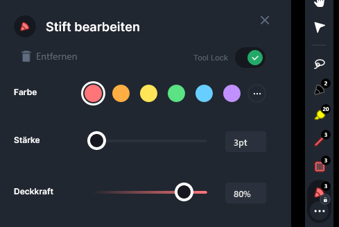

### Radmenu (radial menu) einrichten und verwenden

Für die unterschiedlichen Tools steht auch noch ein rundes Toolmenü zur Verfügung. Um dieses zu aktivieren klickt man links unten auf das Zahnradsymbol:

Im nun erscheinenden Fenster kann man unter _Ansicht & Layout_ die Option _use radial menu_ wählen. Das Radmenü erscheint nun nebst der Menüleiste.

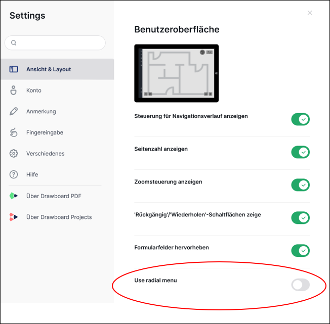

#### Textmarker

Mit dem Textmarkertool können Bilder oder Text markiert werden.

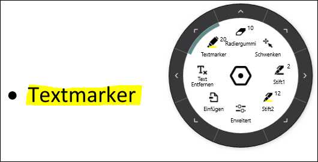

Durch einen Klick auf den Pfeil ! kann ein weiteres Menü geöffnet werden, in dem die Farbe ausgewählt werden kann. Ausserdem können Deckkraft und Pinselgrösse eingestellt werden. Auf den Pfeil [[:mdi-arrow-left:]] klicken, um zur vorherigen Ansicht zurückzukehren.

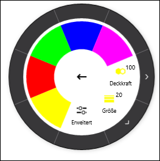

#### Text durchstreichen, hervorheben und unterstreichen

Mit diesem Tool, welches sich ganz links auf dem Toolrad befindet, kann ausschliesslich Text (keine Bilder!) durchgestrichen, hervorgehoben oder unterstrichen werden. Hierfür auf den Toolbutton ganz links auf dem Rad klicken.

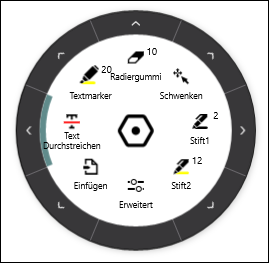

In der nun erscheinenden Ansicht kann zwischen verschiedenen Optionen gewählt werden:

- Text durchstreichen
- Text hervorheben (= markieren)
- Text unterstreichen
- Wellenlinie: Text mit Wellenlinie unterstreichen

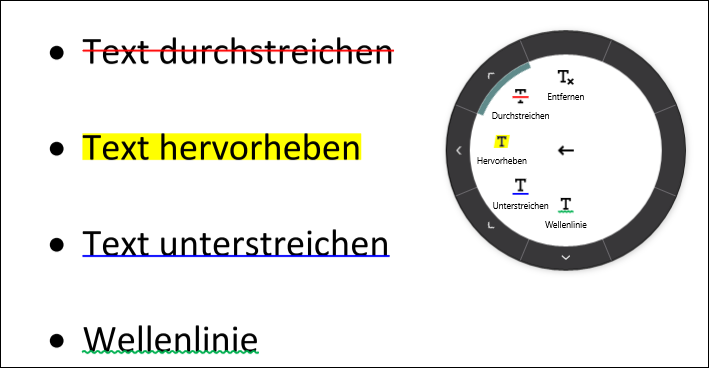

Durch einen Klick auf den Pfeil ! kann ein weiteres Menü geöffnet werden, in dem die Farbe ausgewählt werden kann. Ausserdem kann die Deckkraft eingestellt werden. Auf den Pfeil [[:mdi-arrow-left:]] klicken, um zur vorherigen Ansicht zurückzukehren.

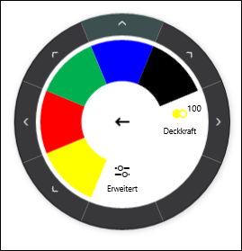

#### Diverse Elemente einfügen

Durch einen Klick auf _Einfügen_ wird ein Menü mit diversen Einfügeoptionen geöffnet. Je nach Option kann durch einen Klick auf den Pfeil ! ein weiteres Menü geöffnet werden, in dem die Farbe, Strichdicke oder Textgrösse ausgewählt werden kann. Auf den Pfeil [[:mdi-arrow-left:]] klicken, um zur vorherigen Ansicht zurückzukehren.

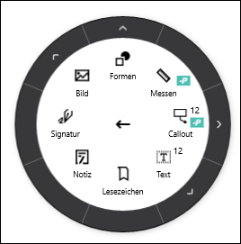

- **Formen:** Es stehen diverse vorgefertigte Formen, wie Polylinie, Polygon, Wolke, Pfeil, Ellipse, Linie und Rechteck zur Verfügung.

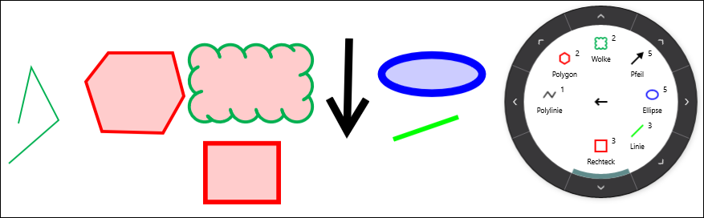

- **Notiz:** Mittels eines Doppelklicks kann eine Notiz im Dokument angebracht werden. 

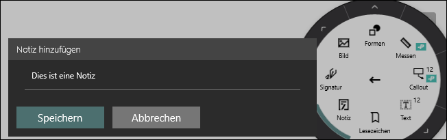

Diese wird durch einen Klick auf das Notizsymbol sichtbar.

- **Text:** Mit der Maus kann ein Rechteck gezogen werden, welches als Textfeld für beliebigen getippten Text dient.

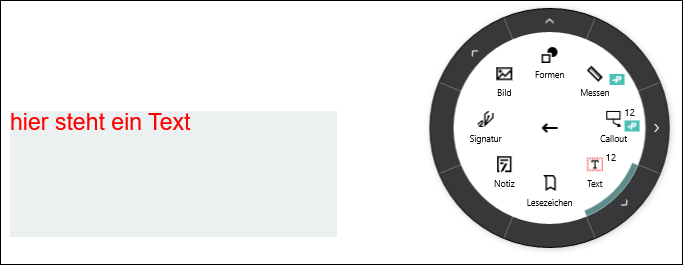

- **Bild:** Mit dieser Option kann ein Bild direkt ab Kamera gemacht und eingefügt oder ein bereits gespeichertes Bild (z.B. Screenshot) in das Dokument eingefügt werden. 

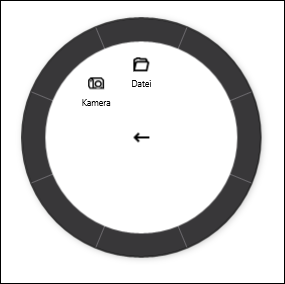
#### Stift 1 und 2

Hiermit können 2 Stifte definiert werden um freihand zu schreiben oder zu zeichnen/skizzieren.

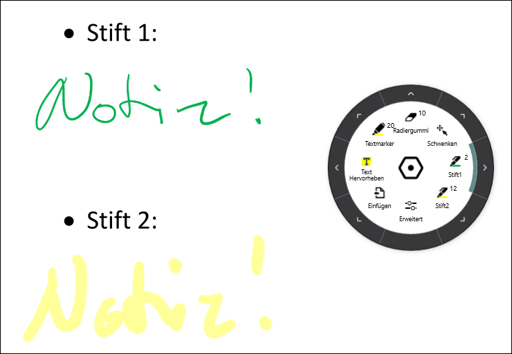

Durch einen Klick auf den Pfeil ! kann ein weiteres Menü geöffnet werden, in dem die Farbe ausgewählt werden kann. Ausserdem können Deckkraft und Pinselgrösse eingestellt werden. Auf den Pfeil [[:mdi-arrow-left:]] klicken, um zur vorherigen Ansicht zurückzukehren.

#### Radiergummi

Mit dem Radiergummi können in Drawboard PDF eingefügte Elemente gelöscht werden. Hierzu mit gedrückter Maustaste über die Elemente fahren, die gelöscht werden sollen und anschliessend die Maustaste wieder loslassen. 

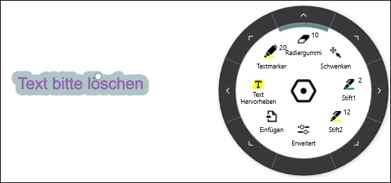

#### Schwenken

In diesem Modus kann man mit gedrückter Maustaste das Dokument bewegen. 

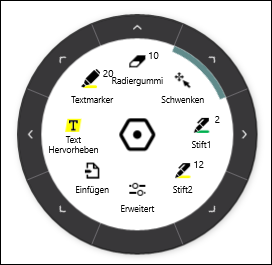

#### Speichern

Auf das Symbol links oben mit den drei Strichen klicken.

Auf das Diskettenicon ganz unten klicken.

