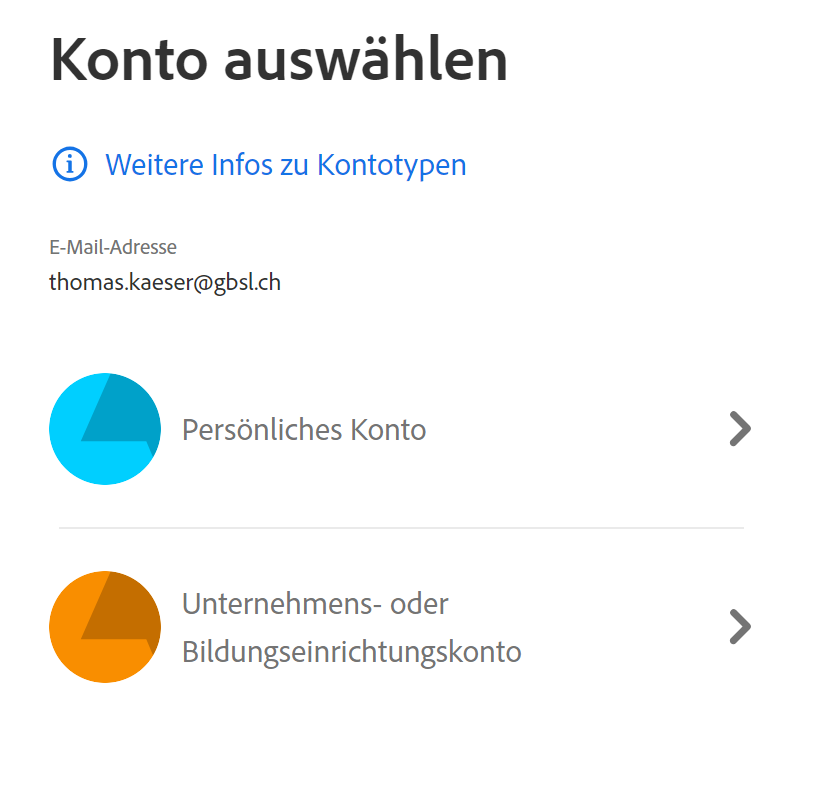

# Programmsuite von Adobe: PDF, Foto, Video bearbeiten

Mit deiner Schulmailadresse hast du eine Lizenz für die Programmsuite von Adobe und kannst unter anderem
PDF bearbeiten
Filme schneiden
Fotos bearbeiten

Folgendermassen kannst du die Programme installieren auf deinem Gerät:

Gehe zu [Adobe Creative Cloud](https://www.adobe.com/ch_de/creativecloud/business.html). Rechts oben kannst du dich anmelden mit deiner Schulmailadresse.

**Wichtig**: Wähle "Unternehmens- oder Bildungseinrichtungskonto".

**Tipp** Wenn du das Grundlagen- oder Schwerpunktfach Bildnerisches Gestalten gewählt hast, so lade Photoshop herunter.
