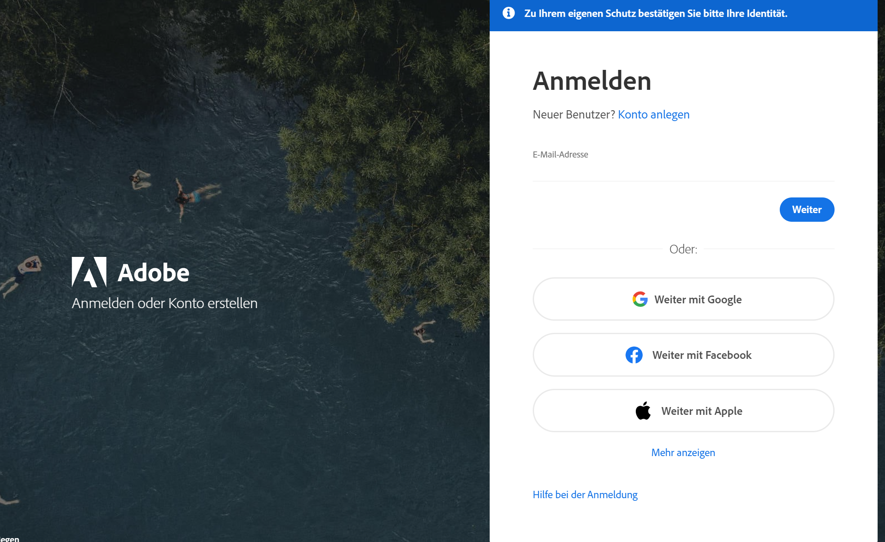

# Programmsuite von Adobe: PDF, Foto, Video bearbeiten

Mit deiner Schulmailadresse hast du eine Lizenz für die Programmsuite von Adobe und kannst unter anderem
- PDF bearbeiten
- Filme schneiden
- Fotos bearbeiten

Folgendermassen kannst du die Programme installieren auf deinem Gerät:

Gehe zu [Adobe-Konto](https://account.adobe.com/) und melde dich mit deiner Schulmailadresse an. Klicke auf "Mehr anzeigen" und danach auf "Weiter mit microsoft"

:::tip
Wenn du das Grundlagen- oder Schwerpunktfach Bildnerisches Gestalten gewählt hast, so lade Photoshop herunter.
:::
