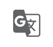
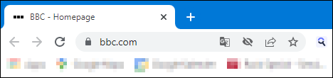
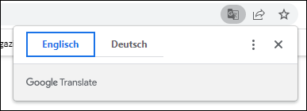
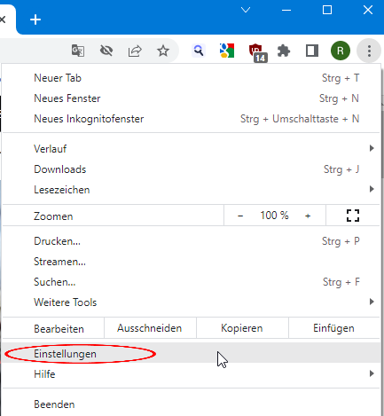
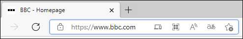
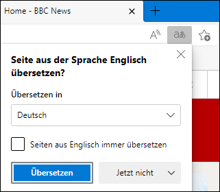
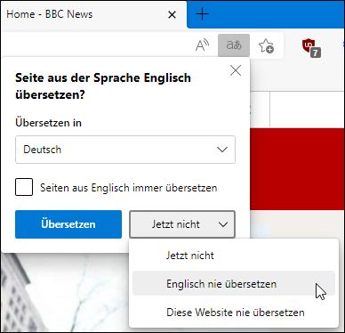
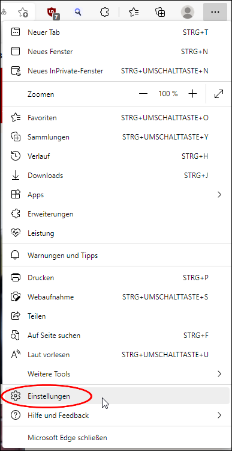
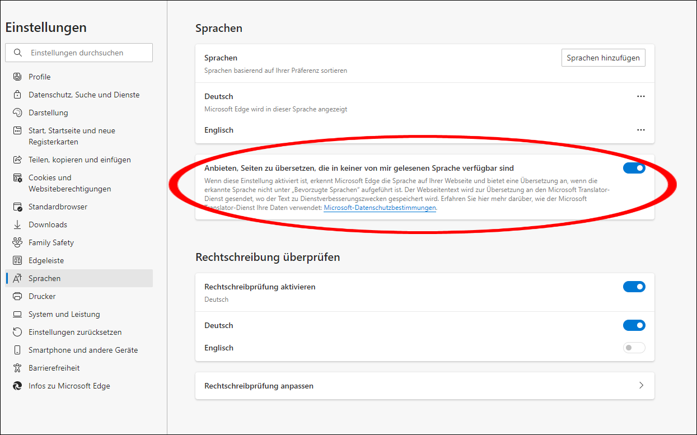

# Automatische Übersetzung

Edge und Chrome bieten eine automatische Übersetzung fremdsprachiger Seiten an. Hier wird beschrieben, wie man diesen Service ein- oder ausschaltet.

## Chrome Browser 

Ob die automatische Übersetzung im Browser aktiviert ist, kann man sehen, wenn man auf eine fremdsprachige Internetseite geht (z.B. bbc.com). Ist die Übersetzung im Browser aktiviert, so erscheint in der Adresszeile das folgende Symbol:

Durch einen Klick auf das Icon kann man die Anzeigesprache umstellen:

Um den Übersetzer an- oder auszuschalten oben rechts auf die drei Punkte klicken und auf _Einstellungen_ gehen. 

Anschliessend unter _Erweitert_ auf _Sprachen_ klicken und bei _Übersetzung von fremdsprachigen Seiten anbieten_ den Knopf nach rechts (eingeschaltet) oder links (ausgeschaltet) schieben. 

## Edge Browser

Ob die automatische Übersetzung im Browser aktiviert ist, kann man sehen, wenn man auf eine fremdsprachige Internetseite geht (z.B. bbc.com). Ist die Übersetzung im Browser aktiviert, so erscheint in der Adresszeile das folgende Symbol:

Durch einen Klick auf das Icon kann man die Anzeigesprache umstellen und einstellen, ob immer übersetzt werden soll:

Im Feld _Übersetzen in_ kann die Sprache, in die übersetzt werden soll, eingestellt werden. Den Haken im Kästchen _Seiten aus [Sprache] immer übersetzen_ kann man setzen, wenn man fremdsprachige Webseiten immer übersetzen will.

Neben dem Knopf _Übersetzen_ kann man einstellen, in welchen Fällen man die Seite übersetzen möchte.

Um den Übersetzer an- oder auszuschalten oben rechts auf die drei Punkte klicken und auf _Einstellungen_ gehen. 

Anschliessend unter _Sprachen_ bei _Anbieten, Seiten zu übersetzen, die in keiner von mir gelesenen Sprache verfügbar sind_ den Knopf nach rechts (eingeschaltet) oder links (ausgeschaltet) schieben. 

