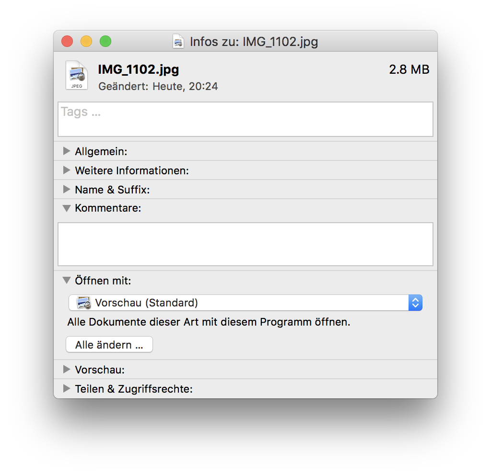
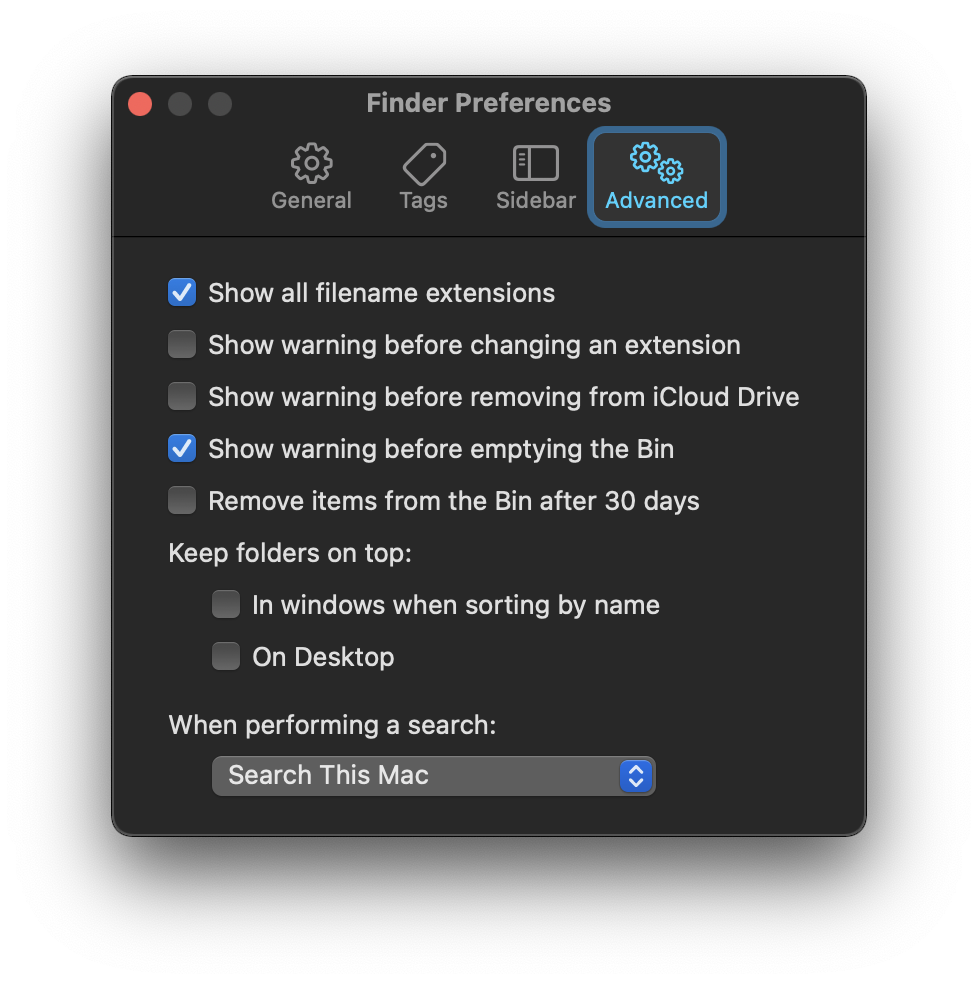

# Dateien mit macOS

## Standard-App ändern

Meist gibt es mehrere Apps, welche einen bestimmten Dateityp öffnen können. Im Betriebssystem ist festgelegt, welches die **Standard-App** ist, mit welcher eine Datei geöffnet wird. Die Standard-App kann natürlich geändert werden.

Um einen bestimmten Dateityp standardmässig mit einem anderen Programm zu öffnen, klickt man mit der rechten Maustaste auf eine Datei dieses Typs und wählt den Eintrag __Informationen__. Im neuen Fenster klappt man den Bereich __Öffnen mit__ auf und wählt das entsprechende Programm aus.

## Dateiendung anzeigen

Auch unter macOS werden Dateiendungen standardmässig ausgeblendet. Die Endungen können wie folgt angezeigt werden:

1. Finder öffnen mit.
2. Im Finder den Menüpunkt __Finder__ :mdi-chevron-right: __Einstellungen__
3. Unter __Erweitert__ die Checkbox __alle Dateiendungen anzeigen__ aktivieren.

