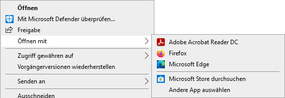
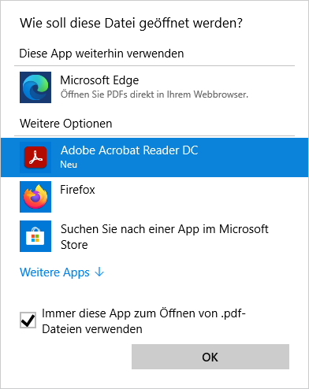
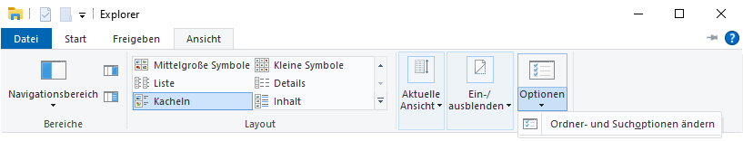
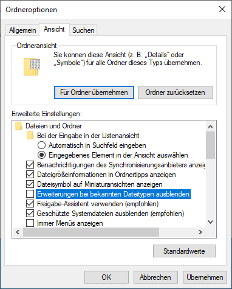

---
systems:
  - Windows
sidebar_position: 30
sidebar_custom_props:
  icon: mdi-microsoft-windows
  source: gym-kirchenfeld
  path: /docs/anderesoftware/dateien/windows/README.md
draft: false
---

# Dateien mit Windows

## Standard-App ändern

Meist gibt es mehrere Apps, welche einen bestimmten Dateityp öffnen können. Im Betriebssystem ist festgelegt, welches die **Standard-App** ist, mit welcher eine Datei geöffnet wird. Die Standard-App kann natürlich geändert werden.

1. Klicke mit der rechten Maustaste (Touchpad: zwei Finger) auf die Datei, welche du mit einer anderen App öffnen möchstest.

2. Wähle den Menüpunkt __Öffnen mit__ und dann __Andere App auswählen__.

    

3. Wähle die gewünschte App aus, setze einen Haken bei _Immer diese App zum Öffnen von .xxx-Dateien verwenden_ und klicke auf __OK__.

    

## Dateiendung anzeigen

Unter Windows werden Dateiendungen standardmässig ausgeblendet. Die Endungen können wie folgt angezeigt werden:

1. Dateiexplorer öffnen mit [[:mdi[microsoftWindows]]]+[[E]].
2. Im Windows Explorer den Menüpunkt __Ansicht__ :mdi[chevronRight] __Optionen__ :mdi[chevronRight] __Ordner-&nbsp;und&nbsp;Suchoptionen&nbsp;ändern__ auswählen.

    

3. Anschliessend die Registerkarte __Ansicht__ auswählen und den Eintrag _Erweiterungen bei bekannten Dateitypen ausblenden_ **deaktivieren**.

    

3. Die Änderung mit einem Klick auf __OK__ speichern.
