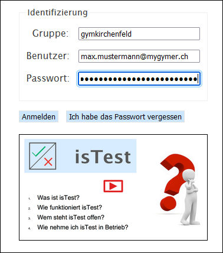

# Anmelden bei isTest2

## Für Schüler*innen

- Auf https://istest2.ch/ gehen

- Sich mit folgenden Angaben anmelden: 

| Gruppe         | Benutzer          | Initialpasswort   |
| :------------- | :---------------- | :---------------- |
| gymkirchenfeld | Schul-Mailadresse | Schul-Mailadresse |

- Das Initialpasswort gilt nur so lange, bis man sich zum ersten Mal eingeloggt hat. Dann wird man aufgefordert, ein eigenes Passwort zu setzen und sollte sich dieses gut merken.

## Für Lehrpersonen

Um die Zugangsdaten für den Erstlogin zu erhalten, kann man sich an den Informatikdienst support@gymkirchenfeld.ch wenden. Wenn man bereits einmal eingeloggt war, gelten folgende Zugangsdaten:

| Gruppe         | Benutzer          | Passwort              |
| :------------- | :---------------- | :-------------------- |
| gymkirchenfeld | Schul-Mailadresse | Das gesetzte Passwort |

Falls das Passwort vergessen gegangen ist, kann man auf https://istest2.ch/ die Logindaten eintragen und anschliessend auf __Ich habe das Passwort vergessen__ klicken.