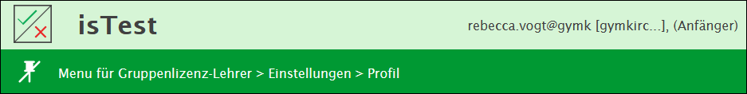
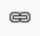
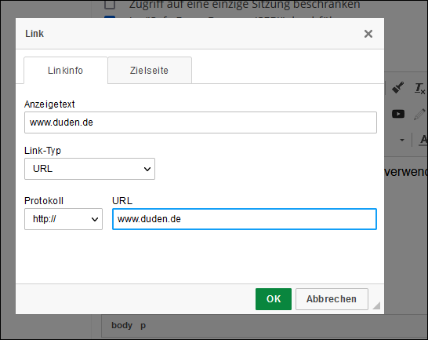
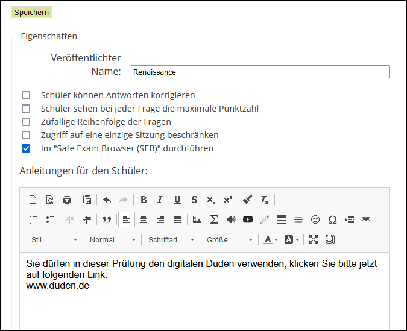
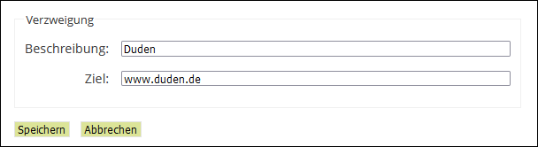
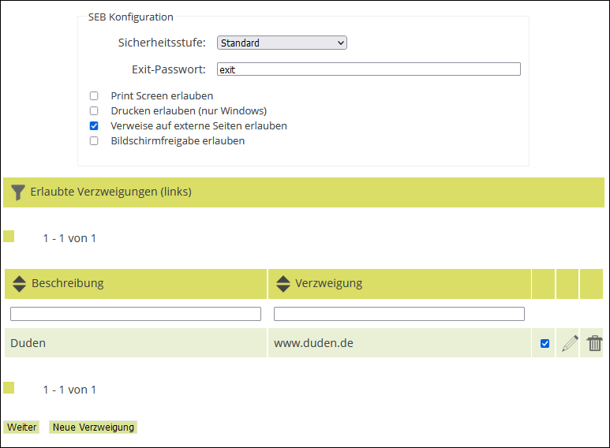

---
apps:
  - isTest2
  - Safe Exam Browser
sidebar_position: 40
sidebar_custom_props:
  icon: mdi-check-outline
  source: gym-kirchenfeld
---

# Safe Exam Browser mit isTest2

Safe Exam Browser bietet die Möglichkeit, dass sämtliche anderen Applikationen während einer Prüfung blockiert werden. Somit können die Schüler\*innen während einer Prüfung, die sie auf ihrem Gerät schreiben, den Browser nicht nutzen um Lösungen zu googeln und auch andere Dokumente mit Notizen nicht öffnen. Dies funktioniert, weil der SEB im sog. Kioskmodus geöffnet wird. Damit wird das Gerät zu einer abgesicherten Arbeitsstation. Seit Juni 2020 kann der Safe Exam Browser für Prüfungen direkt in isTest2 auf besonders einfache Weise aktiviert werden. 

## 1. SEB installieren

Zunächst sollten die Lehrperson und alle Schüler:innen der Klasse den Safe Exam Browser auf dem eigenen Gerät installieren.

Folgende Betriebssysteme werden unterstützt:

  * Windows 8.1, 10 und 11
  * macOS 10.11, 10.12, 10.13, 10.14, 10.15, 11, 12
  * iOS / iPadOS 11 und neuer

:::warning Achtung: 
Mac-User sollten wenn möglich nicht den Safaribrowser verwenden, da die Verwendung des SEB unter Safari je nachdem zu Problemen führen kann (z.B. dass der Browser hängenbleibt). Man sollte stattdessen Firefox installieren und über diesen auf den Test zugreifen.
:::
  
### Installer herunterladen und ausführen

Hierzu auf der [SEB-Seite (https://safeexambrowser.org/download_de.html)](https://safeexambrowser.org/download_de.html) beim entsprechenden Betriebssystem den Installer herunterladen.

Der heruntergeladene Installer kann dann einfach ausgeführt werden.

## 2. Expertiselevel einstellen 

Das Expertiselevel wird im Fenster von isTest2 rechts oben angezeigt, wenn man in isTest2 eingeloggt ist. 

In isTest2 kann der SEB nur aktiviert werden, wenn man im Expertiselevel **fortgeschritten** oder **Experte** arbeitet. Um das Expertiselevel umzustellen, muss man auf _Einstellungen > Profil_ gehen. 

## 3. SEB für isTest2 aktivieren

Ist das Expertiselevel entsprechend eingestellt, kann der Safe Exam Browser für isTest2 global aktiviert werden. Hierfür auf _Einstellungen > Vorlieben_ klicken und anschliessend unter _Prüfungen > Safe Exam Browser (SEB)_ die Optionen 
  
  * _Safe Exam Browser (SEB) Verwendung_
  * _Bei Prüfungen SEB benutzen_ 

auf _Ja_ stellen, indem man jeweils den Haken bei _Default Konfiguration_ setzt.

**Default Sicherheitsstufe**: Die Sicherheitsstufe, die bei einer Prüfung standardmässig eingestellt ist auf **Stufe 1** belassen. _Bemerkung zu den anderen Sicherheitsstufen:_ Stufe 2 würde lediglich das Eingeben eines Passworts für das Starten der Prüfung nötig machen - da sich die Schüler:innen ohnehin mit ihrem Konto anmelden müssen, bietet diese Massnahme keine zusätzliche Sicherheit. Es sei denn man möchte, dass die Prüfung trotz vorheriger Freigabe durch die Lehrperson (unter _Prüfungen > beginnen_) von den Schüler\*innen erst nach Bekanntgabe des Passworts gestartet werden kann. Stufe 3 scheint momentan nicht zu funktionieren. Deswegen wird davon abgeraten, eine andere Sicherheitsstufe als 1 zu verwenden.  

 ## 4. SEB für eine Prüfung in isTest2 aktivieren

Bitte die Anleitungen zu isTest2 befolgen um zu verstehen, wie eine Prüfung erstellt werden kann: [Anleitung zu isTest2](../verwenden).

SEB kann nur beim Vorbereiten einer Prüfung aktiviert werden. Wenn die Prüfung bereits vorbereitet ist, kann diese Option nicht mehr angewählt werden und es muss gegebenenfalls eine neue Prüfung erstellt werden. 

* Auf _Prüfungen > Vorbereiten_ klicken

  * Die Angaben unter _Filter_ kann man so lassen, wie sie sind

  * Unter _Wählen Sie einen Test_ den zuvor erstellten Test wählen

  * Unter _Wählen Sie einen Kurs_ einen Kurs wählen

  * Auf __weiter__ klicken

  * **Weitere Optionen**:
    * **Schüler können Antworten korrigieren** (empfohlen): Schüler:innen können während dem Test ihre Antworten ändern
    * **Zufällige Reihenfolge der Fragen**: Schüler haben jeweils unterschiedliche Reihenfolgen der Fragen, sodass es schwieriger wird, gegenseitig abzuschreiben
    * **Zugriff auf eine einzige Sitzung beschränken** (empfohlen): Eine Prüfung kann nur einmal gestartet werden
    * **Im "Safe Exam Browser (SEB)" durchführen**: Erscheint nur, wenn der SEB wie oben beschrieben aktiviert ist
  
  

  * **Anleitungen für den Schüler** Anweisungen für die Prüfung einfügen. Falls ein Link auf eine Webseite freigegeben soll, die man während der Prüfung als Hilfsmittel nutzen darf (z.B. duden.de), sollte der Link hier eingefügt werden. 
    * Den Text mit dem Verweis (in diesem Falle _www.duden.de_) markieren

    * Auf das Verweis-Symbol  klicken

    * Hier die korrekte URL eingeben (_www_ nicht vergessen)

    * Mit __OK__ bestätigen

  * Anschliessend auf __Speichern__ klicken

  * Es folgt die SEB-Konfiguration:
    * **Sicherheitsstufe**: Auf _Standard_ belassen
    * **Exit-Passwort**: **wichtig:** hier muss ein Passwort gesetzt werden, das man sich gut merken sollte, da man andernfalls die Prüfung nicht beenden kann. 
    * **Print Screen erlauben** (nicht empfohlen): Erlaubt es den Schüler\*innen, Screenshots zu machen. Es wird deshalb nicht empfohlen, diese Option zu aktivieren. Schüler\*innen könnten auf diese Art die Prüfungsfragen an andere Klassen oder Kolleg*innen weitergeben, die eine Nachprüfung schreiben. Diese Option wird dann empfohlen, wenn eine Lehrkraft eine Prüfung selbst in SEB absolvieren will und den Vorgang mit Screenschots dokumentieren möchte.
    * **Drucken erlauben (nur Windows)** (nicht empfohlen): Diese Option ermöglicht es, dass man bei offenen Fragen diese drucken kann, falls man auf einem Windowsrechner arbeitet
    * **Verweise auf externe Seiten erlauben**: Siehe das [nachfolgende Kapitel](#2)
    * **Bildschirmfreigabe erlauben** (nicht empfohlen): Auf macOS ist es möglich, den Bildschirm für andere Nutzer freizugeben. Diese Option ist nur für Tests durch die Lehrperson gedacht. Für eine Prüfung sollte diese Option nicht aktiviert werden

  * Danach kann die Prüfung, wie auch eine Prüfung ohne SEB, über _Prüfungen > Beginnen_ gestartet werden

  * Das restliche Vorgehen (Abschliessen der Prüfung, Korrekturen, Bewertung, etc.) ist in der [Anleitung zur Verwendung von isTest2](../verwenden#6) nachzulesen

### Verweise auf externe Seite erlauben

Mit dieser Option kann den Schüler\*innen der Zugriff auf bestimmte Internetseiten während der Prüfung gewährt werden, zum Beispiel die Duden-Seite. Damit die Schüler:innen auf den Link zugreifen können, muss ein [Verweis darauf in der Anleitung zur Prüfung (siehe hier)](#1) vorhanden sein, da die Schüler\*innen im SEB nicht selbständig einen Browser öffnen können. 

  * Den Text mit dem Verweis (in diesem Falle _www.duden.de_) markieren

  * Auf das Verweis-Symbol  klicken

  * Hier die korrekte URL eingeben (_www_ nicht vergessen)

  * Mit __OK__ bestätigen

 Klickt man auf die Schaltfläche _Verweise auf externe Seiten erlauben_, öffnet sich eine Tabelle. In dieser lässt sich einstellen, welche externen Seiten in dieser Prüfung verwendet werden dürfen (Beispiel: Duden-Seite bei einer Deutschprüfung). 

  * Auf __Neue Verzweigung__ klicken

  * Eine Beschreibung (z.B. _Duden_) und das Ziel (z.B. _www.duden.de_) einfügen

  * Auf __Speichern__ klicken

  * Nun erscheint der neue Verweis in der Liste. **Wichtig**: Der Haken muss hinter dem Verweis gesetzt sein, andernfalls ist er für die Prüfung nicht aktiviert

  * Auf __Weiter__ klicken

Die Schüler:innen können nun, wenn sie in der Anleitung auf den Link klicken, diesen öffnen und als Hilfsmittel für die Prüfung nutzen

