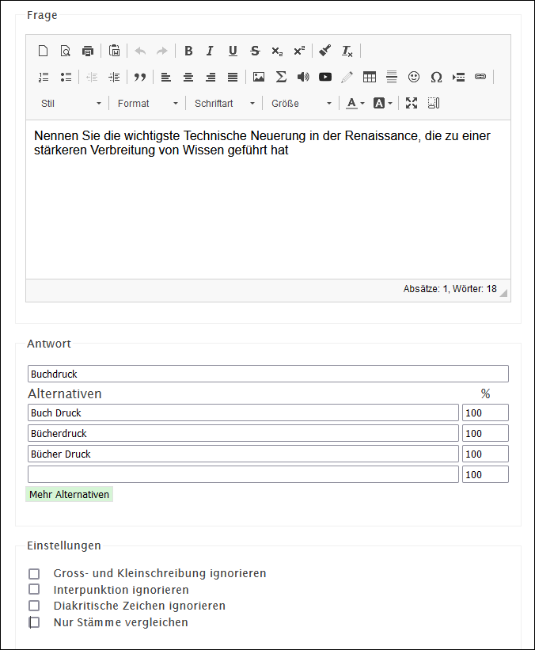

# Frageart Einfacher Text

Die Frage muss mit einem Freitext beantwortet werden (z.B. einem Begriff). Es gibt die Möglichkeit, alternative Antworten zu definieren. Dies ist geeigent um für korrekte, aber falsch geschriebene Ausdrücke (z.B. beim Abfragen von Fremdsprachen-Vokabular) ebenfalls Punkte zu vergeben.

