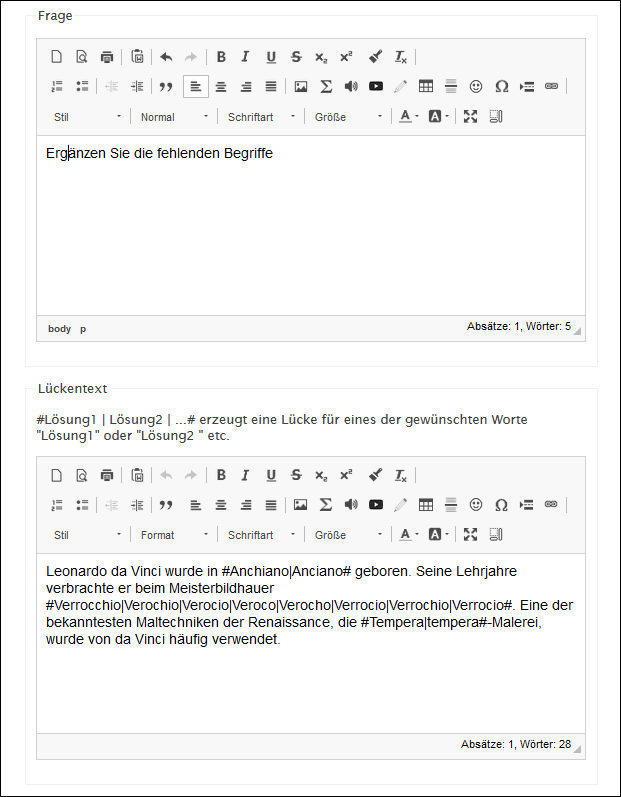
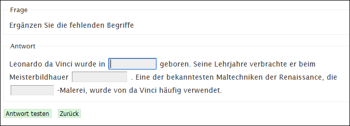

# Frageart Lückentext

Der Lückentext kann mit Bildern (Begriffe als Freitext den Bildern zuordnen) oder als reiner Text erstellt werden. Die Lücken müssen von der Schülerin mit Freitext gefüllt werden. Den Trennstrich zwischen den Antwortmöglichkeiten kann man mit der Tastenkombination mit __altGr__ + __7__ machen.

