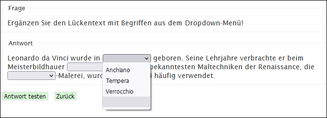

# Frageart Lückentext (Auswahl aus vertauschten Lösungen)

Der Lückentext kann mit Bildern oder als reiner Text erstellt werden. Für jede Lücke wird ein Dropdown-Menü angezeigt, in dem alle Lösungsmöglichkeiten angezeigt werden. Das Erstellen der Aufgabe kann auf dieselbe Weise gemacht werden wie beim Fragetyp _Lückentext_.

