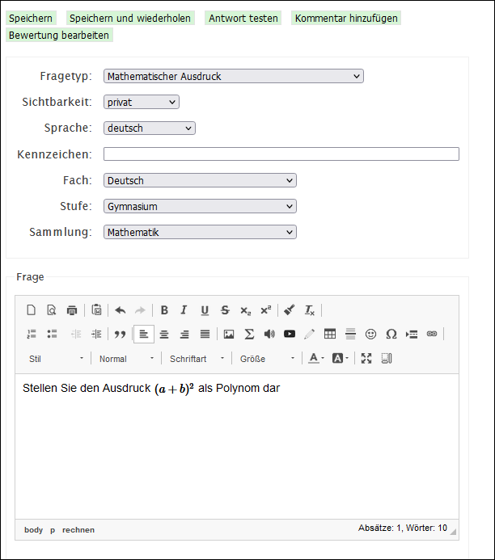
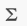
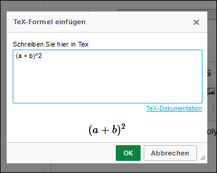
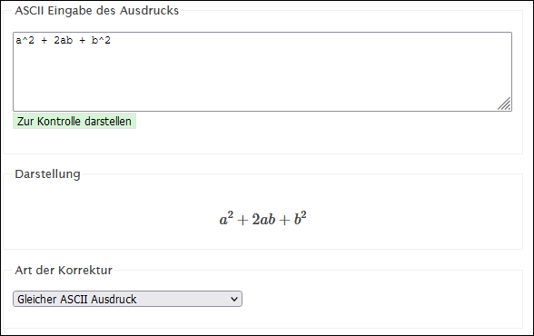

# Frageart Mathematischer Ausdruck

<PageTitle />

Bei diesem Fragetyp können mathematische Ausdrücke in einem Freitextfeld eingegeben werden. Die Formeln für die Fragestellungen können mit LaTex eingegeben werden. LaTeX ist eine Syntax, um mathematische Ausdrücke darzustellen.

Um für die Frage eine Formel einzugeben, auf das LaTeX-Symbol  klicken. 

Eine Einführung, wie man die Ausdrücke schreibt, findet man hier: 

http://wiki.math.se/wikis/2009/bridgecourse1-TU-Berlin/index.php/5.1_Mathematische_Formeln_schreiben

_Anmerkung:_ Die _\<math\>_-Tags, die in der Anleitung erwähnt werden, können in isTest2 weggelassen werden.

Zuletzt kann auch die Antwort in der LaTeX-Syntax eingegeben werden. 

Mit dem Button __Zur Kontrolle darstellen__ kann getestet werden, wie der Ausdruck schlussendlich aussieht.