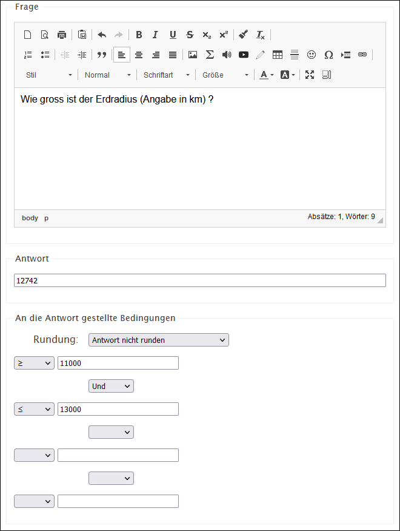

# Frageart Numerische Antwort

Bei diesem Fragetyp soll eine Zahl als Antwort eingegeben werden. Unter _An die Antwort gestellte Bedingungen_ kann ein Toleranzbereich eingestellt werden, in welchem die Antwort noch als rchtig zählt.

