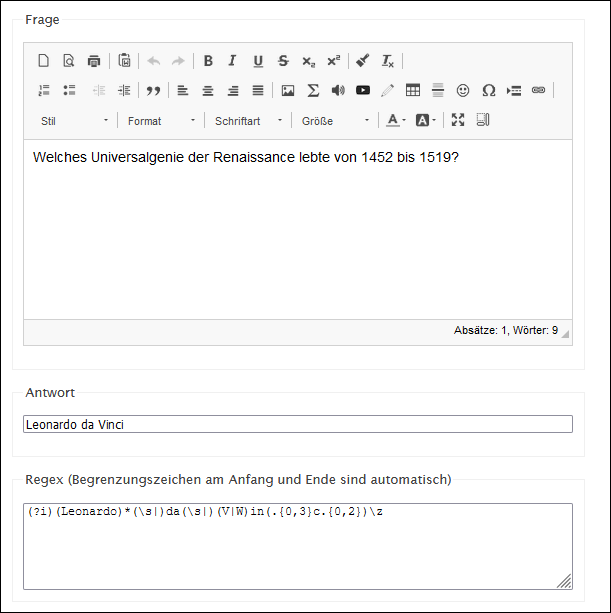
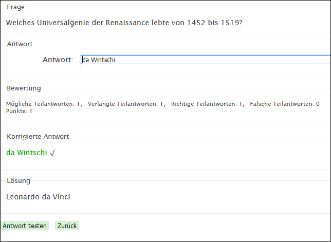

# Frageart Regex

Der Fragetyp ist ähnlich wie _Einfacher Text_, allerdings wird die Antwort mit Regex (Regular Expressions = Reguläre Ausdrücke) ausgewertet, anstatt dass man mehrere explizite Alternativen zur richtigen Antwort angibt. Dadurch kann ein Muster definiert werden, dem eine Antwort folgen soll.

### Schnellreferenz Regex

| Symbol     | Beschreibung                                                                                             |
| :--------- | :------------------------------------------------------------------------------------------------------- |
| (?i)       | Dieses Zeichen an den Beginn der Antwort stellen, damit Gross- und Kleinschreibung nicht beachtet werden |
| \z         | Eingabeende                                                                                              |
| [abc]      | Ein einzelner Buchstabe: a, b oder c                                                                     |
| [^abc]     | Jeder Buchstabe ausser a, b, oder c                                                                      |
| [a-z]      | Jeder einzelne Buchstabe im Bereich von a bis z                                                          |
| [a-zA-Z]   | Jeder einzelne Buchstabe im Bereich von a bis z oder A bis Z                                             |
| .          | Jeder einzelne Buchstabe                                                                                 |
| ?          | Vorheriges Zeichen ist optional                                                                          |
| \s         | Lücke (Whitespace)                                                                                       |
| \S         | Jedes Zeichen, das keine Lücke ist                                                                       |
| \d         | Jede Ziffer                                                                                              |
| \D         | Jedes Zeichen, das keine Ziffer ist                                                                      |
| (Leonardo) | Alle Zeichen in der Klammer                                                                              |
| (a\|b)     | a oder b                                                                                                 |
| a*         | Null oder mehr a                                                                                         |
| a+         | Ein oder mehr a                                                                                          |
| a\{3\}     | Genau 3 a                                                                                                |
| a\{3,\}    | 3 oder mehr a                                                                                            |
| a\{3,6\}   | Zwischen 3 und 6 a                                                                                       |

### Beispiel

Auf die Frage _Welches Universalgenie der Renaissance lebte von 1452 bis 1519?_ soll die Antwort "Leonardo da Vinci" geschrieben werden. Die Antwort soll auch dann richtig gezählt werden, wenn der Name falsch geschrieben wird. Das Weglassen des Vornamens soll möglich sein. "da Vinci" soll ebenso richtig gezählt werden wie "da Wintschi" oder "de Vinchi". 

(?i)(Leonardo)*(\s|)da(\s|)(V|W)in(.{0,3}c.{0,2})\z

|             |                                                                                                                                                                                 |
| :---------- | :------------------------------------------------------------------------------------------------------------------------------------------------------------------------------ |
| (?i)        | für alle folgenden Zeichen gilt: Gross- und Kleinschreibung spielen keine Rolle                                                                                                 |
| (Leonardo)* | Der Vorname kann geschrieben oder weggelassen werden                                                                                                                            |
| (\s\|)      | es folgt entweder eine Lücke oder keine Lücke                                                                                                                                   |
| da(\s\|)    | es folgt _da_ und danach eine Lücke oder keine Lücke                                                                                                                            |
| (V\|W)      | _da Vinci_ kann mit W oder V geschrieben werden                                                                                                                                 |
| in(.{0,3}   | nach V oder W folgt _in_ und es können 0-3 beliebige weitere Buchstaben folgen                                                                                                  |
| c.{0,2})    | danach folgt ein _c_ und 0-2 beliebige Buchstaben                                                                                                                               |
| \z          | Hier endet die Eingabe. Dieses Symbol sollte nicht vegessen gehen, da ansonsten noch beliebige Buchstaben angehängt werden können ohne dass die Antwort als falsch gezählt wird |

