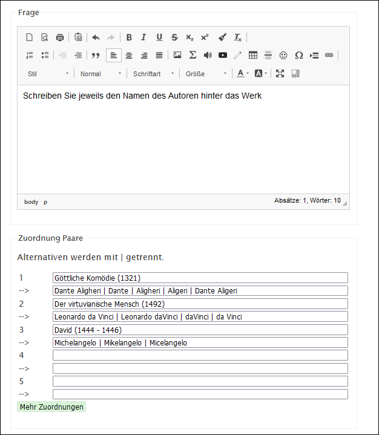
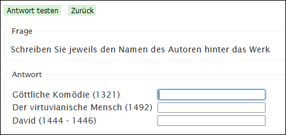

Die Schülerin soll einer Liste von genannten Begriffen weitere Begriffe, die sie als Freitext eingeben muss, zuordnen. Den Trennstrich zwischen den Antwortmöglichkeiten kann man mit der Tastenkombination __altGr__ + __7__ machen.

