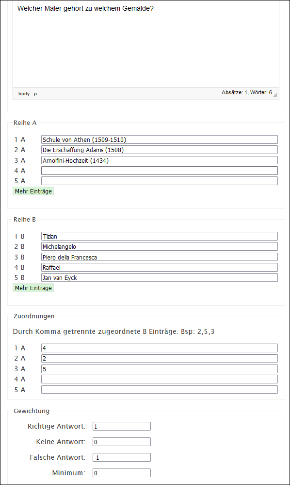
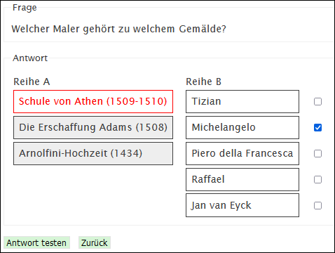

# Frageart Zuordnung (m:n)

Einer Reihe von m Begriffen können aus n Antwortmöglichkeiten die korrekten Antworten zugewiesen werden. Pro Begriff sind mehrere Antworten möglich. Die Begriffspaare werden jeweils in die _Reihe A_ und _Reihe B_ eingetragen. Danach kann unter _Zuordnungen_ pro Eintrag in der Reihe A eine oder mehrere Nummern aus der Reihe B eingetragen werden. Im folgenden Beispiel: Dem Eintrag aus der Reihe A _Schule von Athen (1509-1510)_ wird der Eintrag 4 aus der Reihe B _Raffael_ zugeordnet.  

