---
apps:
  - isTest2
sidebar_position: 40
sidebar_custom_props:
  icon: mdi-check-outline
  source: gym-kirchenfeld
  path: /docs/anderesoftware/istest2/verwenden/README.md
---

# Verwenden von isTest2

Auf Youtube steht eine Schulung zu isTest2 zur Verfügung: https://youtu.be/rABE2pgjbIQ.

:::warning Achtung: 
Wenn isTest2 ohne **Safe Exam Browser (SEB)** verwendet wird, können Schüler\*innen jederzeit andere Dokumente öffnen und so zum Beispiel digitale Unterrichtsunterlagen verwenden. Auch können die Schüler\*innen im Internet nach Lösungen suchen resp. Übersetzungsprogramme verwenden! isTest2 alleine ist also nur für Open-book-Prüfungen geeignet (Prüfungen, an denen alle Unterlagen und auch im Internet verfügbare Informationen verwendet werden dürfen). Soll die Prüfung ohne die Hilfe von Unterlagen absolviert werden, so sollte [isTest2 in Kombination mit dem Safe Exam Browser verwendet werden](../seb).
:::

## Expertise einstellen

Das Expertiselevel wird im Fenster von isTest2 rechts oben angezeigt.

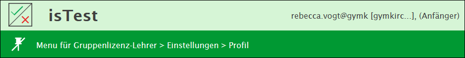

Das Expertiselevel lässt sich individuell einstellen, um die Menge der Funktionen zu reduzieren oder zu erweitern. Dies soll es Einsteiger*innen ermöglichen, sich an die umfangreichen Funktionalitäten von isTest2 heranzutasten. Zu Beginn ist man als Anfänger registriert. Die Optionen sind:

  * Anfänger
  * Standard
  * Fortgeschritten
  * Experte

Je höher Expertise, desto mehr Optionen hat man insbesondere beim Erstellen von Fragen:

  * Anfänger: Es stehen für die Fragen 2 Funktionen und 3 Fragetypen zur Verfügung
  * Experte: Es stehen für die Fragen 5 Funktionen und 17 Fragetypen zur Verfügung

Das Expertiselevel kann umgestellt werden unter _Einstellungen > Profil_

Falls der Safe Exam Browser verwendet werden soll, sollte das Expertiselevel auf **fortgeschritten** oder **Experte** gestellt werden [(mehr Infos zum Safe Exam Browser)](../seb)
## Kurse 

### 1. Kurse erzeugen

Hier kann man als Lehrperson eine Klasse bzw. einen Kurs zusammenstellen.

  * Unter _Kurse > Verwaltung_ auf __Neuer Kurs__ klicken.

**Name**: Name des Kurses
**Anfang**: Wann fängt der Kurs an?
**Ende**: Wann hört der Kurs auf?

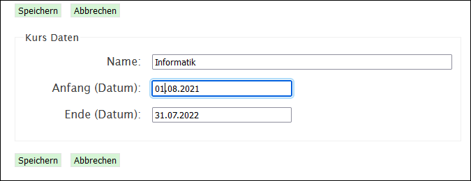

  * Zum Abschliessen auf __Speichern__ klicken. Der Kurs erscheint nun in der Liste der Kurse

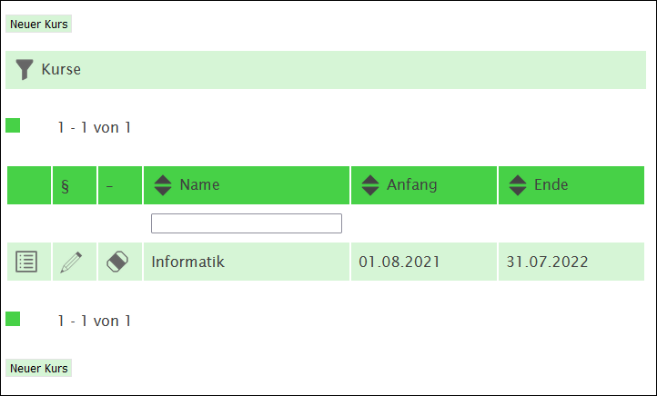

### 2. Schüler:innen als Klasse einladen

Wenn alle Schüler:innen einer Klasse in einen Kurs eingeladen werden sollen, kann man diese in einem Arbeitsschritt einem Kurs zuweisen.

  * Hierfür im Menü links auf _Kurse > Verwaltung_ gehen

  * Beim entsprechenden Kurs auf das Tabellen-Symbol  klicken
  
  * Anschliessend auf __Klasse übernehmen__ klicken.

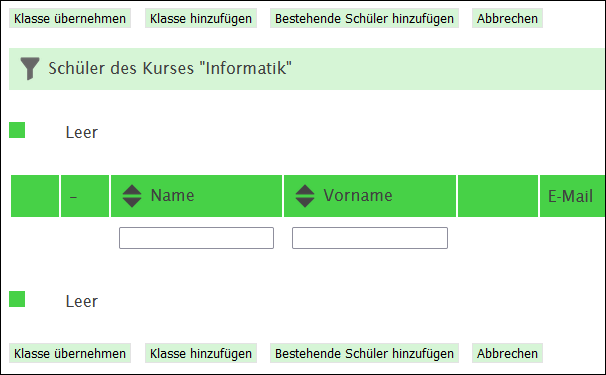

  * Nun im Textfeld _Klasse_ die Klassenbezeichnung eingeben. 

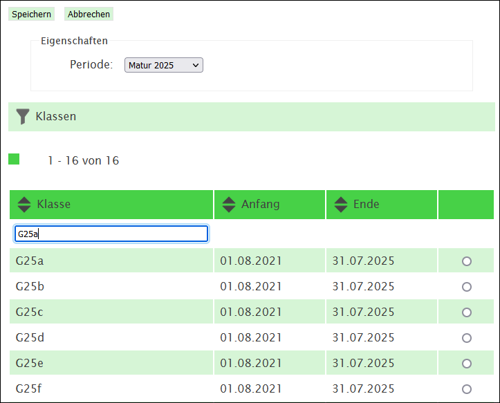

**Achtung**: **Nicht** Enter drücken, sondern mit Klick auf das Filtersymbol  klicken!

  * Die gewünschte Klasse nun auswählen und auf __Speichern__ klicken. Die Schüler:innen dieser Klasse sind nun dem Kurs zugewiesen und somit können ab jetzt Prüfungen durchgeführt werden

### 3. einzelne Schüler:innen in bestehenden Kurs übernehmen

Wenn während des Semesters Schüler\*innen in eine Klasse neu ein- oder austreten oder wenn man einen Kurs mit Schüler\*innen aus unterschiedlichen Klassen erstellen möchte, muss man diese einzeln in einen Kurs aufnehmen.

:::warning Achtung: 
Wenn während eines laufenden Semesters Schüler\*innen in eine Klasse neu eintreten, werden diese nicht automatisch in isTest2 hinzugefügt! Die Schülerin muss von einem Admin in isTest2 hinzugefügt werden, damit sie in der Liste erscheint. Fehlende Schüler\*innen können an support@gymkirchenfeld.ch gemeldet werden. Bitte den Vor- und Nachnamen des Schülers und die Klasse angeben.
:::

  * Kurs erzeugen (wie unter [1. Kurs erzeugen](#Kurserz) beschrieben).
  
  * Auf _Kurse > Verwaltung_ gehen
  
  * In dem entsprechenden Kurs auf das Schüler-Symbol  klicken
  
  * __Bestehende Schüler hinzufügen__ anklicken

  * Nun sind alle Schüler:innen in einer Liste sichtbar

  * Um zu filtern, den Vor- oder Nachnamen in das entsprechende Textfeld eingeben

**Achtung**: **Nicht** Enter drücken, sondern mit Klick auf das Filtersymbol  klicken!

  * Beim gewünschten Schüler das Häkchen setzen

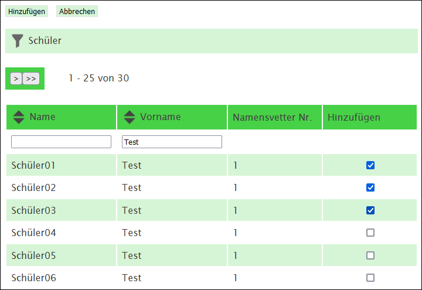

  * Falls noch mehr Schüler:innen hinzugefügt werden sollen, kann man noch andere Namen filtern und das Häkchen setzen

  * Wenn alle Schüler:innen ausgewählt wurden, auf __Hinzufügen__ klicken

### 4. Einzelne Schüler:innen aus bestehendem Kurs entfernen

  * Auf _Kurse > Verwaltung_ gehen

  * In dem entsprechenden Kurs auf das Schüler-Symbol  klicken

  * Bei der entsprechenden Schülerin auf das Symbol _Schüler vom Kurs abmelden_  klicken

### 5. Kurs löschen

  * Auf _Kurse > Verwaltung_ gehen

  * Beim entsprechenden Kurs auf das Löschen-Symbol  klicken

  * Mit __Ja__ bestätigen

### 6. Einen Testkurs erzeugen um zu üben

  * Auf _Kurse > Verwaltung_ gehen

  * Auf __Neuer Kurs__ klicken

  * Einen neuen Namen geben (z.B. _Testkurs_)

  * Auf __Speichern__ klicken

Danach Testschüler hinzufügen:

  * Auf __Schüler__ klicken und anschliessend auf __Bestehende Schüler hinzufügen__

Mit dem Vornamen _Test_ nach Namen filtern. 

**Achtung**: **Nicht** Enter drücken, sondern mit Klick auf das Filtersymbol  klicken!

  * Es erscheinen 30 Testschüler, die hinzugefügt werden können (Schüler01 - Schüler30)

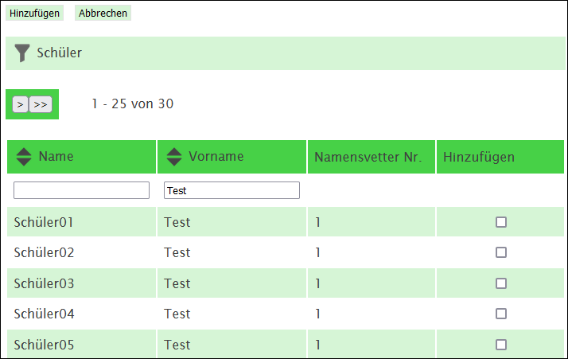

  * Bei 3-4 Schülern jeweils Haken bei _Hinzufügen_ setzen
  
  * Auf __Hinzufügen__ klicken
  
  * Nun erscheint eine Übersicht mit allen hinzugefügten Schüler:innen

Um sich mit einem TestSchüler:innen-Account anzumelden, kann man die entsprechenden Anmeldedaten zu den Test-Schüler\*innen auf [intern > Dokumente > Anleitungen > isTest2: TestSchüler:innen-Liste](https://api.gymkirchenfeld.ch/document/show?id=201438) finden. 
## Tests erstellen

Ein **Test** ist eine Zusammenstellung von Fragen. Ein Test kann später als Prüfung in mehreren Klassen/Kursen durchgeführt werden. Eine **Prüfung** ist ein Test, der mit einer _bestimmten_ Klasse oder einem bestimmten Kurs durchgeführt wird. Tests werden als Vorlagen, um später Prüfungen durchzuführen, in einem Archiv gespeichert. Dank den Archiven können Tests nach Themen oder Fächern sortiert abgelegt werden.

Um Tests zu erstellen sind folgende Schritte nötig:

[1. Sammlung erzeugen (= Ordner für Fragen, die z.B. thematisch geordnet werden)](#1)
[2. Fragen in die Sammlung eingeben](#2)
[3. Archiv erzeugen (= Ordner für Tests, die z.B. nach Fach geordnet sind)](#3)
[4. Test erzeugen und in ein Archiv einordnen](#4)
[5. Aus Sammlungen die Fragen in den Test füllen](#5)
[6. Eine Prüfung aus einem erzeugten Test erstellen](#6)

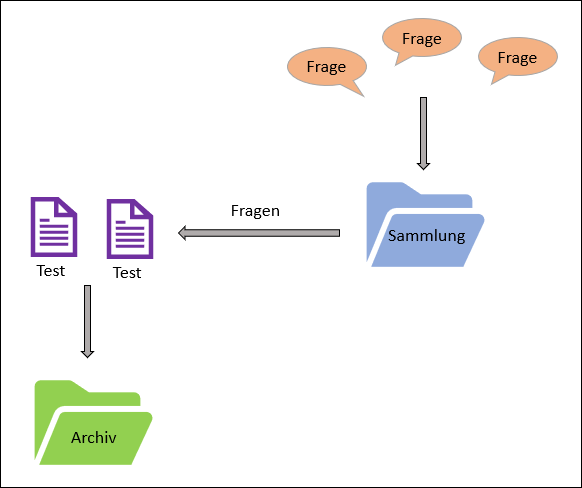

### 1. Sammlung erzeugen

Sammlungen sollten nach Unterrichtsthemen strukturiert werden. Sie dienen dazu, Fragen zu bestimmten Themen oder Fächern zu strukturieren.

  * Auf _Fragen > Sammlungen_ gehen

  * __Neue Sammlung__ anklicken

  * _Eigenschaften_ eintragen:
    * **Name**: Titel des Unterrichtsthemas (z.B. _Renaissance_)
    * **Kennzeichen**: Thematische Stichworte, mit Komma getrennt
    * **Sprache**: Sprache der Fragen einstellen
    * **Sichtbarkeit**: 

|            |                                                                                                                  |
| :--------- | :--------------------------------------------------------------------------------------------------------------- |
| privat     | Nur die Erstellerin/der Ersteller kann die Sammlung sehen                                                        |
| intern     | Andere Lehrpersonen derselben Schule sehen die Sammlung ebenfalls und können Fragen übernehmen                   |
| öffentlich | Alle Lehrpersonen, die isTest2 nutzen (auch von anderen Schulen) sehen die Sammlung und können Fragen übernehmen |

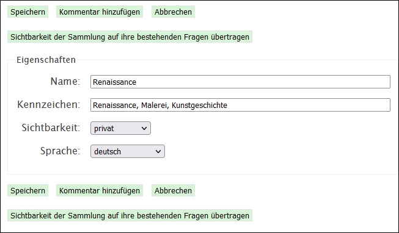

  * Danach auf __Speichern__ klicken

Auf diese Weise können alle Sammlungen erzeugt werden.

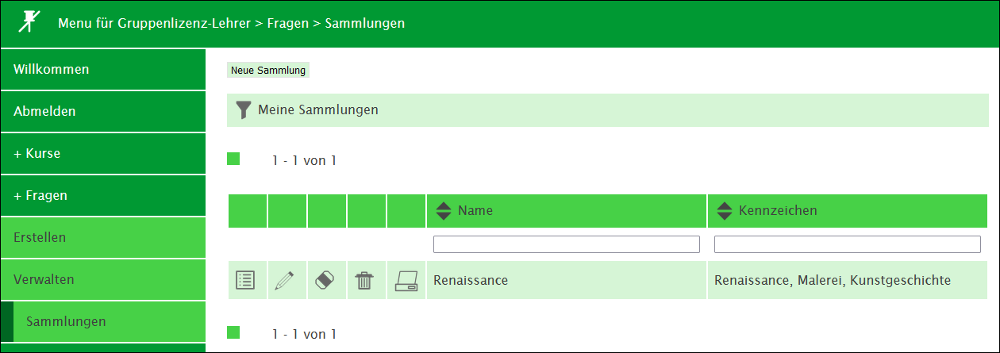

### 2. Fragen & Fragetypen

#### Fragen in Sammlungen eingeben

  * Auf _Fragen > Erstellen_ gehen

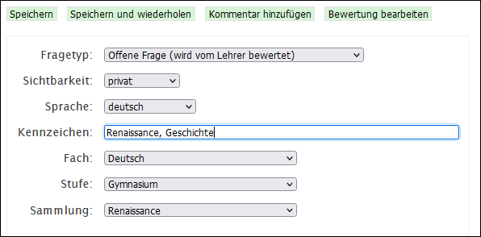

  * Fragetyp: [siehe nächstes Kapitel](#Fragetypen)
  
  * Sichtbarkeit:

|            |                                                                                                              |
| :--------- | :----------------------------------------------------------------------------------------------------------- |
| privat     | Nur die Erstellerin/der Ersteller kann die Frage sehen                                                       |
| intern     | Andere Lehrpersonen derselben Schule sehen die Frage ebenfalls und können diese übernehmen                   |
| öffentlich | Alle Lehrpersonen, die isTest2 nutzen (auch von anderen Schulen) sehen die Frage und können diese übernehmen |

  * Sprache: Sprache der Frage einstellen
 
  * Kennzeichen: Thematische Stichworte, mit Komma getrennt

  * Fach, Stufe und Sammlung wählen

  * Im Feld _Frage_ die Frage eingeben und unter _Antworten_ die Antworten

  * Beim Fragetyp _Auswahl (eine Möglichkeit)_ die korrekte Antwort markieren

  * _In zufälliger Reihenfolge fragen_: Antworten werden zufällig gemischt

  * Gewicht:
    * Richtige Antwort: Die Punktzahl, die ein\*e Schüler\*in erhält, wenn die Frage komplett richtig beantwortet wurde
    * Keine Antwort: Die Punktzahl, die Schüler:innen erhalten, wenn die Frage nicht beantwortet wird
    * Falsche Antwort: Die Punktzahl, die die Schülerin erhält, wenn die Frage komplett falsch beantwortet wurde. Diese Zahl kann auch negativ sein. Eine negative Zahl macht hier nur Sinn, wenn es in einer multiple-Choice-Frage mehrere Antwortmöglichkeiten gibt.
    * Minimum: Wie tief darf das Resultat aus einer Frage insgesamt ausfallen (meist 0, könnte aber auch negativ sein)?
  
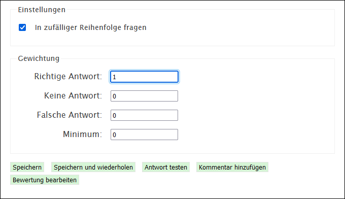

  * Bewertung ausprobieren mit dem Button __Antwort testen__

  * Auf __Speichern__ klicken, um die Frage abzuspeichern

  * Bilder in Fragen einfügen: 
    * Mittels Copy/Paste: Mit Rechtsklick auf _Bild > Kopieren_ (oder Bild markieren und __ctrl__ + __C__) und Rechtsklick auf das _Fragefeld > Einfügen_ (oder __ctrl__ + __V__). 
    * Alternativ kann man ein Bild über das Bildymbol  oberhalb des Fragefensters einfügen

#### Fragetypen

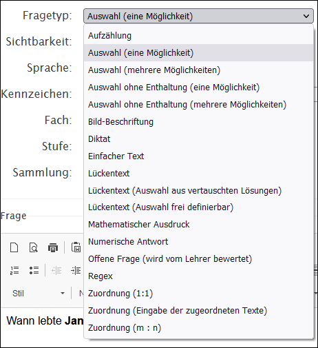

| Fragetyp                                        | Beschreibung                                                                                                                                                                                                                                                                                    | sichtbar ab Expertisestufe ([Infos zu Expertisestufe](#0)) | Link               |
| :---------------------------------------------- | :---------------------------------------------------------------------------------------------------------------------------------------------------------------------------------------------------------------------------------------------------------------------------------------------- | :--------------------------------------------------------- | :----------------- |
| Aufzählung                                      | Die Frage hat mehrere richtige Antworten, die als Freitext von der Schülerin eingegeben werden sollen. Den Trennstrich zwischen den Antwortmöglichkeiten kann man mit der Tastenkombination __altGr__ + __7__ machen.                                                                           | fortgeschritten                                            |                    |
| Auswahl (eine Möglichkeit)                      | Multiple-Choice-Frage mit nur einer korrekten Antwort mit der Möglichkeit, sich zu enthalten (_ich weiss es nicht_)                                                                                                                                                                             | Anfänger                                                   | [Beispiel](Bsp01/) |
| Auswahl (mehrere Möglichkeiten)                 | Multiple-Choice-Frage mit mehreren korrekten Antworten mit der Möglichkeit, sich zu enthalten (_ich weiss es nicht_). Für falsche Antworten sollte ein Punkteabzug eingestellt werden, da man andernfalls Punkte holt, wenn man alle Antworten (auch falsche) ankreuzt                          | Standard                                                   |                    |
| Auswahl ohne Enthaltung (eine Möglichkeit)      | Multiple-Choice-Frage mit nur einer korrekten Antwort ohne Möglichkeit, sich zu enthalten                                                                                                                                                                                                       | fortgeschritten                                            |                    |
| Auswahl ohne Enthaltung (mehrere Möglichkeiten) | Multiple-Choice-Frage mit mehreren korrekten Antworten ohne Möglichkeit, sich zu enthalten. Für falsche Antworten sollte ein Punkteabzug eingestellt werden, da man andernfalls Punkte holt, wenn man alle Antworten (auch falsche) ankreuzt                                                    | fortgeschritten                                            |                    |
| Bild-Beschriftung                               |                                                                                                                                                                                                                                                                                                 | fortgeschritten                                            |                    |
| Diktat                                          | Mittels einer Audiodatei schreibt die Schülerin ein Diktat. Die Audiodatei kann nicht in isTest2 aufgenommen werden - es muss eine bestehende mp3-Datei hochgeladen werden                                                                                                                      | fortgeschritten                                            |                    |
| Einfacher Text                                  | Die Frage muss mit einem Freitext beantwortet werden (z.B. einem Begriff). Es gibt die Möglichkeit, alternative Antworten zu definieren. Dies ist geeigent um für korrekte, aber falsch geschriebene Ausdrücke (z.B. beim Abfragen von Fremdsprachen-Vokabular) ebenfalls Punkte zu vergeben.   | Anfänger                                                   | [Beispiel](Bsp02/) |
| Lückentext                                      | Der Lückentext kann mit Bildern (Begriffe als Freitext den Bildern zuordnen) oder als reiner Text erstellt werden. Die Lücken müssen von der Schülerin mit Freitext geüllt werden                                                                                                               | fortgeschritten                                            | [Beispiel](Bsp03/) |
| Lückentext (Auswahl aus vertauschten Lösungen)  | Der Lückentext kann mit Bildern oder als reiner Text erstellt werden. Für jede Lücke wird ein Dropdown-Menü angezeigt, in dem alle Lösungsmöglichkeiten angezeigt werden. Das Erstellen der Aufgabe kann auf dieselbe Weise gemacht werden wie beim Fragetyp _Lückentext_                       | fortgeschritten                                            | [Beispiel](Bsp04/) |
| Lückentext (Auswahl frei definierbar)           | Der Lückentext kann mit Bildern oder als reiner Text erstellt werden. Für jede Lücke wird ein Dropdown-Menü angezeigt, in dem pro Frage unterschiedliche Lösungsmöglichkeiten angezeigt werden. Das Erstellen der Aufgabe kann auf dieselbe Weise gemacht werden wie beim Fragetyp _Lückentext_ | fortgeschritten                                            |                    |
| Mathematischer Ausdruck                         | Es können mathematische Ausdrücke in einem Freitextfeld eingegeben werden. Formeln für die Fragestellungen können mit LaTeX eingegeben werden                                                                                                                                                   | fortgeschritten                                            | [Beispiel](Bsp05/) |
| Numerische Antwort                              | Als Antwort soll eine Zahl eingegeben werden                                                                                                                                                                                                                                                    | Anfänger                                                   | [Beispiel](Bsp06/) |
| Offene Frage (wird vom Lehrer bewertet)         | Freitextfrage, die als einziger Fragetyp nicht automatisch korrigiert wird, sondern von der Lehrperson von Hand korrigiert werden muss. Man kann jedoch eine Musterlösung für die spätere Korrektur hinterlegen.                                                                                | Standard                                                   |                    |
| Regex                                           | Wie _Einfacher Text_, allerdings wird die Antwort mit Regex (Regular Expressions) ausgewertet, anstatt dass man mehrere explizite Alternativen zur richtigen Antwort angibt.                                                                                                                    | Experte                                                    | [Beispiel](Bsp07/) |
| Zuordnung (1:1)                                 | Der Schüler soll einer Liste von genannten Begriffen weitere Begriffe mittels Drag and Drop zuordnen                                                                                                                                                                                            | Standard                                                   |                    |
| Zuordnung (Eingabe der zugeordneten Texte)      | Der Schüler soll einer Liste von genannten Begriffen weitere Begriffe, die er als Freitext eingeben muss, zuordnen. Beispiel: _Schreiben Sie zu den genannten Städten jeweils das Land_.                                                                                                        | Standard                                                   | [Beispiel](Bsp08/) |
| Zuordnung (m : n)                               | Einer Reihe von m Begriffen können aus n Antwortmöglichkeiten die korrekten Antworten zugewiesen werden. Pro Begriff sind mehrere Antworten möglich                                                                                                                                             | fortgeschritten                                            | [Beispiel](Bsp09/) |

#### Bestehende Fragen anderer Lehrpersonen übernehmen

Fragen anderer Lehrpersonen, die diese als _intern_ oder _öffentlich_ eingestellt haben, können in die eigene Sammlungen übernommen werden. Hier kann man auch Fragen von Lehrpersonen anderer Schulen auswählen.

  * Auf _Stöbern > In Fragen / In Sammlungen / In Tests oder In Archiven_ gehen
  
In bestehenden Sammlungen, Tests und Archiven können mit dem Listen-Symbol  Fragen in Sammlungen/Tests angeschaut und getestet werden. Mit dem Klonen-Symbol  können die Fragen, Sammlungen oder Tests in den eigenen Account übernommen werden.

### 3. Archiv erzeugen

Die erstellten Tests werden in Archiven gruppiert. Diese sollte man nach Fächern aufteilen und entsprechend benennen.

#### Archiv erstellen

  * Auf _Tests > Archive_ gehen und __Neues Archiv__ anklicken

  * _Eigenschaften_ eintragen:
    * **Name**: Titel des Fachs (z.B. _Geschichte_)
    * **Kennzeichen**: Thematische Stichworte, mit Komma getrennt
    * **Sprache**: Sprache der Fragen einstellen
    * **Sichtbarkeit**: 
|            |                                                                                                               |
| :--------- | :------------------------------------------------------------------------------------------------------------ |
| privat     | Nur die Erstellerin/der Ersteller kann das Archiv sehen                                                       |
| intern     | Andere Lehrpersonen derselben Schule sehen das Archiv ebenfalls und können Tests übernehmen                   |
| öffentlich | Alle Lehrpersonen, die isTest2 nutzen (auch von anderen Schulen) sehen das Archiv und können Tests übernehmen |

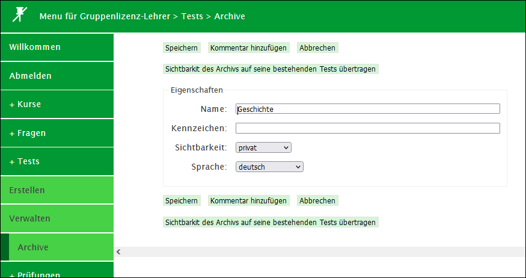

### 4. Test erzeugen und in ein Archiv einordnen

Ein **Test** ist eine Zusammenstellung von Fragen. Ein Test kann später als Prüfung in mehreren Klassen/Kursen durchgeführt werden. 

#### Test erstellen

  * Auf _Tests > Erstellen_ gehen

    * **Name**: Namen eingeben
    * **Sichtbarkeit**: (siehe oben)
    * **Archiv**: Das zuvor erzeugte Archiv wählen
    * **Anleitungen für den Schüler**: z.B. Angaben zur Dauer der Prüfung oder einfach nur _viel Erfolg!_

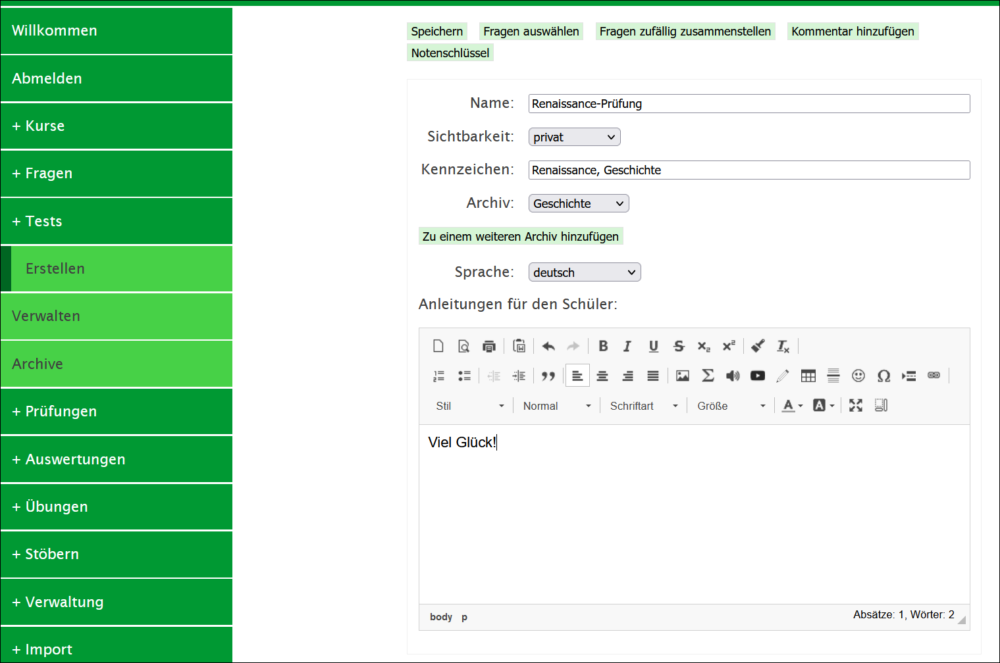

  * Anschliessend Fragen hinzufügen

### 5. Fragen aus Sammlungen in den Test füllen

  * In der _Test erstellen_-Ansicht auf __Fragen auswählen__ klicken

    * **Filter-Typ**: Nach eigenen Sammlungen
    * **Sprache**: deutsch
    * **Sammlung**: Die zuvor angelegte Sammlung auswählen

  * Auf __Alle auswählen__ klicken

  * Bei allen Fragen sollte nun ein Häkchen gesetzt sein 

  * __Angezeigte Auswahl zum Test hinzufügen__ wählen

  * Auf __Speichern__ klicken

Der Test ist nun unter _Test > Verwalten_ sichtbar und kann dort geändert oder gelöscht werden

## Prüfung

Eine **Prüfung** ist ein Test, der mit einer _bestimmten_ Klasse oder einem bestimmten Kurs durchgeführt wird. Daher muss, damit eine Prüfung durchgeführt werden kann, zuvor ein Test erstellt werden.

### 1. Prüfung vorbereiten

Das Vorbereiten der Prüfung kann zu Hause gemacht werden. 

  * Auf _Prüfungen > Vorbereiten_ klicken

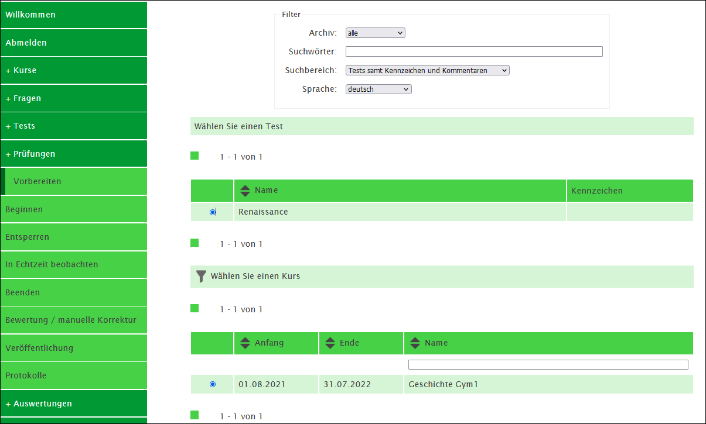

  * Die Angaben unter _Filter_ kann man so lassen, wie sie sind

  * Unter _Wählen Sie einen Test_ den zuvor erstellten Test wählen

  * Unter _Wählen Sie einen Kurs_ einen Kurs wählen

  * Auf __weiter__ klicken

  * **Weitere Optionen**:
    * **Schüler können Antworten korrigieren** (empfohlen): Schüler:innen können während dem Test ihre Antworten ändern
    * **Zufällige Reihenfolge der Fragen**: Schüler haben jeweils unterschiedliche Reihenfolgen der Fragen, sodass es schwieriger wird, gegenseitig abzuschreiben
    * **Zugriff auf eine einzige Sitzung beschränken** (empfohlen): Eine Prüfung kann nur einmal gestartet werden
    * **Im "Safe Exam Browser (SEB)" durchführen**: Erscheint nur, wenn der SEB aktiviert ist, siehe auch den [Artikel zu Safe Exam Browser](../seb)

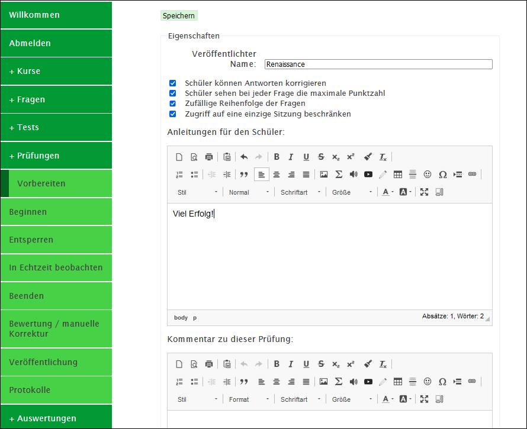

  * Anschliessend auf __Speichern__ klicken

### 2. Prüfung beginnen

  * Auf _Prüfungen > Beginnen_ klicken

  * Die Prüfung anwählen

  * Auf __Gewählte Prüfung zur Durchführung freischalten__ klicken

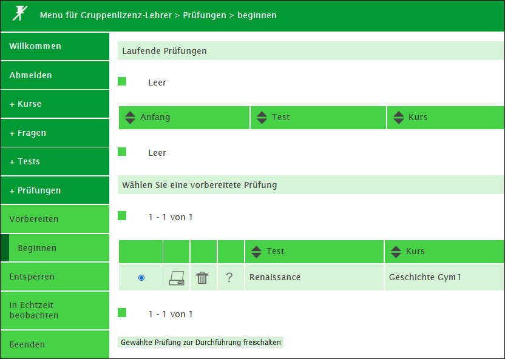

### 3. Was tun, wenn sich der Browser einer Schülerin aufhängt?

Wenn _Zugriff auf eine einzige Sitzung beschränken_ in den Prüfungsoptionen gewählt wurde, kann eine Schülerin sich nur einmalig bei der Prüfung anmelden (empfohlen). Falls die Schülerin versucht, die Prüfung erneut zu öffnet, erhält sie folgende Fehlermeldung:

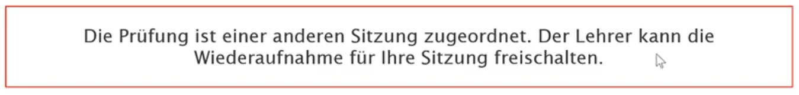

In diesem Fall kann die Lehrperson die Sitzung manuell noch einmal freigeben.

  * Auf _Prüfung > Entsperren_ klicken

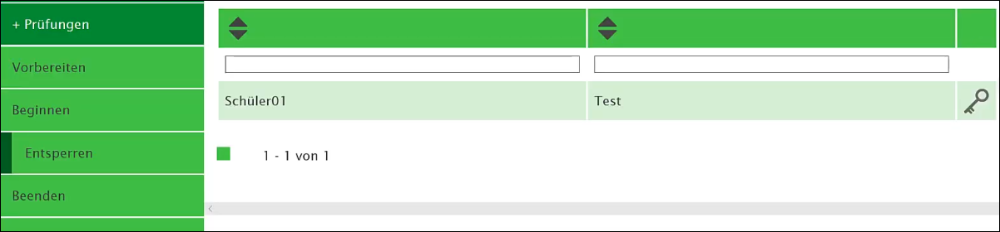

  * Das Schlüssel-Symbol  anklicken

### 4. Prüfung beenden

  * Auf _Prüfung > Beenden_ klicken

  * Das Schlüssel-Symbol  anklicken

### 5. Prüfung korrigieren
Wenn die Prüfung keine offene Fragen enthält, so wird diese automatisch von isTest2 korrigiert. Anschliessend kann der Notenmassstab kontrolliert und die Prüfung zurückgegeben werden.

Wenn die Prüfung offene Fragen enthält, muss sie von Hand korrigiert werden

  * Auf _Prüfungen > manuelle Nachkorrektur_ klicken

  * Die Fragen, die noch nicht automatisch korrigiert wurden, erscheinen mit roten Zahlen

  * Auf das Bleistift-Symbol  klicken

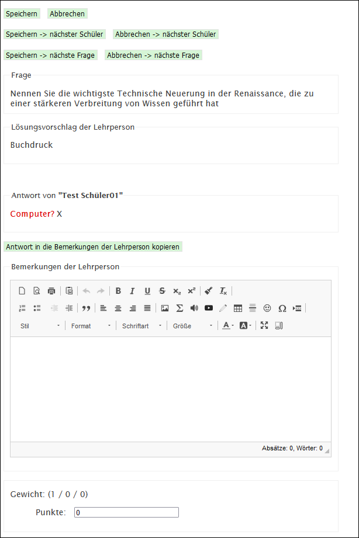

  * Zu sehen sind: Die Frage, die Musterantwort und die Schüler-Antwort. Darunter können Bemerkungen der Lehrperson eingetragen werden

  * Bei _Punkte_ können die vergebenen Punkte eingetragen werden

  * Danach entweder auf __Speichern -> nächster Schüler__ (gleiche Frage, anderer Schüler) oder __Speichern -> nächste Frage__ (gleicher Schüler, andere Frage) klicken

### 6. Notenergebnis anschauen und Prüfung anpassen

Um das Histogramm anzuschauen, das die Verteilung der Noten zeigt, folgendermassen vorgehen:

  * Auf _Prüfungen > Bewertung / manuelle Korrektur_ klicken

  * Das Bleistift-Symbol  anklicken

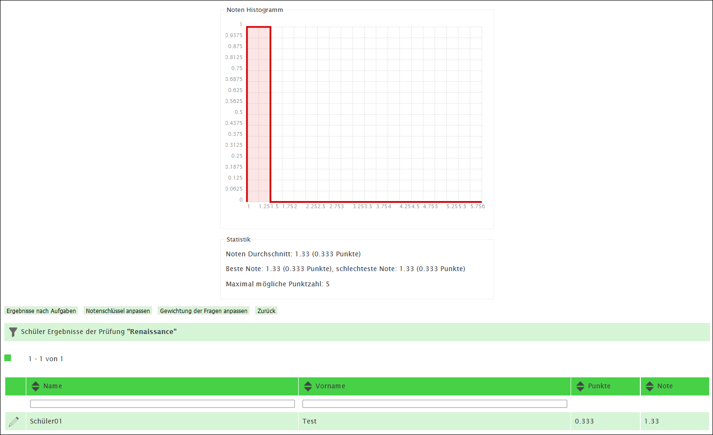

  * __Ergebnisse nach Aufgaben__: Hier kann geschaut werden, welche Frage wie gut beantwortet wurde. Mit dem Bleistift-Symbol  kann eine eventuelle falsche Korrektur noch angepasst werden

  * __Gewichtung der Fragen anpassen__: Hier kann angepasst werden, wie gross das Gewicht einzelner Fragen an der Prüfung ist. Hier kann die Bewertung einer Frage für die gesamte Klasse 
angepasst werden. Beispielsweise dann, wenn eine Frage sich hinterher als unklar formuliert herausstellt

  * __Notenschlüssel anpassen__: Hier können die Noten in Bezug auf die Punktezahl angepasst werden

### 7. Prüfung als Nachprüfung freischalten

Um eine Prüfung nach Beendigung wieder freizuschalten, beispielsweise für Nachprüfungen, kann man folgendermassen vorgehen:

  * Auf _Prüfung > Veröffentlichung_ gehen

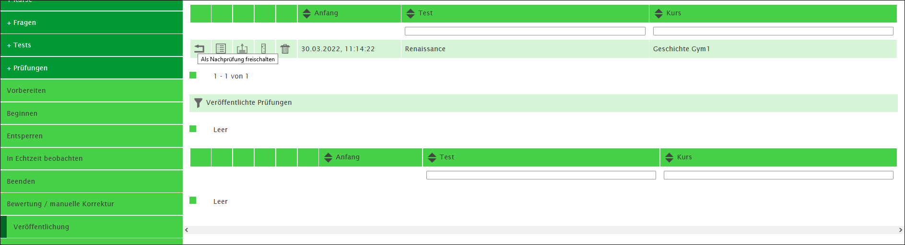

  * Das Pfeil-Symbol  anklicken 

Alle Schüler:innen, die sich noch nicht eingeloggt hatten am Prüfungstermin, können die Prüfung nun lösen. Das Resultat wird mit den bestehenden Resultaten verrechnet.

### 8. Prüfung ausdrucken (nur Fragen und Lösungen)

Falls gewünscht, kann die Prüfung vor der Freigabe an die Schüler\*innen gedruckt werden. Es werden hierbei nur die Fragen & Lösungen ausgedruckt, nicht die Ergebnisse der Schüler\*innen. Um die Prüfungsergebnisse auszudrucken, siehe [Kapitel 12](#Ergebnisse)

  * Auf _Prüfung > Veröffentlichung_ klicken

  * Auf das Tabellen-Symbol  klicken, um zur Druckansicht zu gelangen

  * In der Druckansicht __Ctrl__ + __P__ drücken, um ins Druckmenü zu gelangen

  * Im Druckmenü entweder einen Drucker wählen, um die Prüfung auf Papier auszudrucken, oder _Als PDF speichern_ wählen, um die Prüfung als PDF abzuspeichern.

### 9. Prüfung für die Schüler:innen freigeben

Wenn alle Korrekturen erledigt sind, kann die Prüfung für die Schüler:innen freigegeben werden.

* Auf _Prüfung > Veröffentlichung_ klicken

* Auf das Freigabe-Symbol  klicken

* Anchliessend kann gewählt werden, was für die Schüler:innen sichtbar sein soll:
  
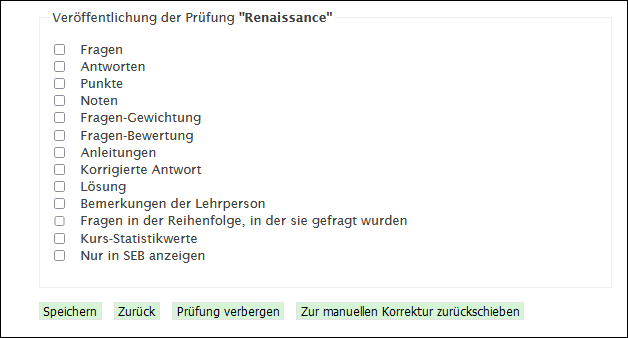

* Diese Auswahl kann nach der Prüfung jederzeit mit dem Bleistift-Symbol  geändert werden.

### 10. Vergangene Prüfungen einsehen und Ergebnisse speichern

Um vergangene Prüfungen und die Noten aufzurufen, kann man folgendermassen vorgehen: 

  * Auf _Auswertungen > Noten_ gehen

Hier können über das Tabellen-Symbol  die Noten direkt eingesehen oder als Excel-Datei  heruntergeladen werden.

### 11. Besprechungsansicht für Klasse

Für Besprechungen mit der Schulklasse kann man in isTest2 die Fragen und die Musterlösungen einblenden.

  * Auf _Auswertungen > Prüfungen_ gehen

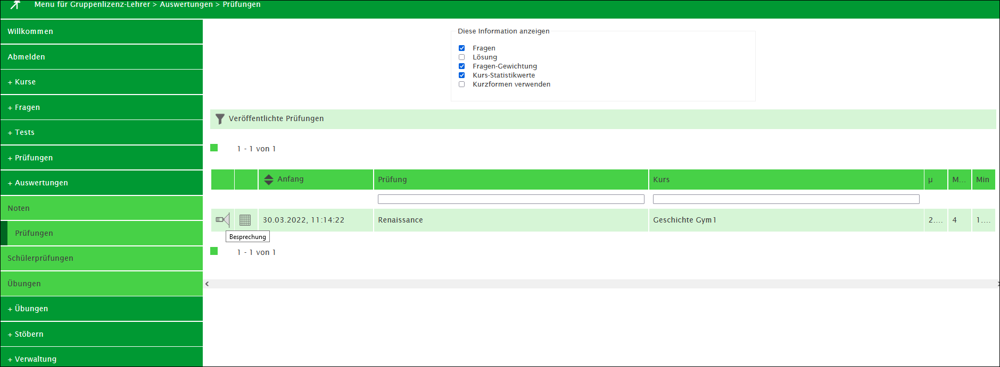

  * Oben kann man wählen, welche Aspekte der Prüfung für die Klasse eingeblendet werden sollen

  * Auf das Besprechen-Symbol  klicken

### 12. Prüfungsergebnisse der Schüler:innen abspeichern und ausdrucken

Hier kann man alle Prüfungsergebnisse mit den Schülerantworten im Detail ausdrucken. Dies ist nützlich, um Prüfungsergebnisse als PDF oder auf Papier zu archivieren.

  * Auf _Auswertungen >  Schülerprüfungen_ gehen

  * Oben kann man wählen, welche Aspekte der Prüfung gespeichert werden sollen

  * Auf das Drucken-Symbol  klicken

  * In der Druckansicht __Ctrl__ + __P__ drücken, um ins Druckmenü zu gelangen

  * Im Druckmenü entweder einen Drucker wählen, um die Prüfung auf Papier auszudrucken, oder _Als PDF speichern_ wählen, um die Prüfung als PDF abzuspeichern.

### 12. Prüfung nur als Übung schreiben lassen (ohne Benotung)

Zu Übungszwecken können Prüfungen als Übung veröffentlicht werden. So können die Schüler:innen ihren Wissensstand selber testen.

  * Auf _Übungen > Veröffentlichen_ klicken

  * __weiter__ anklicken

  * Die Klasse wählen

  * Auf __speichern__ klicken
