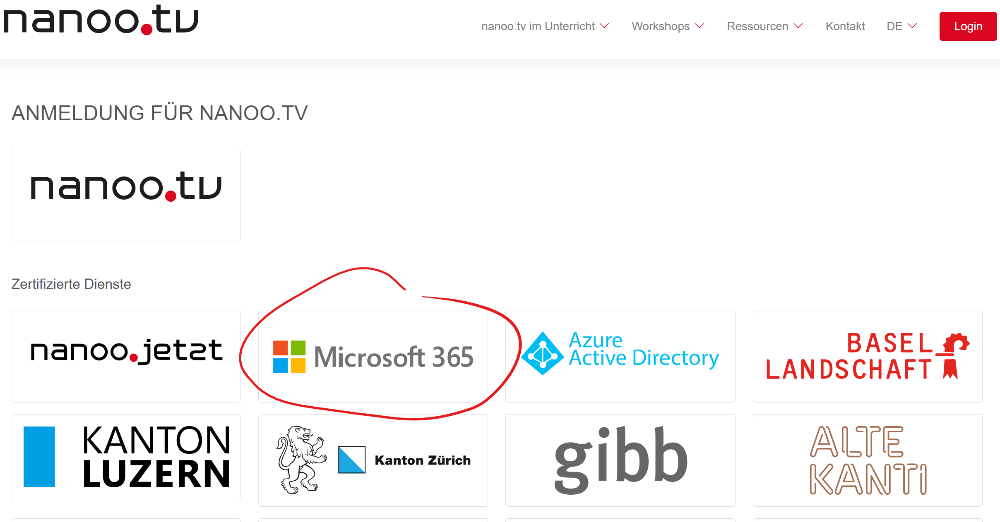

# Mediathek nanoo.tv für Lehrer:innen

Auf nanoo.tv steht der Schule ein Medienserver zur Verfügung. Nach Filmen kann auch schulübergreifend gesucht werden.

Anmelden
: [👉 nanoo.tv](https://portal.nanoo.tv/de/login-nanoo-tv.html) Anmelden mit Microsoft 365.

