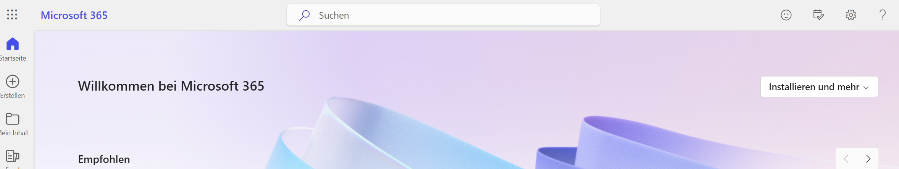

---
sidebar_custom_props:
  icon: mdi-microsoft-office
  path: /docs/byod/teams/README.md
sidebar_position: 17
---

# Microsoft 365 einrichten

Alle Lehrer:innen und Schüler:innen haben eine Lizenz für die Programmsuite office 365 und arbeiten mit diesen Programmen.

Microsoft 365 wird wie folgt installiert:

<Tabs>
  <TabItem value="win" label="Windows">
 
Gehe zu folgender Seite [Konto](https://www.microsoft365.com/?auth=2&home=1), melde dich an und wähle __Installieren und mehr__. Die Programme werden heruntergeladen und installiert.

Kontrolliere, ob auch **Teams** und **OneNote** installiert worden sind. Wenn nicht, findest du die Anleitung auch auf der **ict.gbsl-Seite**.

  </TabItem>
  <TabItem value="osx" label="Mac OS">
    
Gehe zu folgender Seite [Konto](https://www.microsoft365.com/?auth=2&home=1), melde dich an und wähle **Installieren und mehr**. 

Sichere die Datei:

Oeffne die Datei:

Wähle _Standardinstallation_, damit werden auch _OneNote_  und _Teams_ installiert.

Sollten **Teams** und **OneNote** nicht installiert worden sein, Wfindest du die Anleitung auch auf der **ict.gbsl-Seite* um sie zu installieren.

  </TabItem>
  <TabItem value="ios" label="iOS">

## Installation

Microsoft 365 lässt sich auch auf dem iPhone oder iPad installieren. Gerade wenn du dein iPad im Unterricht brauchen willst, macht das Sinn:

1. Die Microsoft Apps vom AppStore installieren,
2. dich in den Apps mit deinem Schul-Account anmelden.

Installiere die folgenden Apps:

- [Microsoft Word im App Store][1]
- [Microsoft Excel im App Store][2]
- [Microsoft PowerPoint im App Store][3]
- [Microsoft OneNote im App Store][4]
- [Microsoft Teams im App Store][5]

[1]: https://apps.apple.com/ch/app/microsoft-word/id586447913
[2]: https://apps.apple.com/ch/app/microsoft-excel/id586683407
[3]: https://apps.apple.com/ch/app/microsoft-powerpoint/id586449534
[4]: https://apps.apple.com/ch/app/microsoft-onenote/id410395246
[5]: https://apps.apple.com/ch/app/microsoft-teams/id1113153706

  </TabItem>
  <TabItem value="android" label="Android">
Microsoft 365 lässt sich auch auf dem Android-Smartphone oder Android-Tablet installieren. Gerade wenn du dein Tablet im Unterricht brauchen willst, macht das Sinn:

1. Die Microsoft Apps vom _Play-Store_ installieren,
2. dich in den Apps mit deinem Schul-Account anmelden.

Installiere die folgenden Apps:
- Microsoft Word
- Microsoft Excel
- Microsoft PowerPoint
- Microsoft OneNote
- Microsoft Teams

</TabItem>
</Tabs>

## Hast du Probleme mit Installieren, gibt es zwei Hauptursachen

### Anmeldung

Anmeldung nicht möglich tritt auf, wenn du folgendes Häkchen nicht gelöscht hast.

Unten Links auf __Nein, nur bei dieser App anmelden__ klicken.

### Das alte Schulkonto wird angezeigt

Falls du von deiner alten Schule die Office-Installation nicht vollständig gelöscht hast, treten verschiedene Probleme auf, eines davon ist z.B. die Synchronisation von OneDrive. Mit dem vollständigen Löschen der alten Installatin aber löst du alle Probleme, die durch die alte Installation entstehen.

Damit die automatische Synchronisation der Dateien mit OneDrive funktioniert, darf nur ein einziges Schulkonto aktiv sein. Um ein bestehendes Schulkonto zu entfernen, ist wie folgt vorzugehen:

<Tabs groupId="os">
  <TabItem value="win" label="Windows">

Unter __Einstellungen :mdi[cog]{.blue}__ klicke auf __Konten :mdi[account]{.cyan}__ scrolle runter auf __Auf Arbeits-, Schulkonto...zugreifen__ danach auf __trennen__ klicken.

  </TabItem>
  <TabItem value="osx" label="Mac">

Unter Mac OS X muss ein Tool für die Entfernung von bestehenden Konten verwendet werden. 

Anleitung
: [👉 Anleitung](https://support.microsoft.com/de-de/office/entfernen-von-office-lizenzdateien-auf-einem-mac-b032c0f6-a431-4dad-83a9-6b727c03b193)
Tool
: [👉 Removal-Tool](https://go.microsoft.com/fwlink/?linkid=849815)

  </TabItem>
</Tabs>
