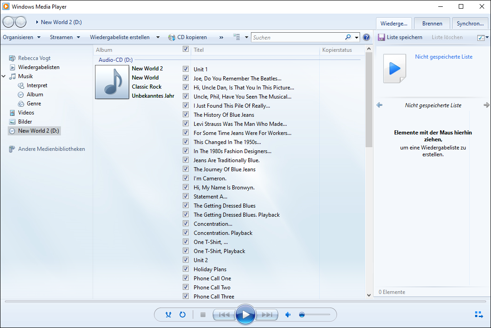
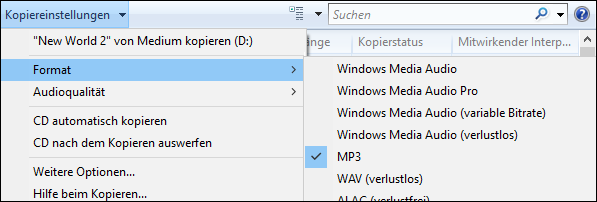
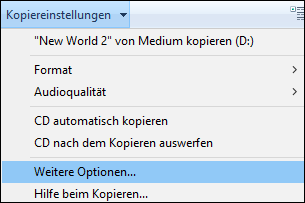
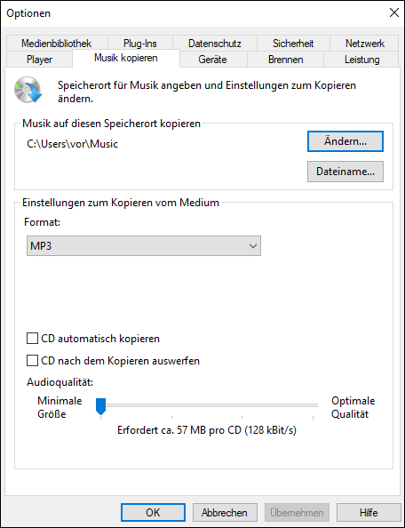
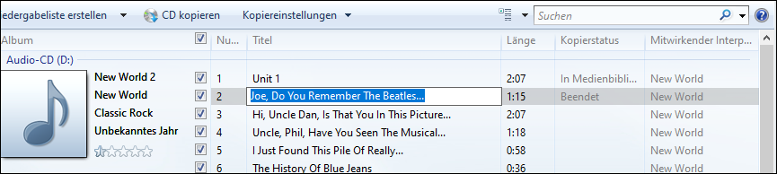
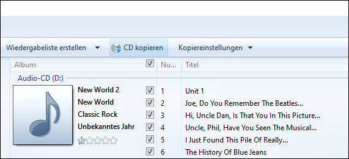
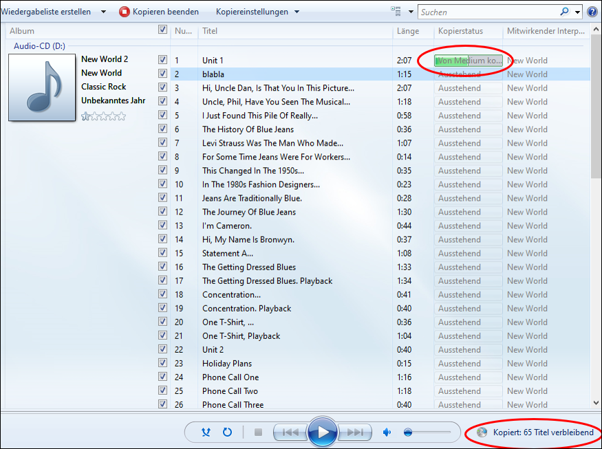

Aufnahmen von einer Audio-CD können als Dateien abgespeichert werden. Die so generierten Audiodateien können anschliessend auf _Teams_ hochgeladen oder per USB-Stick auf einem beliebigen Gerät mit USB-Anschluss (z.B. Notebook) abgespielt werden. Um Audioaufnahmen von einer CD als Datei abzuspeichern, benötigt man ein CD-Rom-Laufwerk.

:::warning Achtung
Wenn man den Inhalt einer CD am Computer öffnet, erscheinen die darauf enthaltenen cda-Dateien. Diese lassen sich zwar direkt aus dem CD-Ordner kopieren, sind aber nutzlos, da es sich bei cda-Dateien lediglich um Verknüpfungen auf die CD-Inhalte selbst handelt. Um Audiodateien ab CD zu generieren ist ein Programm wie Windwos Media Player nötig! 
:::

### CD-Inhalte als Dateien speichern mit Windows Media Player

1. Die Audio-CD in das CD-Rom-Laufwerk einlegen und dieses anschliessen.

2. Windows Media Player öffnen.

3. Der Inhalt der CD wird automatisch angezeigt.

4. Im Menü _Kopiereinstellungen_ > _Format_ > _MP3_ wählen.

5. Standardverzeichnis, in dem die mp3-Dateien gespeichert werden, ist _Nutzerkonto_ > _Musik_.
Um den Speicherpfad zu sehen oder zu ändern: Im Menü _Kopiereinstellungen_ > _Weitere Optionen_ anklicken.

Der Pfad ist im Reiter _Musik kopieren_ unter _Musik auf diesen Speicherort kopieren_ ablesbar. Um einen anderen Pfad zu wählen auf den Button __Ändern...__ klicken und einen neuen Speicherort wählen.

6. Sicherstellen, dass die Haken bei allen Stücken gesetzt sind, die man kopieren möchte.

7. **Optional:** Mit einem Klick auf den Namen der Aufnahme kann der spätere Dateiname geändert werden.

8. Auf __CD kopieren__ klicken um den Kopiervorgang zu starten.

* Der Fortschritt ist jeweils unter _Kopierstatus_ hinter dem jeweiligen Stück als grüner Balken sichtbar.
* Der Gesamtfortschritt ist unten rechts im Windows Media Player als _Kopiert: x Titel verbleibend_ sichtbar.

    

9. Nach Abschluss des Kopiervogangs sind die Dateien im zuvor festgelegten Pfad abgelegt. Standardpfad: _Nutzerkonto_ > _Musik_.
