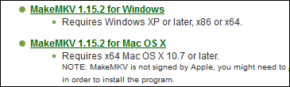
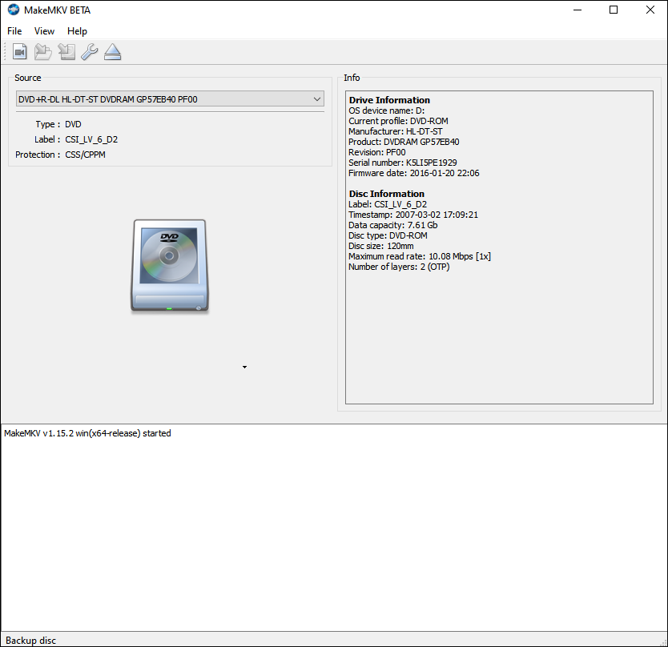
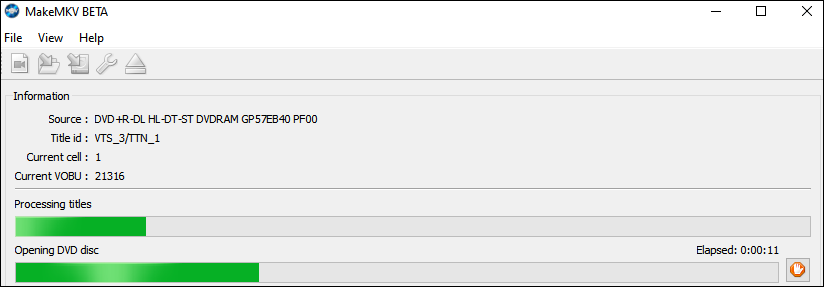
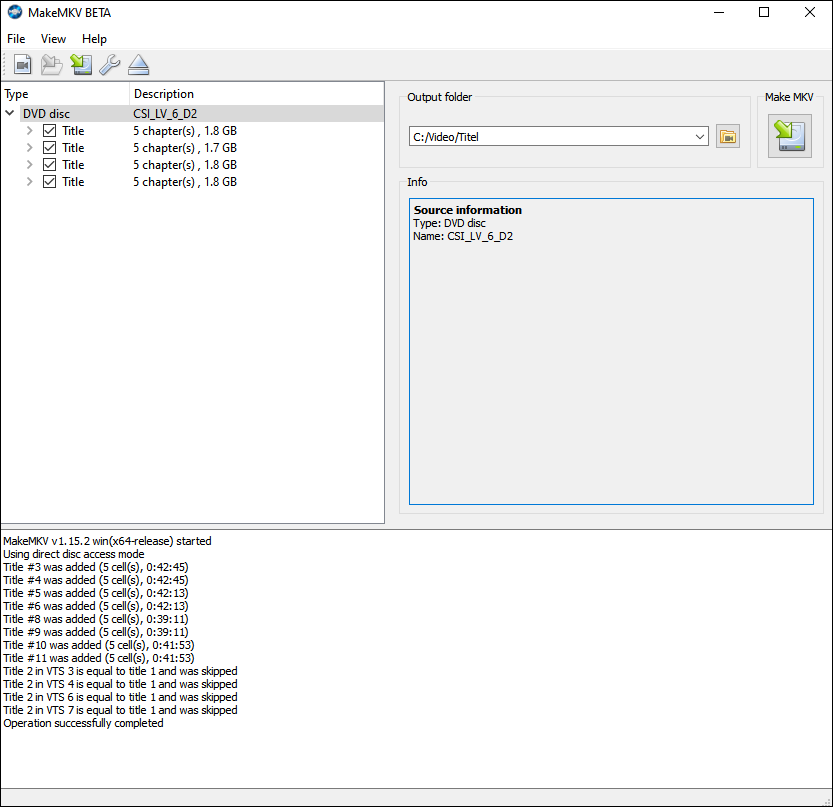
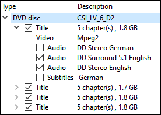
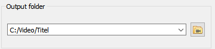
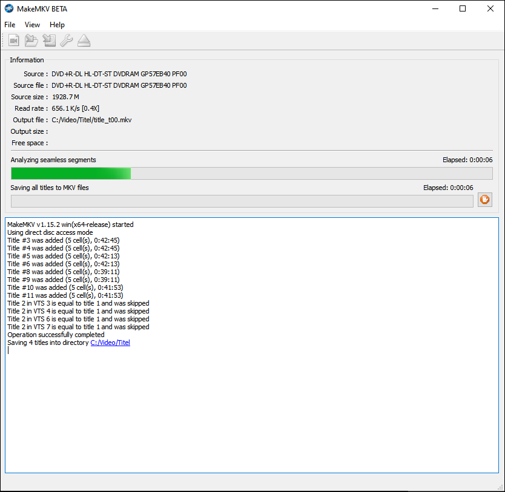

---
apps:
  - MakeMKV
sidebar_position: 2
sidebar_custom_props:
  icon: mdi-play-circle
  source: gym-kirchenfeld
  path: /docs/anderesoftware/video-audio/dvd/README.md
---

# DVDs

Filme von einer DVD können als Dateien abgespeichert werden. Die so generierten Videodateien können anschliessend auf _Stream_ hochgeladen oder per USB-Stick auf einem beliebigen Gerät mit USB-Anschluss (z.B. Notebook) abgespielt werden. Um Filme von einer DVD als Datei abzuspeichern, benötigt man ein CD-Rom-Laufwerk.

## DVD-Inhalte als Dateien speichern mit MakeMKV

1. Auf der [Website von MakeMKV](https://www.makemkv.com/download/) die Installationsdatei für Windows oder Mac OS X herunterladen

2. MakeMKV installieren

3. Falls ein externes CD-Rom-Laufwerk verwendet wird, dieses anschliessen und die DVD einlegen

4. Falls der Film automatisch abgespielt wird, das entsprechende Abspielprogramm schliessen

5. MakeMKV starten 

6. Wenn die DVD erkannt wurde, erscheint folgendes Fenster:

7. Auf das DVD-Laufwerk-Symbol klicken:

8. MakeMKV erstellt nun eine Vorschau für die ausgelesenen Videodateien. Abwarten, bis die grünen Balken gefüllt sind

9. Es erscheint eine Auflistung der Videodateien, die zum Kopieren zur Verfügung stehen

10. Durch einen Klick auf > neben der jeweiligen Datei öffnet man ein Menu, in dem selektiert werden kann, welche Tonspuren und Untertitel mitkopiert werden sollen. Diese Selektion muss für jede Datei einzeln gemacht werden

**Hinweis, falls die Videodatei später auf Stream hochgeladen werden soll:** Stream kann nur eine Tonspur speichern und kann keine Untertitel wiedergeben! Deshalb nur diejenige Tonspur anwählen, mit der die Datei später hochgeladen werden soll. Das Kästchen für Untertitel kann in dem Falle abgewählt werden.

11. Unter _Output Folder_ kann der Pfad eingegeben werden, in dem die Dateien abgespeichert werden

12. Wenn alles korrekt eingestellt ist, auf das _Kopieren_-Symbol  klicken

13. Die Dateien werden nun auf die Festplatte gespeichert. Die grünen Ladebalken geben Auskunft darüber, wie weit das Kopieren fortgeschritten ist.

14. Sobald der Kopiervorgang abgeschlossen ist, sind die entsprechenden Dateien im Ordner, der unter _Punkt 11_ angegeben wurde, abgelegt. 
