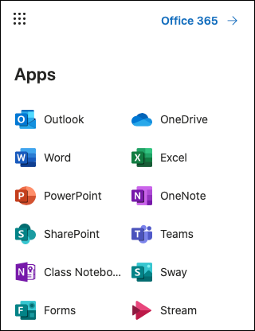
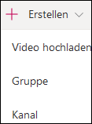
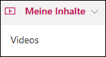
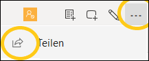
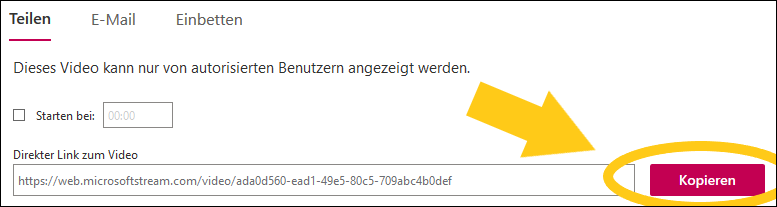
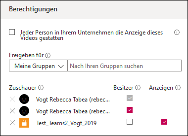
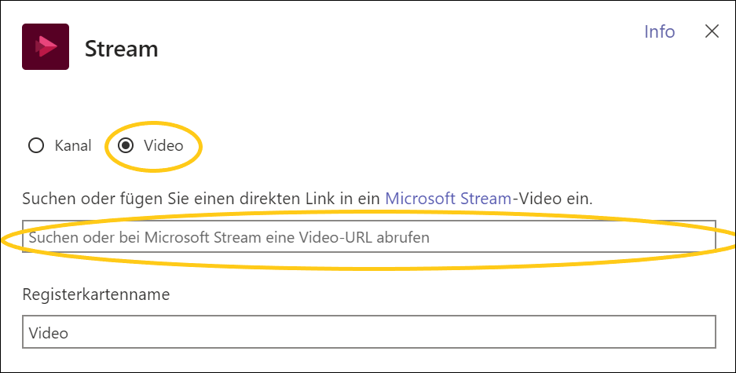

---
apps:
  - Microsoft Stream
sidebar_position: 4
sidebar_custom_props:
  icon: mdi-play-outline
  source: gym-kirchenfeld
  path: /docs/anderesoftware/video-audio/stream/README.md
draft: true
---

# Stream

Über Microsoft Stream können grosse Videodateien in guter Qualität geteilt werden.

## Video auf Stream hochladen

1. Aufnahme mit Handy oder anderem Gerät machen und Datei abspeichern oder eine Videodatei von einer anderen Quelle (Youtube, DVD) abspeichern.

2. Im Browser die [Schul-Cloud](https://cloud.gymkirchenfeld.ch) öffnen.

3. In der Cloud auf das Menu (9 Punkte) links oben klicken.

4. App _Stream_ wählen:

5. Auf _Erstellen_ und _Video hochladen_ klicken:

## Video in Teams teilen

1. In Stream auf _Meine Inhalte_ und _Videos_ klicken:

2. Auf das Menüsymbol (drei Punkte) klicken und _teilen_ wählen:

3. Neben dem Link auf _Kopieren_ klicken:

4. Fenster schliessen und auf das Stiftsymbol klicken:

5. Unter «Berechtigungen» kann die Freigabe für Gruppen und Einzelpersonen eingestellt werden:

6. In **Teams**: Im Reiter-Menu auf das «+»-Symbol klicken:

7. _Stream_ wählen

8. _Video_ anwählen, im Textfeld den Link aus der Zwischenablage einfügen

Das Video ist jetzt im Team über eine eigene Registerkarte verfügbar.

## Anmerkungen zu Mehrsprachigkeit 

**Microsoft Stream unterstützt keine Mehrsprachigkeit bei Videodateien.** Mit MakeMKV können mehrsprachige Videodateien (z.B. von mehrsprachigen DVDs) erstellt werden. Die Sprache lässt sich in einem Videoplayer, wie dem VLC-Player, jeweils umstellen. Beim Hochladen mehrsprachiger Videodateien via Stream selektiert das Programm standardmässig die jeweils erste Sprache - dies lässt sich manuell nicht umstellen. Es empfiehlt sich deshalb, nur jeweils die Sprache von der DVD zu kopieren, die man auf Stream haben möchte, wenn man mit MakeMKV eine Videodatei erstellt.

## Anmerkungen zu Untertiteln

**Das Hochladen von Untertiteldateien, die von einer DVD extrahiert wurden, ist in Stream noch nicht möglich.** Zwar gibt es beim Hochladen und Editieren von Videodateien unter _Optionen_ den Abschnitt _Untertitel: Datei mit Untertitel hochladen_, der das Hochladen einer .vtt-Datei erlaubt, jedoch kann der Untertitel von Stream nicht wiedergegeben werden. Stream bietet die Möglichkeit, einen Untertitel für Hörgeschädigte automatisch zu generieren unter _Untertitel für Hörgeschädigte: Untertitel automatisch generieren_. Es ist nicht empfehlenswert, diese Option zu nutzen, da die so erzeugten Untertitel mangelhaft sind.

