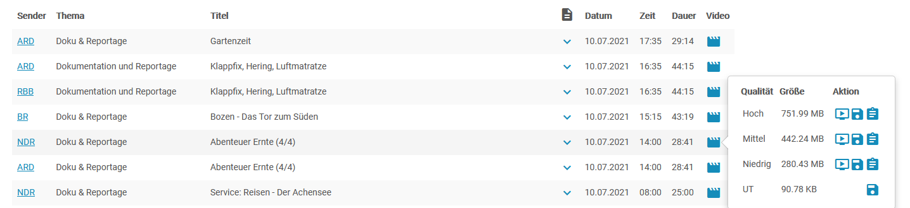
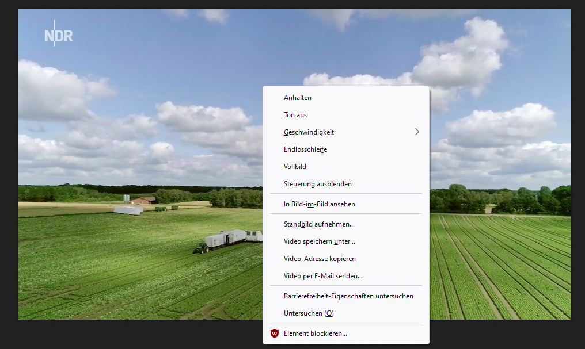

# Video aus Mediathek herunteladen

Mit MediathekView können Filme aus diversen Meditheken, z.B. von Arte, ZDF, usw. heruntergeladen und gespeichert werden.

## MediathekView im Browser öffnen und verwenden

1. Auf [mediathekviewweb.de](https://mediathekviewweb.de) gehen.

2. In der Suchleiste einen Suchbegriff eingeben.

3. Nähere Informationen zum Film können mit einem Klick auf den Pfeil aufgerufen werden.

4. Um den Film herunterzuladen auf das Filmklappensymbol und dann bei der gewünschten Auflösung auf das Diskettensymbol klicken.

5. Der Film wird in einem neuen Fenster geöffnet.

6. Auf den Film rechtsklicken und auf _Video speichern unter.._ klicken.

7. Passenden Speicherpfad auswählen und auf __Speichern__ klicken.
