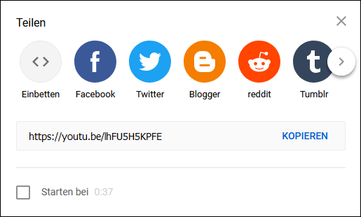
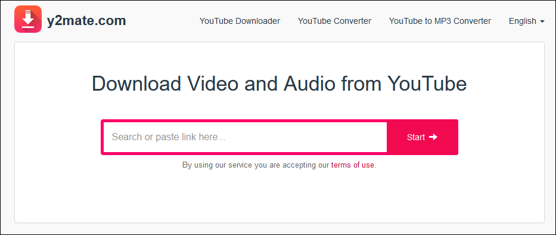
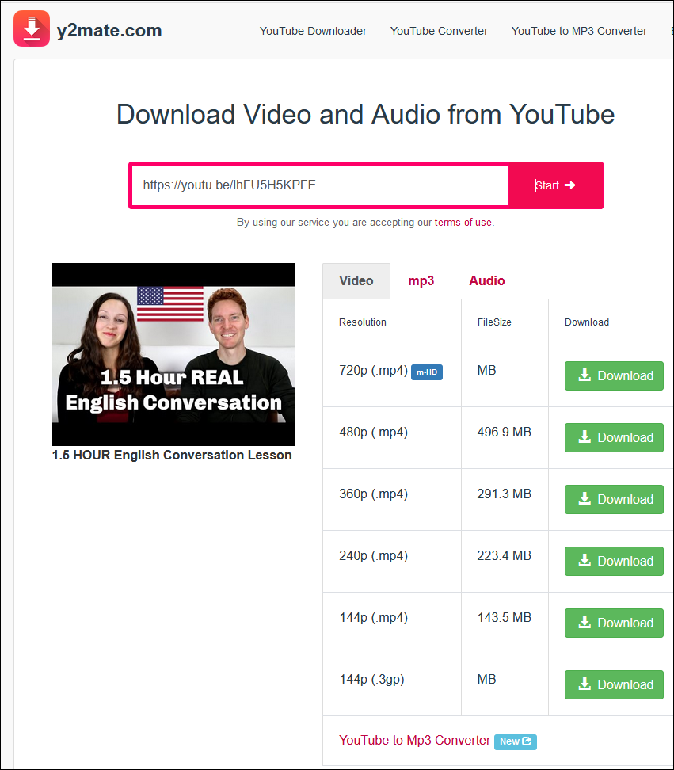
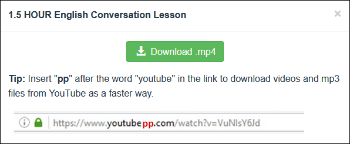
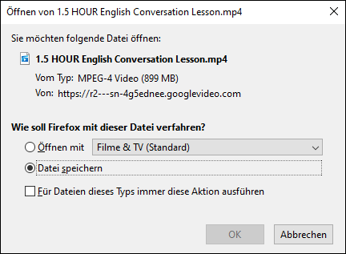

# YouTube

Filme von YouTube können als Dateien abgespeichert werden. Die so generierten Videodateien können anschliessend auf _Stream_ hochgeladen oder per USB-Stick auf einem beliebigen Gerät mit USB-Anschluss (z.B. Notebook) abgespielt werden.

## Filme von YouTube als Datei abspeichern

1. Für den verwendeten Internetbrowser einen Adblocker installieren, z.B. [uBlock Origin für Firefox](https://ict.mygymer.ch/byod/windows/firefox/#ad-blocker-installieren)

2. Im Browser das entsprechende YouTube-Video öffnen.

3. Unterhalb des YouTube-Videos auf _Teilen_ klicken.

4. Es öffnet sich folgendes Fenster:

5. Auf _Kopieren_ klicken

6. In einem neuen Tab im Browser auf die [Seite von y2mate](https://www.y2mate.com/) gehen.

7. In das Textfeld klicken und den zuvor kopierten Link mit der Tastenkombination __Ctrl__ __V__ einfügen.

8. Auf _start_ klicken

9. Bei der gewünschten Auflösung auf __Download__ klicken. Für eine möglichst gute Qualität die höchste Auflösung wählen

10. Es erscheint das folgende Fenster:

11. Mit einem Klick auf __Download .mp4__ bestätigen.

12. Es erscheint das folgende Fenster:

Mit einem Klick auf __Ok__ bestätigen.

13. Der Download startet. Im Firefox Browser ist der Fortschritt rechts oben im Fenster durch das Pfeilsymbol mit Ladebalken  erkennbar

14. Ist die Datei fertig heruntergeladen, befindet sie sich im Standard-Download-Verzeichnis des Computers. Unter Windows: _Dieser PC_ > _Downloads_
