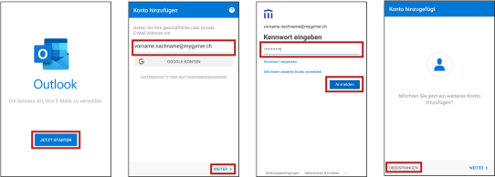
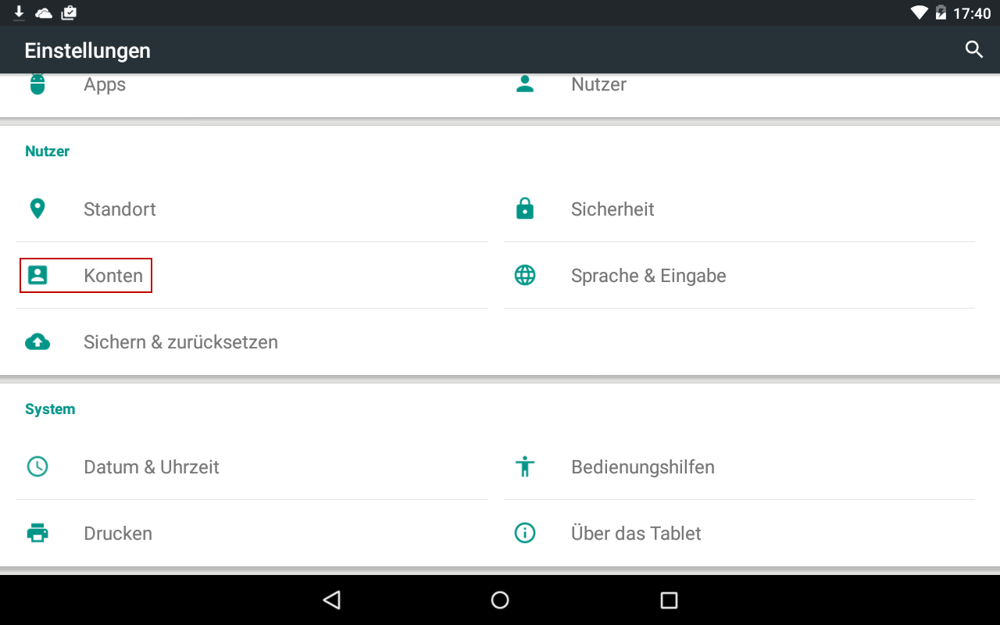
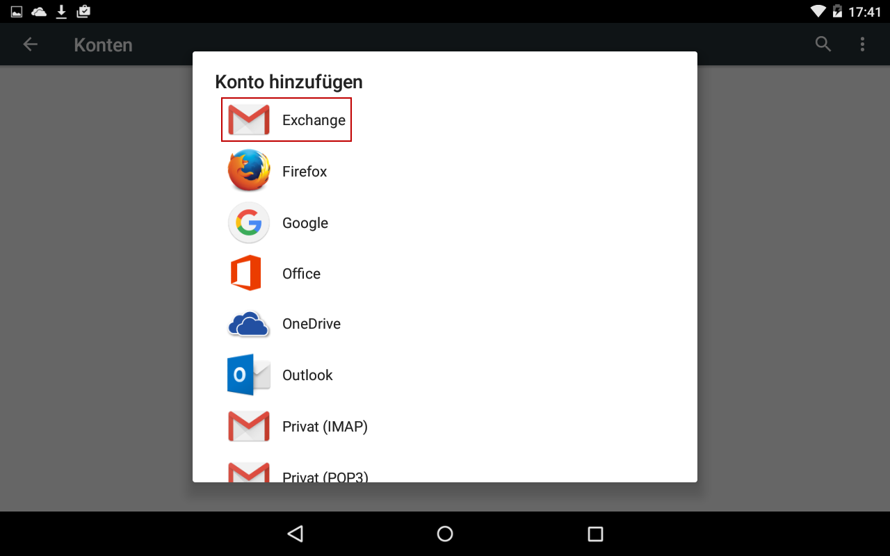
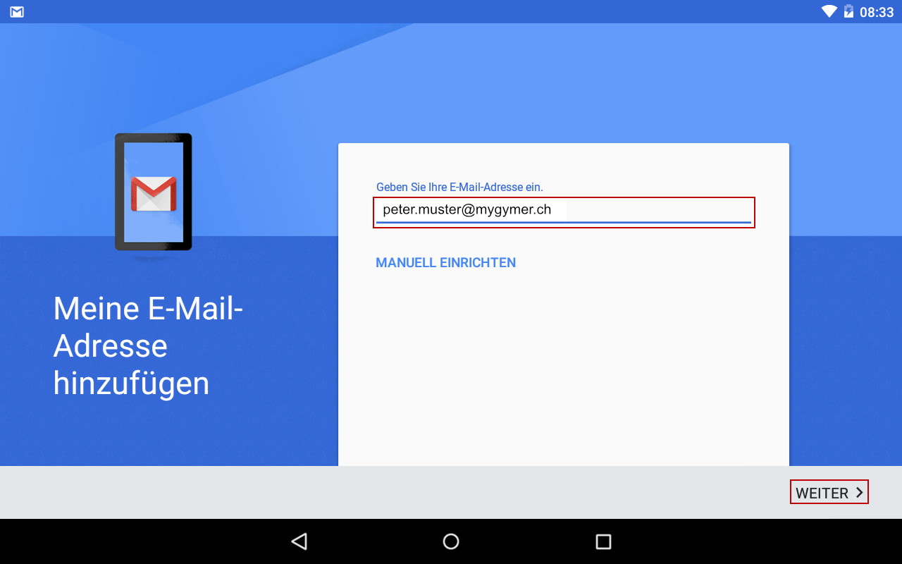
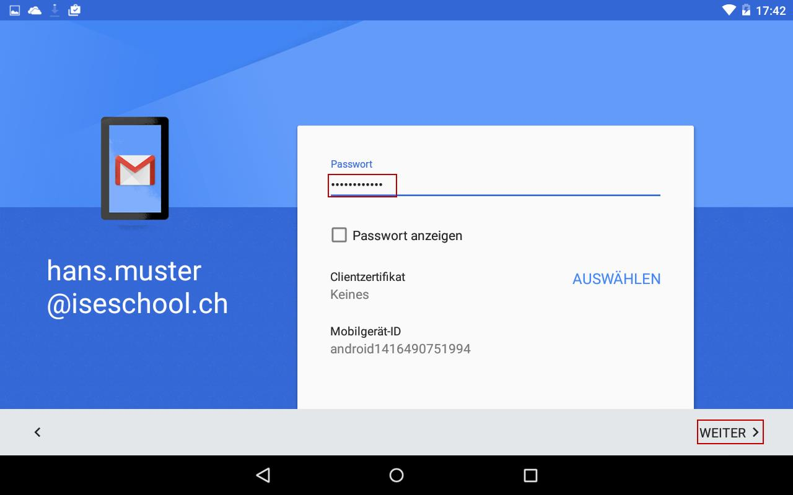
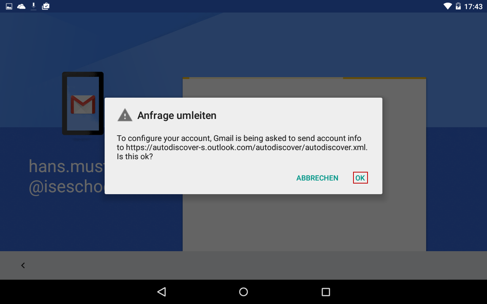
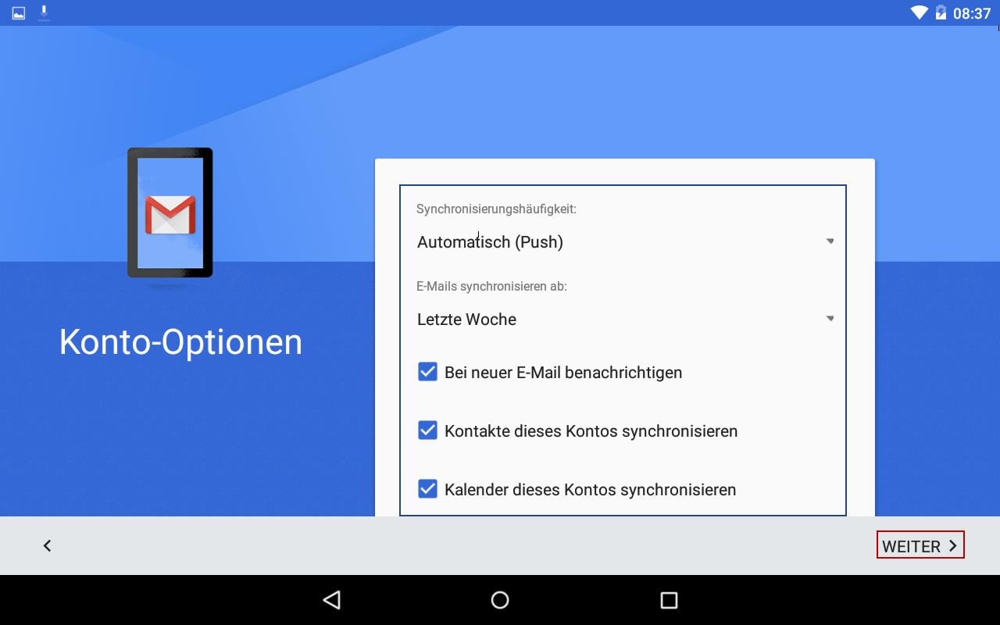

---
systems:
  - Android
sidebar_position: 20
sidebar_custom_props:
  icon: mdi-email
  source: gym-kirchenfeld
  path: /docs/byod/android/e-mail/README.md
draft: false
---

# E-Mail einrichten

## Microsoft Outlook (empfohlen)

1. Installiere die Microsoft Outlook-App aus dem Google Play Store:

   [Microsoft Outlook im Google Play Store][1]

2. Starte die App und drücke auf _Jetzt Starten_.
3. Gib deine Schul-E-Mail-Adresse _vorname.nachname@mygymer.ch_ ein und drücke auf _Weiter_.
4. Gib dein Passwort ein und drücke auf _Anmelden_.
5. Drücke auf _Überspringen_.

## Gmail

Du kannst deine E-Mails, Termine und Kontakte mit deinem Android Phone oder Tablet synchronisieren.

1. Öffne die _Einstellungen_ auf deinem Gerät, scrolle in den Bereich _Nutzer_ und wähle dort _Konten_.

    

2. Drücke auf der Übersichtsseite auf _:mdi-plus: Konto hinzufügen_.

3. Wähle _Microsoft Exchange_:

    

4. Trage in der nächsten Ansicht deine E-Mail Adresse ein. Klicke auf _Weiter_.

    

5. Anschliessend wirst du nach deinem Passwort gefragt.

    

6. Bestätige danach die Meldung «Anfrage umleiten» mit _OK_.

    

7. Auf Android werden die E-Mail Einstellungen zum Teil nicht automatisch erkannt. Trage deshalb noch einmal deine E-Mail Adresse ein und bei Server «outlook.office365.com». Bestätige mit _Weiter_.

    

8. Sobald du erfolgreich angemeldet werden konntest, kannst du noch diverse Einstellungen konfigurieren. Z.B. welche Daten synchronisiert werden und wie häufig synchronisiert wird.

    

9. Jetzt kannst du deine Daten mit der Gmail App synchronisieren.

[1]: https://play.google.com/store/apps/details?id=com.microsoft.office.outlook
