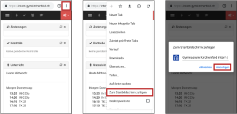
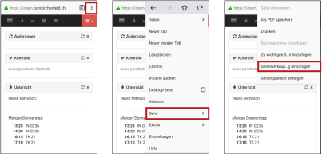

---
systems:
  - Android
sidebar_position: 40
sidebar_custom_props:
  icon: mdi-account-multiple
  source: gym-kirchenfeld
---

# Klassenbuch einrichten

Das elektronische Klassenbuch unserer Schule findest du auf der Webseite intern.gymkirchenfeld.ch. Verwende den folgenden QR-Code, um die Seite mit dem Smartphone zu öffnen:

Du kannst für eine Webseite ein Link auf dem Home-Bildschirm erzeugt werden. Damit kann die Webseite gleich einfach wie eine App geöffnet werden:

## Google Chrome

1. Tippe auf die drei senkrechten Punkte, um das Menü zu öffnen.
2. Wähle den Menüpunkt _Zum Startbildschirm zufügen_.
3. Ändere wenn gewünscht die Beschriftung und tippe auf _Hinzufügen_.

## Firefox

1. Tippe auf die drei senkrechten Punkte, um das Menü zu öffnen.
2. Wähle den Menüpunkt _Seite_.
3. Wähle den Menüpunkt _Seitenverknüpfung hinzufügen_.

