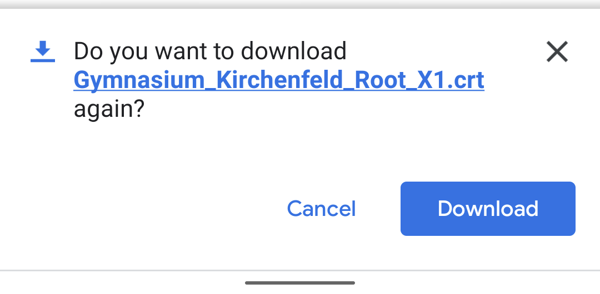
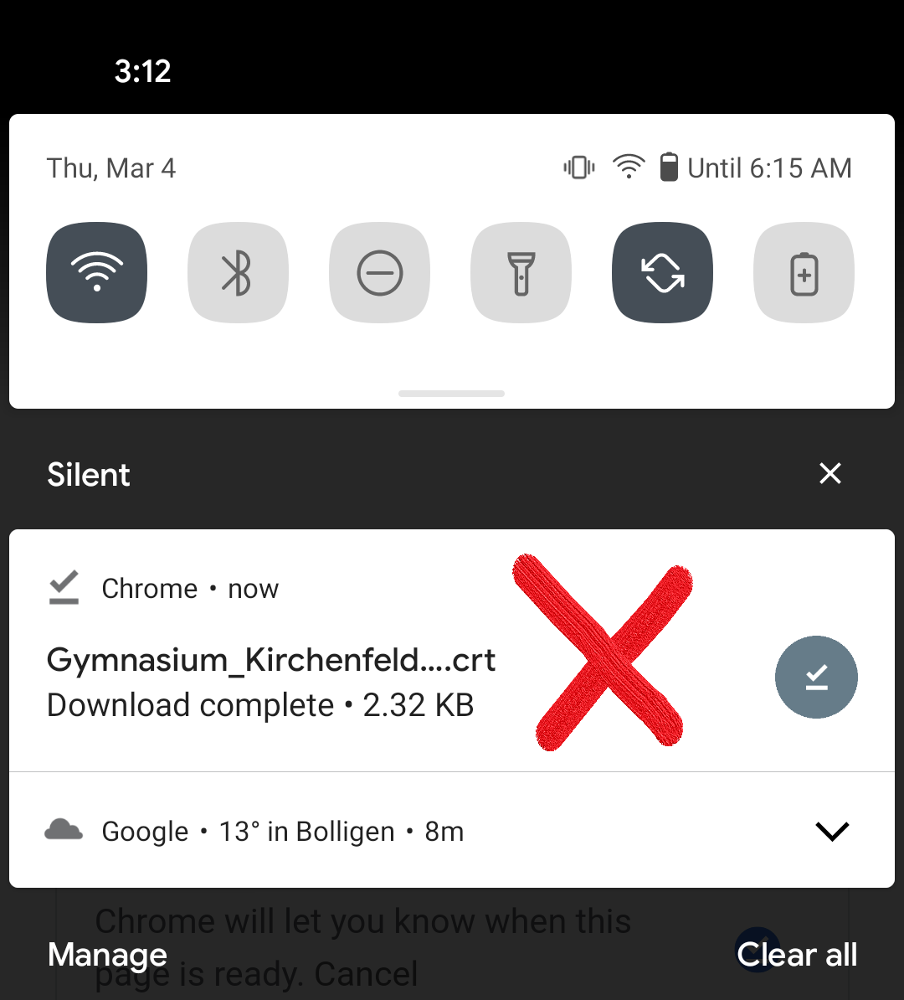
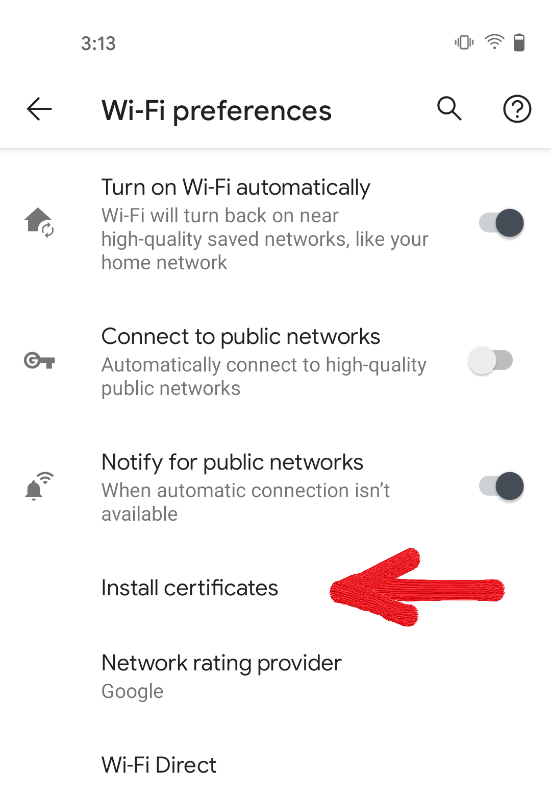
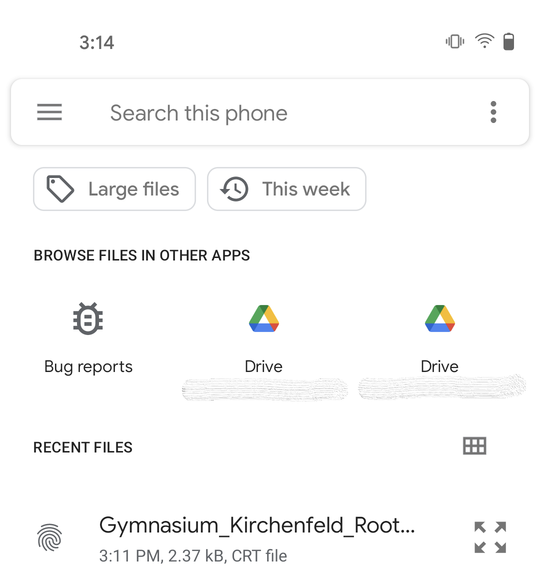
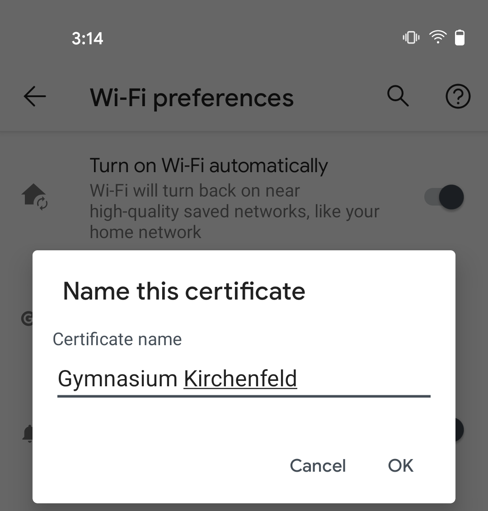
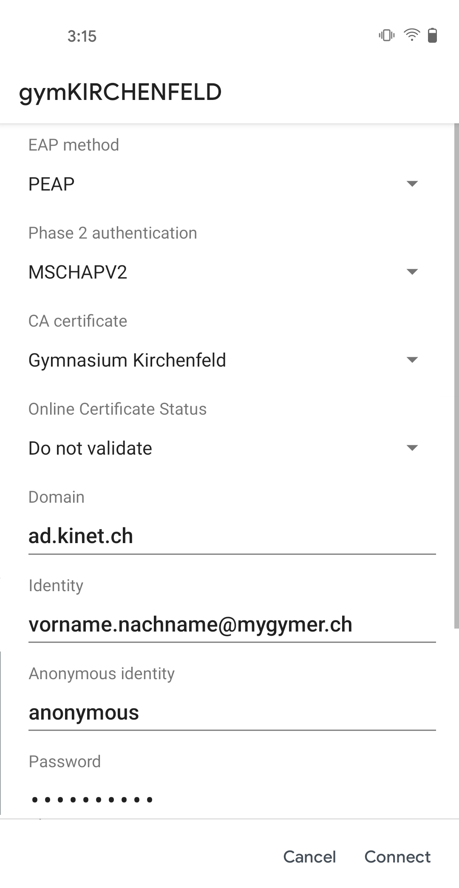

---
systems:
  - Android
sidebar_position: 10
sidebar_custom_props:
  icon: mdi-wifi
  source: gym-kirchenfeld
---

# WLAN einrichten

## Automatische Installation

Leider können wir für Android (noch) keine automatische Installation anbieten. Bitte folge stattdessen den Schritten in nächsten Kapitel.

## Manuelle Installation

1. Lade das Schul-Zertifikat herunter.

   :::tip
   Dieser Schritt ist ab Android 11 **unumgänglich** und für Android <= 10 ebenfalls empfohlen.
   :::

   

   Alternativ kann das Zertifikat auch unter folgender Adresse heruntergeladen werden:

   [:mdi-download: WLAN-Zertifikat Gymnasium Kirchenfeld][1]

   [1]: http://media.mygymer.ch/wifi/Gymnasium_Kirchenfeld_Root_X1.crt

   Wähle nach dem Öffnen der Webseite _Download_.

   

2. Bitte die heruntergeladene Datei **nicht** wie üblich durch Antippen öffnen, das Zertifikat muss in den WLAN-Einstellungen importiert werden.

   

3. Öffne die Einstellungsseite mit den WLAN-Verbindungen (z.B. _Einstellungen_ ‣ _Netzwerk & Internet_ ‣ _WLAN_).
4. Öffne die erweiteren WLAN-Einstellungn. Je nach Android-Version oder Telefonmodell ist ein anderer Weg nötig:
   - Falls du oben rechts drei Punkte hast, tippe darauf und wähle _Erweitert_.
   - Falls nicht, sollte unten den verfügbaren Netzwerken ein Eintrag _WLAN-Einstellungen_ auftauchen. Tippe darauf und wähle anschliessend _Erweitert_.
5. Anschliessend tippst du auf _Zertifikate installieren_.

   

6. Suche die heruntergeladene Datei `Gymnasium_Kirchenfeld_Root_X1.crt` und tippe sie an. Wenn du gefragt wirst, wo du das Zertifikat installieren möchtest, wähle die Option _WLAN_.

   

7. Wähle einen sinnvollen Namen, z.B. `Gymnasium Kirchenfeld` (wird weiter unten gebraucht).

   

8. Wähle das Netzwerk _gymKIRCHENFELD_.
9. Stelle sicher, dass du folgende Einstellungen verwendest:

   

10. Tippe auf _Verbinden_.
