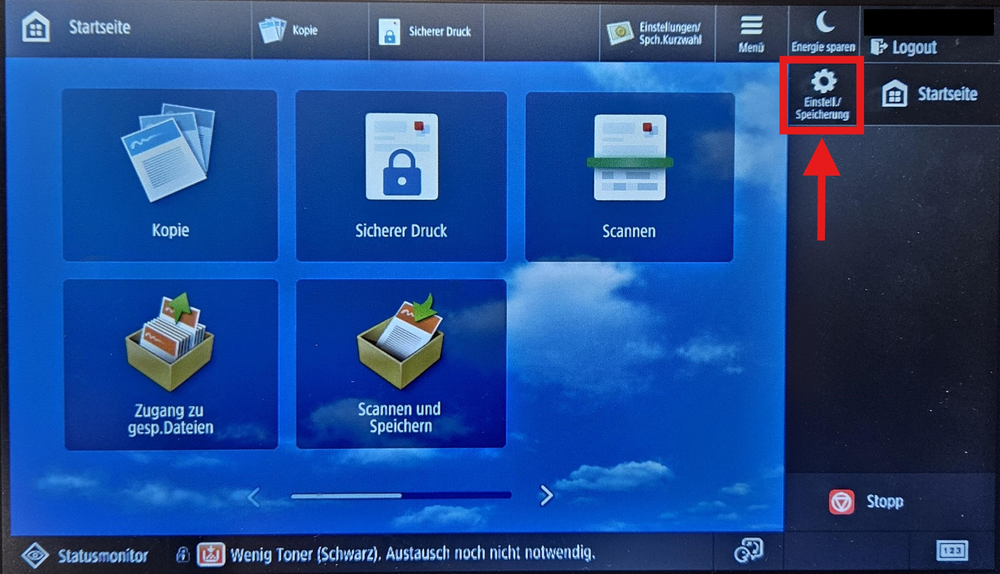
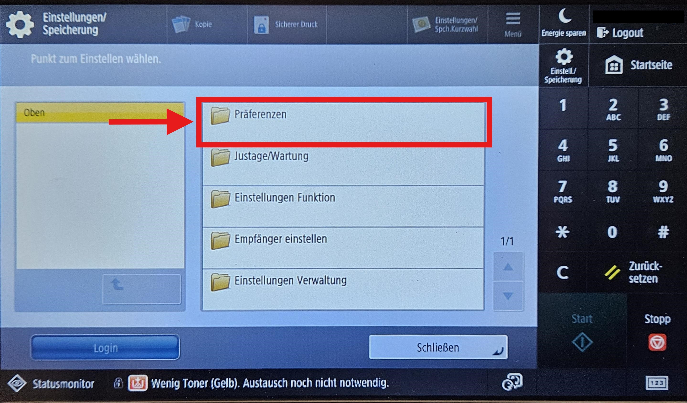
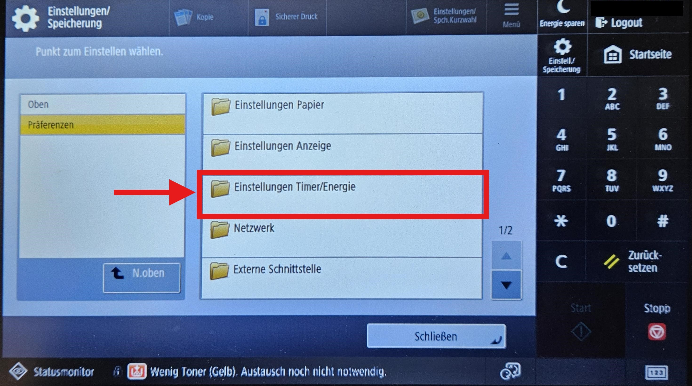
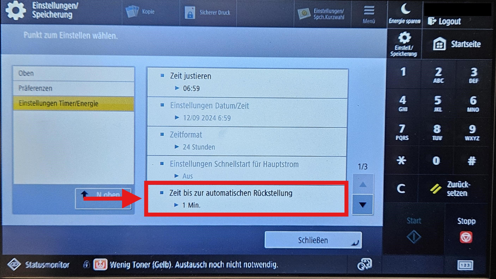
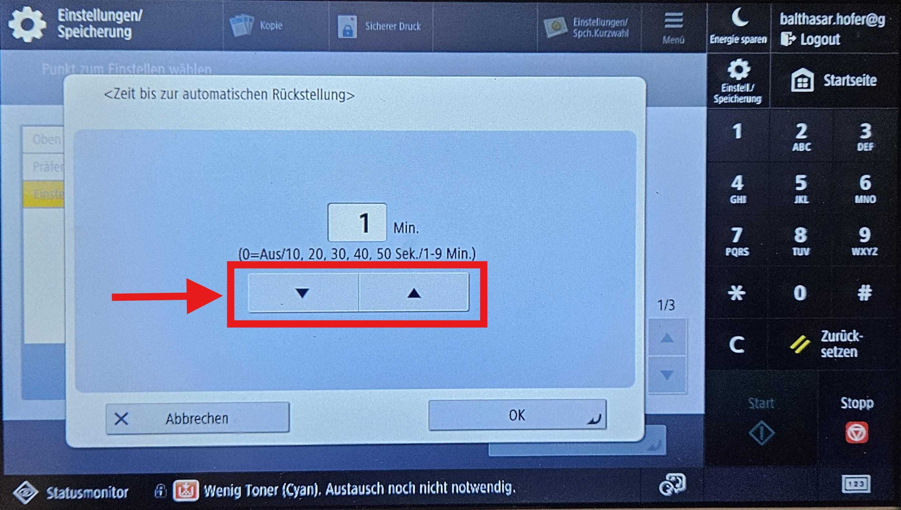

# Bildschirmtimeout

Standardmässig wird man am Drucker nach **30 Sekunden** abgemeldet. Dies kann im persönlichen Profil angepasst werden.

:::tip[Anleitung]
Ausgehend von der Startseite :mdi[home]:

__Einstellungen :mdi[cog] > Präferenzen > Einstellungen Timer/Energie__ und dann auf 

__Zeit bis zur automatischen Rückstellung__
:::

## Schritt für Schritt

:::cards{basis=400px}

::br

::br

::br

::br

:::
