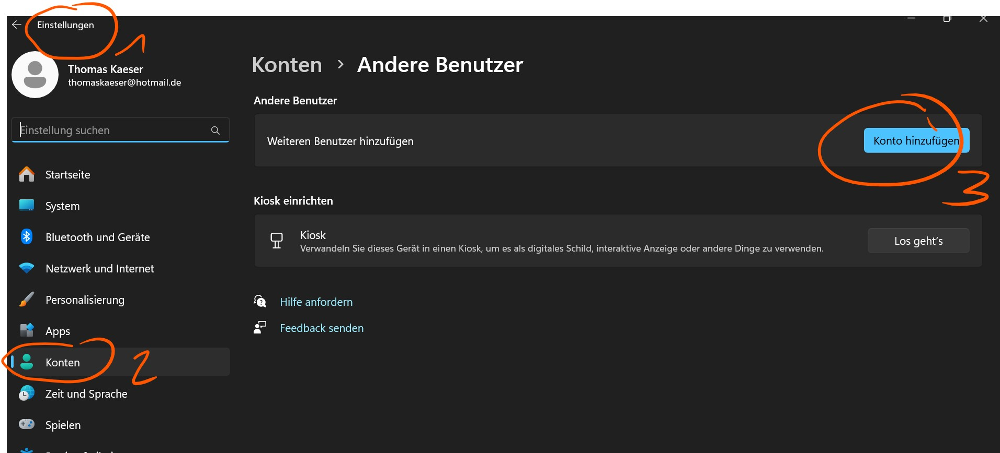
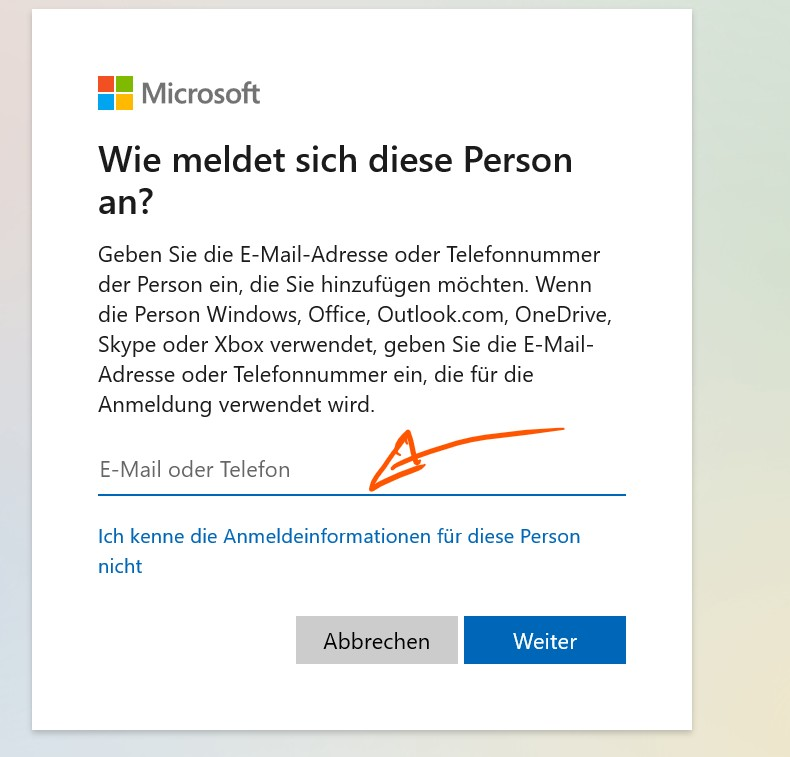
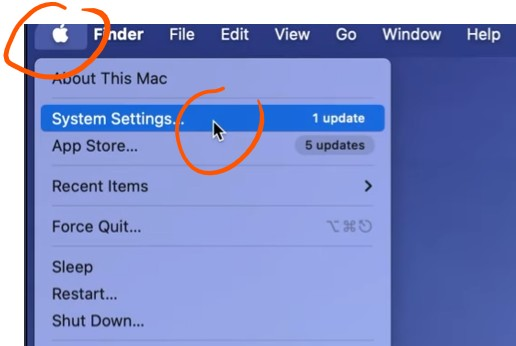
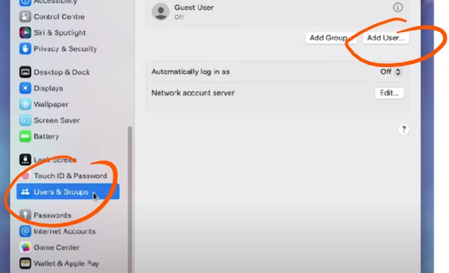
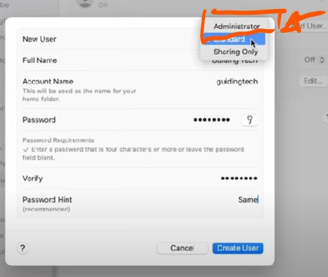

---
sidebar_custom_props:
  icon: mdi-account-supervisor
  path: /docs/byod/geraeteeinrichtenk/README.md
sidebar_position: 1
---

# Ersteinrichtung

:::info
**Hier findest du Anleitungen, um deinen Laptop und dein Smartphone für den Gebrauch an unserer Schule einzurichten.**

Du kannst die Einrichtung von daheim aus vornehmen und in der Schule. Von daheim aus kannst du nicht alles einrichten. Richte nach Möglichkeit aber alles ein, was du von daheim einrichten kannst.

 **Achtung: Die Aufgaben 1 bis 4 (s. weiter unten) möglichst rasch erledigen.**
:::

Hast du von der alten Schule her eine Office365 Lizenz, so beachte unbedingt [👉 das](../../anderesoftware/office365/README.md).

Du befindest dich übrigens auf der ict-Seite der Schule, auf der du für alle möglichen technischen Probleme und Fragen Antworten finden kannst. Du kannst die Adresse dieser Seite im Browser als Favorit speichern oder sogar als App auf deinem Laptop oder Smartphone einrichten. Eine Anleitung findest du unter [Tipps](../../tipps/01-webseite-als-app/README.md).

Hast du beim Einrichten Probleme, kannst du dich beim Support für Schüler:innen melden:

QR-Codes findest du im Schulhaus. Mailadresse für den Support: [it-help-for-students@bernedu.ch](mailto:it-help-for-students@bernedu.ch). Wichtig: die grünen QR-Codes in den Schulzimmern sind nur für die Lehrpersonen gedacht.

::::tip[Zusätzliches Benutzerkonto einrichten]
Wir empfehlen ein Benutzerkonto für die Schule einzurichten, damit Probleme zwischen einem bisherigen Konto der alten Schule und/oder einem privaten Konto von vornherein ausgeschlossen werden.

:::solution[Anleitung]
<Tabs>
<TabItem value="Win" label="Windows" default>

</TabItem>
<TabItem value="OSX" label="Mac">

</TabItem>
</Tabs>
:::
::::

<Tabs>
<TabItem value="home" label="1. Vorgängig" default>

:::danger[Vorgängig]
Eigenständige Einrichtung zu Hause. Es wird erwartet, dass diese Schritte bis am 15. Juni erledigt werden.
:::

:::aufgabe[Schritte zu Hause, erledigt bis 15. Juni]

1. Ersteinrichtung deines Schulkontos [👉 Ersteinrichtung Schulkonto](../../schulkonto/README.md)
2. Mehrfachauthentifikation einrichten [👉 MFA](../../schulkonto/mfa/README.md)
3. Mail einrichten [Mail einrichten](../mail/outlook-web/README.md)
4. Foto für den Schüler:innenausweis [👉 Foto für den Ausweis](../../schulkonto/foto-ausweis/README.md)
5. Updates installieren [👉Updates](/docs/tipps/updates/README.md)
6. Office-Programme installieren: [👉 Office365](http://portal.office.com/)
   - Office365 (Word, Excel, Powerpoint)
   - Teams
   - OneDrive
   - OneNote
7. Weitere Programme
   - Mailprogramm einrichten [👉 Mailprogramm](../mail/mail-programme)
   - WebUntis: Stundenplan-App auf dem Smartphone [👉 Stundenplan](../stundenplan)
   - Adobe-Programme [👉 Adobe](../../anderesoftware/adobe)
   - Programm für elektronische Prüfungen [👉 E-Prüfen](../../anderesoftware/digitales%20prüfen/)
8. Abschluss: 
   - Hier kannst du deine Installationen testen: Teile mit gbsl.onboarding@bernedu.ch eine Word-Datei: [Word-Datei teilen](../onedrive/Dateienteilen)
   - Fülle dieses Formular aus [👉](https://forms.office.com/e/8rwV7ixe5G)

:::

</TabItem>
<TabItem value="school" label="2. Am ersten Schultag">

:::warning[An der Schule]
Am ersten Schultag die Geräte an der Schule in Betrieb nehmen.
:::

:::aufgabe[Schritte an der Schule]
[👉 Wlan-Zugang einrichten](../wlan/README.md)
:::

</TabItem>
</Tabs>
