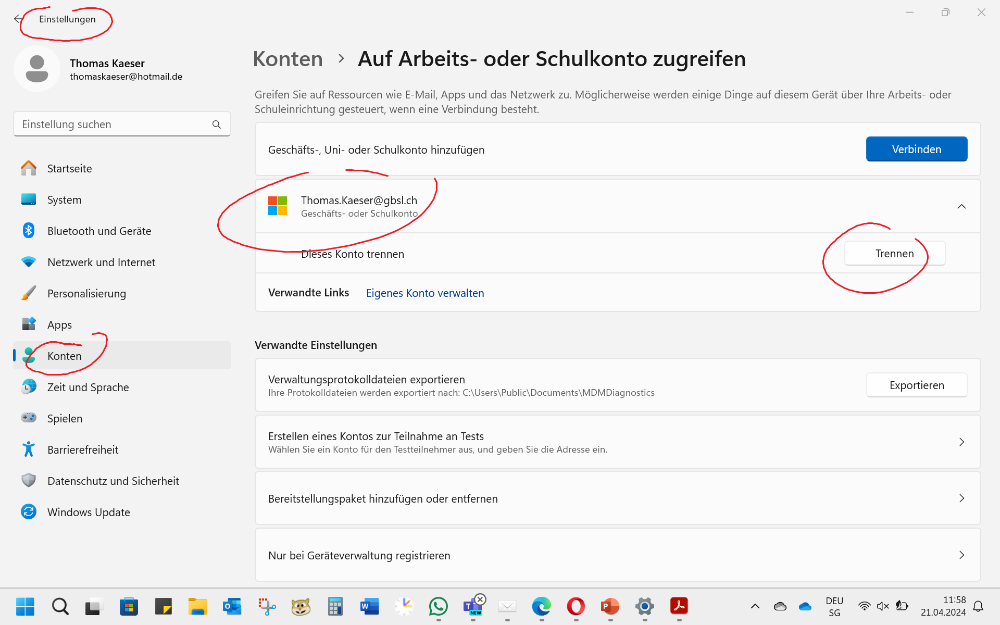

---
sidebar_custom_props:
  icon: mdi-block-helper
  tags: ["Problem Installation"]
  path: /docs/byod/installationsprobleme/README.md
sidebar_position: 39
---

# Installationsprobleme

Es kann vorkommen, dass du Probleme bei der Installation von Office 365 hast. 

Ursachen sind meist eine falsche Anmeldung der Apps: Unbedingt das Häkchen nicht setzen bei den Apps und auf keinen Fall "Verwaltung durch das Unternehmen" wählen oder
das Einrichten eines Arbeits- oder Schulkontos mit der gbsl-Adresse.

Probleme bereiten aber auch vorherige Installationen von office, insbesondere ein office aus der vorherigen Schule. 

Mac-Laptops
: Entferne die verbliebenen Spuren der alten Office-Installation oder der alten Office-Lizenz mit einem [Removal-Tool](https://support.microsoft.com/en-us/office/how-to-remove-office-license-files-on-a-mac-b032c0f6-a431-4dad-83a9-6b727c03b193).
Windows-Gerät
: Überprüfen, ob du von der alten Schule her noch immer ein Schulkonto hast. Falls ja, muss dieses entfernt werden, in dem du auf "trennen" klickst.
: __Einstellungen :mdi-cog--blue: > Konten :mdi-account--cyan: > Trennen__

