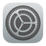
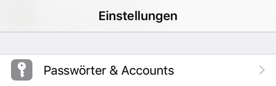
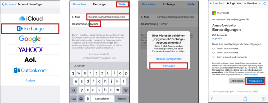
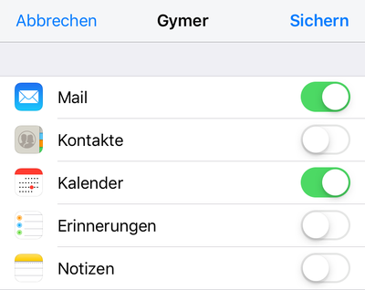

# E-Mail einrichten

Du kannst deine E-Mails, Termine und Kontakte mit deinem iPhone, iPad oder iPod synchronisieren. Am besten verwendest du dazu die Mail-App von Apple. Es ist nicht nötig, eine zusätzliche App zu installieren.

## Konto einrichten

Um das Schul-E-Mail-Konto auf deinem Gerät einzurichten, öffnest du die _Einstellungen_:

Nun wählst du den Menüpunkt _Passwörter und Accounts_:

Dort klickst du auf __Account hinzufügen__. Gehe dann so vor:

1. Wähle __Exchange__ aus.
2. Gib deine Schul-E-Mail-Adresse (_vorname.nachname@mygymer.ch_) und eine Beschreibung (z.B. _Gymer_) ein und drücke auf __Weiter__.
3. Drücke auf __Anmelden__. Gib anschliessend dein Passwort ein (kein Bild).
4. Drücke auf __Akzeptieren__.

Nun kannst du auswählen, welche Arten von Daten du auf dein Gerät holen willst. Wähle hier E-Mail und Kalender:

Nun kannst du mit deinem Gerät auf deine Schul-E-Mails zugreifen.
