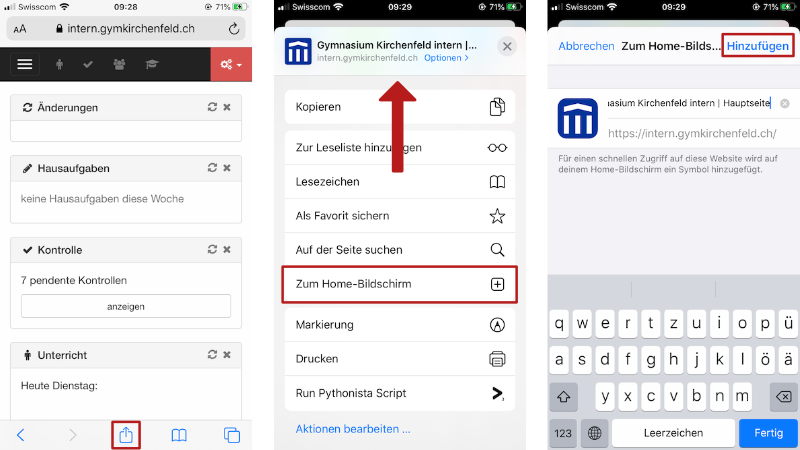

---
systems:
  - iOS / iPadOS
sidebar_position: 40
sidebar_custom_props:
  icon: mdi-account-multiple
  source: gym-kirchenfeld
  path: /docs/byod/ios/intern/README.md
draft: true
---

# Klassenbuch einrichten

Das elektronische Klassenbuch unserer Schule findest du auf dieser Webseite:

Du kannst für eine Webseite ein Link auf dem Home-Bildschirm erzeugt werden. Damit kann die Webseite gleich einfach wie eine App geöffnet werden:

1. Öffne in Safari das _Teilen_-Menü mit :mdi[exportVariant].
2. Ziehe das Menü nach oben und tippe auf die Aktion __Zum Home-Bildschirm__.
3. Nun kannst du den Namen anpassen und auf __Hinzufügen__ tippen.

