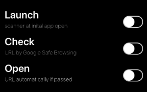

---
systems:
  - iOS / iPadOS
sidebar_position: 30
sidebar_custom_props:
  icon: mdi-qrcode
  source: gym-kirchenfeld
  path: /docs/byod/ios/qrscanner/README.md
---

# QR-Scanner einrichten

## iOS 13 oder neuer

Wenn du auf deinem iPhone iOS 13 oder neuer installiert hast, kannst du mit der vorhandenen Kamera-App QR-Codes scannen:

## iOS 8 oder neuer

Falls du ein älteres iPhone hast, dann installiere die App **QR Blank**:

[QR Blank im App Store](https://apps.apple.com/app/id1137064763)

Im Gegensatz zu anderen QR-Apps ist diese gratis, werbefrei und funktioniert ab iOS 8. Damit du App gut benutzen kannst, solltest du die Einstellungen _Check_ und _Open_ abschalten:

