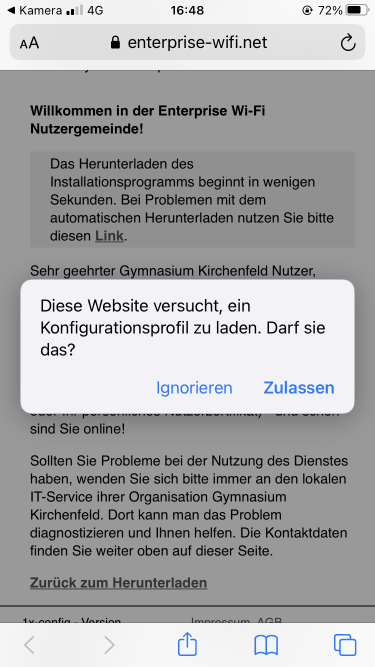
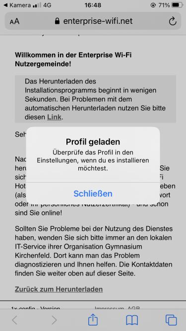
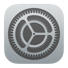
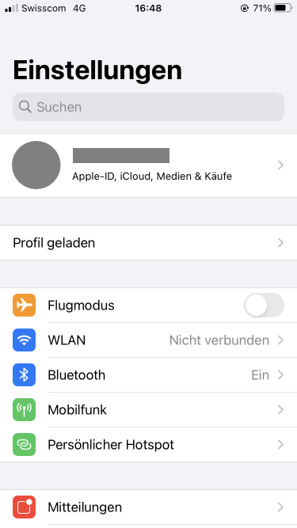
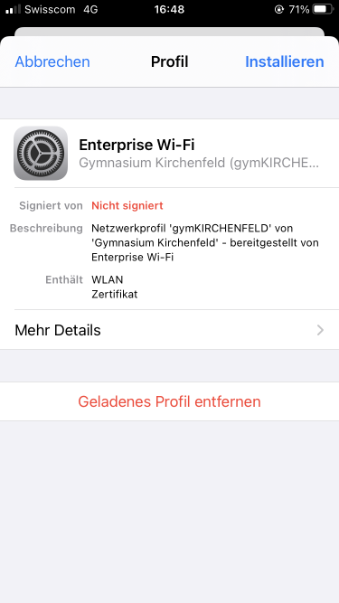
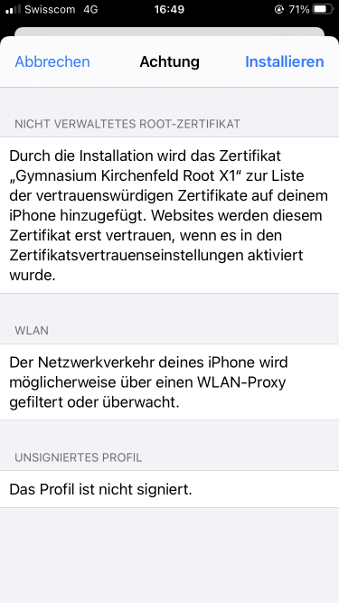
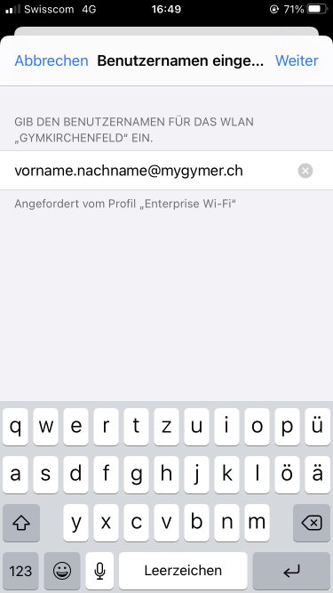
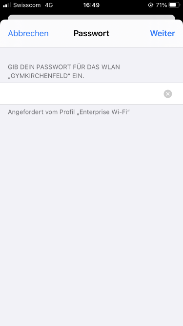

---
systems:
  - iOS / iPadOS
sidebar_position: 10
sidebar_custom_props:
  icon: mdi-wifi
  source: gym-kirchenfeld
  path: /docs/byod/ios/wlan/README.md
draft: true
---

# WLAN einrichten

## Automatische Konfiguration (empfohlen)

Du kannst dein Gerät mit folgendem QR-Code automatisch konfigurieren lassen:

Alternativ kann das WLAN-Profil auch unter folgender Adresse heruntergeladen werden:

[:mdi-download: WLAN-Konfigurationsprogramm (neues WLAN gymKIRCHENFELD)][1]

[1]: https://enterprise-wifi.net/?idp=572&profile=332

1. Beim Herunterladen wird gefragt, ob du das Profil tatsächlich speichern willst. Tippe hier auf __Zulassen__:

   

2. Es wird ein Hinweis angezeigt, dass du die Installation in den _Einstellungen_ abschliessen musst. Tippe hier auf __Schließen__:

   

3. Öffne die _Einstellungen_ mit folgendem Icon:

   

4. Nun unbedingt das **vorbereitete Profil öffnen** und nicht von Hand die WLAN-Einstellungen vornehmen, indem du auf __Profil geladen__ tippst:

   

5. Tippe oben rechts auf __Installieren__:

   

6. Trotz Warnung darf weitergefahren werden. Es ist alles in Ordnung, unser Profil ist einfach nicht von Apple offiziell überprüft worden. Tippe auf __Installieren__:

   

7. Nun ist das Profil vorbereitet und du kannst dich am WLAN anmelden. Als Benutzername gibst du die **Schul-E-Mail-Adresse** ein (_vorname.nachname@mygymer.ch_ oder _vorname.nachname@gymkirchenfeld.ch_). Tippe anschliessend auf __Weiter__.

   

9. Als Passwort verwendest du dein Schul-Passwort. Tippe anschliessend auf __Weiter__.

   
