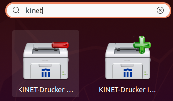
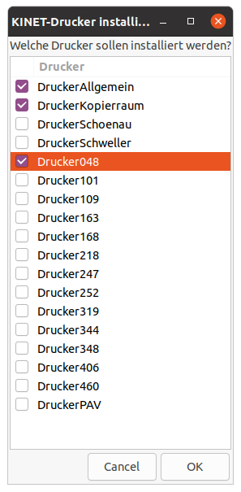
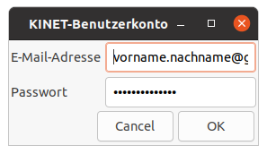

---
systems:
  - Linux
sidebar_position: 20
sidebar_custom_props:
  icon: mdi-printer
  source: gym-kirchenfeld
  path: /docs/byod/linux/drucker/README.md
---

# Drucker installieren

Um die Drucker einrichten zu können, muss zuerst zwingend [unser Kinet-Repository hinzugefügt werden.](../repo/)

## Druckerpaket für Schule installieren

``` bash
sudo apt install cups-kinet
```

## Drucker einrichten

* Anschliessend mit der Suchfunktion des Betriebssystems nach dem Begriff _kinet_ suchen. Das nun erscheinende Druckersymbol mit dem Pluszeichen wählen.



* Im nun erscheinenden Fenster können alle Drucker ausgewählt werden, die installiert werden sollen. Mit einem Klick auf OK bestätigen.



* Danach müssen der Benutzername, dies ist die Schulmailadresse _vorname.nachname@gymkirchenfeld.ch_, und das Schulpasswort eingegeben werden. 



* Es erfolgt eine erneute Aufforderung zur Passworteingabe. Hier muss das Passwort des Linux-Benutzers eingegeben werden. 

* Dann kann man den Standardddrucker auswählen.
