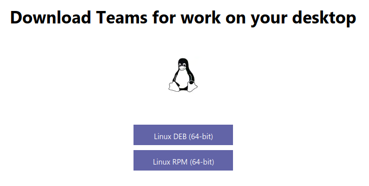

# Teams einrichten


## Teams installieren

1. Öffne die Download-Seite von Teams.

    [Microsoft Teams Download](https://www.microsoft.com/de-ch/microsoft-365/microsoft-teams/download-app)

2. Lade je nach Linux-Variante das entsprechende Installationspaket herunter:

    - Debian oder Ubuntu: __Linux DEB (64-bit)__
    - Red Hat: __Linux RPM (64-bit)__

    

3. Öffne das Terminal und wechsle in den Download-Ordner:

    ``` bash
    cd ~/Downloads
    ```

4. Installiere das heruntergeladene Paket:

    ``` bash
    sudo apt install -i teams_1.3.00.16851_amd64.deb
    ```

    Danach kwerden die Updates via Paketverwaltung durchgeführt.
