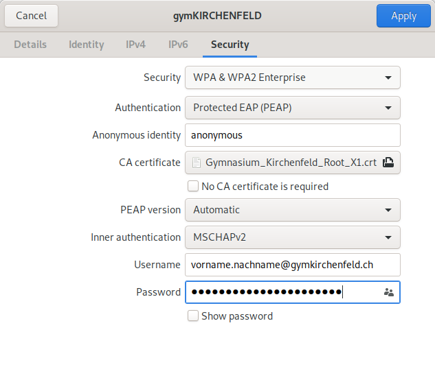

---
systems:
  - Linux
sidebar_position: 10
sidebar_custom_props:
  icon: mdi-wifi
  source: gym-kirchenfeld
  path: /docs/byod/linux/wlan/README.md
draft: true
---

# WLAN einrichten

## Automatische Konfiguration (empfohlen)

Mit der automatischen Installation wird ein allfällig vorhandenes, falsch konfiguriertes Profil mit demselben Namen entfernt. Zudem wird unser Zertifikat installiert (dies muss allerdings bestätigt werden).

[:mdi-download: WLAN-Konfigurationsprogramm (neues WLAN gymKIRCHENFELD)][1]

[1]: https://enterprise-wifi.net/?idp=572&profile=332

:::warning E-Mail-Adresse
Beim neuen Netzwerk __gymKIRCHENFELD__ bitte die **Schul-E-Mail-Adresse** in das Feld __Benutzername__ eintragen!
:::

1. Klicke auf den grossen braunen Button zum Herunterladen des Installers.

   Falls auf der Webseite ein anderes Betriebssystem und nicht Linux angezeigt wird, klickst du unterhalb des grossen braunen Buttons auf _Einen anderen Installer auswählen_ und wählst anschliessend _Linux_.
2. Um das Python-Script auszuführen, öffnest du ein Terminal und tippst folgenden Befehl ein:

   `python3 Enterprise_Network-linux-Gymnasium_Kirchenfeld.py`

   und folgst den Anweisungen des Programms.

## Manuelle Konfiguration

1. Lade das Zertifikatherunter und speichere es:
   [:mdi-download: Zertifikat][2]
2. Wähle das WLAN-Netzwerk **gymKIRCHENFELD** aus.
3. Öffne die Netzwerk-Einstellungen.
4. Klicke auf das Zahnrad-Symbol, um das WLAN zu konfigurieren.
5. Wechsle ins Tab _Sicherheit_.
6. Wähle folgende Einstellungen aus:

    - _Sicherheit_: **WPA & WPRA2 Enterprise**
    - _Authentifizierung_: **Protected EAP (PEAP)**
    - _Anonyme Identität_: **anonymous**
    - _CA Zertifikat_: öffne das in Schritt 1 gespeicherte Zertifikat.
    - _Innere Authentifizierung_: **MSCHAPv2**
    - _Benutzername_: (deine [Schul-E-Mail-Adresse](../../konto/))
    - _Passwort_: (dein Passwort)

7. Klicke auf __Anwenden__.

[2]: https://media.mygymer.ch/wifi/Gymnasium_Kirchenfeld_Root_X1.crt
