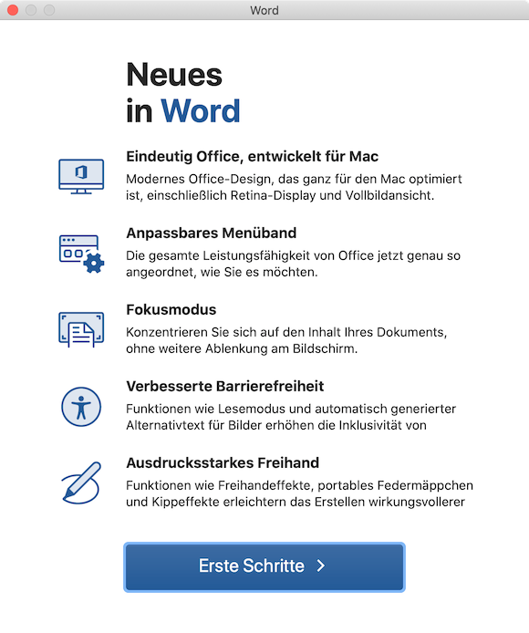
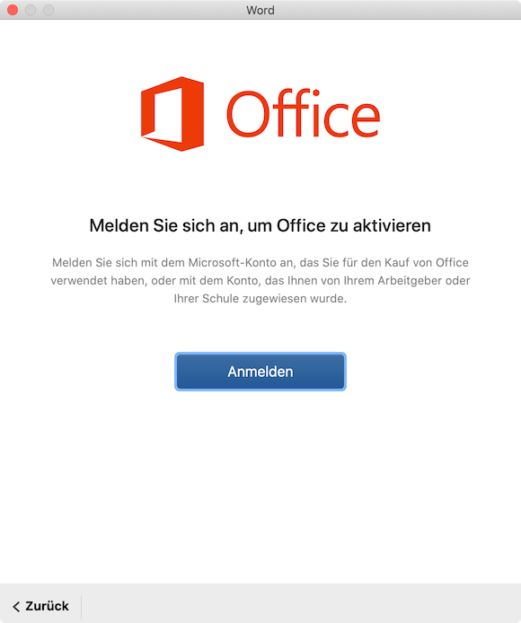
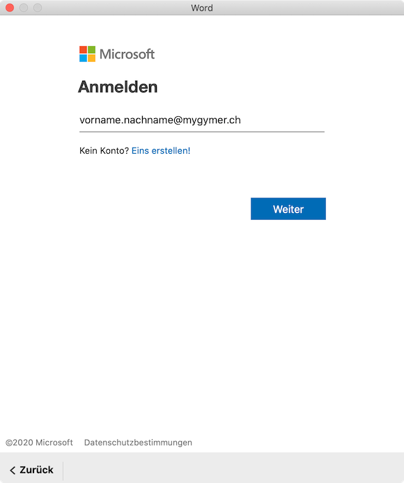
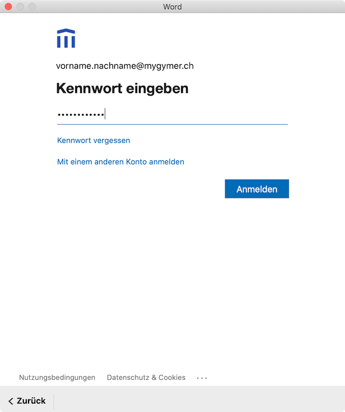
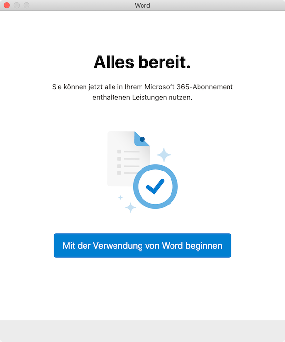

# Microsoft 365 einrichten

Um unsere Microsoft 365 Schul-Cloud verwenden zu können, musst du:

1. Die Microsoft Apps aus dem App Store installieren,
2. dich mit einer App (z.B. Word) an der Schul-Cloud anmelden.

## Microsoft Apps installieren

Installiere die folgenden Apps aus dem App Store:

- Microsoft Word
- Microsoft Excel
- Microsoft PowerPoint
- Microsoft OneNote

## Anmelden an Microsoft 365

Beim ersten Start einer Microsoft 365-App musst du dich an der Schul-Cloud anmelden, damit die App

- auf die in der Cloud gespeicherten Dokumente zugreifen kann.
- überprüfen kann, ob du eine gültige Lizenz besitzt.

:::details Anmeldung Schritt für Schritt

1. Öffne das Launchpad, um Microsoft Word zu starten. Das Launchpad kann mit der Taste [[F4]] oder mit folgendem Icon geöffnet werden:

    

2. Klicke im Launchpad auf das Word-Icon:

    

3. Klicke auf __Erste Schritte__:

    

4. Klicke auf __Anmelden__:

    

5. Gib deine Schul-E-Mail-Adresse ein und klicke auf __Weiter__:

    

6. Gib dein Kennwort ein und Klicke auf __Anmelden__:

    

7. Klicke auf __Mit der Verwendung von Word beginnen__:

    

:::

[1]: https://portal.office.com/account#home
