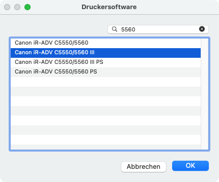
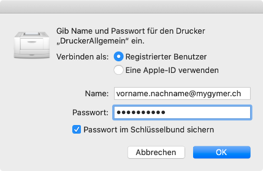

---
systems:
  - macOS
sidebar_position: 60
sidebar_custom_props:
  icon: mdi-printer
  source: gym-kirchenfeld
  path: /docs/byod/macos/drucker/README.md
draft: true
---

# Drucker einrichten

:::warning macOS-Version
Die Behebung der kritischen Sicherheitslücke *PrintNightmare* hat (nicht nur am Gymnasium Kirchenfeld) zur Folge, dass das Drucken auf Windows-Druckserver mit Macbooks nur noch mit den folgenden macOS-Versionen funktioniert:

- Monterey **>= 12.2.1**
- Big Sur **>= 11.6.4**
- Catalina >=10.15.7 **aber nur mit dem Sicherheitsupdate 2022-002**
:::

## Druckertreiber installieren

Bevor du die Drucker der Schule verwenden kannst, musst du den Druckertreiber installieren. Lade den Druckertreiber von dieser Webseite herunter:

[Canon imageRUNNER ADVANCE C5560i III][1]

Installation Schritt für Schritt

1. Klicke auf _Fortfahren_:

    

2. Klicke auf _Fortfahren_:

    

3. Klicke auf _Akzeptieren_:

    

4. Klicke auf _Installieren_:

    

5. Bestätige die Installation mit deinem Fingerabdruck oder klicke auf _Passwort verwenden …_:

    

6. Warte, das kann recht lange dauern.

    

7. Wenn du lange genug gewartet hast, wird die Installation beendet. Nun kannst du auf _Schließen_ klicken:

    

8. Klicke auf _In den Papierkorb legen_:

    

## DruckerAllgemein hinzufügen

1. Öffne die Systemeinstellungen, gehe zu _Drucker & Scanner_ und klicke auf das __:mdi-plus:__-Symbol:

    

2. Damit der Drucker installiert werden kann, muss erst das erweiterte Menü hinzugefügt werden. Mache dazu einen Rechtsklick oder einen Tapp mit zwei Fingern auf dem Trackpad und wähle den Menüpunkt __Symbolleiste anpassen…__:

    

3. Ziehe das Zahnrad-Symbol _Erweitert_ neben das Drucker-Icon oben. Klicke anschliessend auf __Fertig__:

    

4. Klicke auf das Zahnrad-Symbol _Erweitert_ und nimm folgende Einstellungen vor:

    - **Typ:** _Windows printer via spoolss_ auswählen.
    - **URL:** `smb://print1.ad.kinet.ch/DruckerAllgemein` hineinkopieren.
    - **Name:** `DruckerAllgemein` hineinkopieren.
    - **Verwenden:** Menüpunkt __Software auswählen …__ wählen.

    

5. Tippe im Suchfeld **_5560_** ein und wählen den Eintrag **_Canon iR-ADV C5560/5560 III_** aus. Klicke auf __OK__:

    

6. Klicke im vorherigen Fenster auf _Hinzufügen_.

    

## DruckerKopierraum hinzufügen

1. Öffne die Systemeinstellungen, gehe zu _Drucker & Scanner_ und klicke auf das __:mdi-plus:__-Symbol:

    

2. Klicke auf das Zahnrad-Symbol _Erweitert_ (Zahnradsymbol)

 Falls das Zahnradsymbol nicht vorhanden ist

  * Mache einen Rechtsklick oder einen Tapp mit zwei Fingern auf dem Trackpad und wähle den Menüpunkt __Symbolleiste anpassen…__:

    

  * Ziehe das Zahnrad-Symbol _Erweitert_ neben das Drucker-Icon oben. Klicke anschliessend auf __Fertig__:

    

1. Nimm folgende Einstellungen vor:

    - **Typ:** _Windows printer via spoolss_ auswählen.
    - **URL:** `smb://print1.ad.kinet.ch/DruckerKopierraum` hineinkopieren.
    - **Name:** `DruckerKopierraum` hineinkopieren.
    - **Verwenden:** Menüpunkt __Software auswählen …__ wählen.

    

2. Tippe im Suchfeld _5560_ ein und wählen den Eintrag _Canon iR-ADV C5560/5560 III_ aus. Klicke auf __OK__:

    

3. Klicke im vorherigen Fenster auf _Hinzufügen_.

4. Öffne die Systemeinstellungen, gehe zu _Drucker & Scanner_ und klicke auf DruckerKopierraum.

5. Klicke auf _Optionen & Füllstände_ und wähle _Optionen_.

    

6. Ändere folgende Einstellungen:

    - **Papierzufuhroptionen:** High Capacity Cassette Feeding Unit A1
    - **Ausgabeoptionen:** Broschüren Finisher Y1
    - **Ausgabe:** Ein
    - **Lochereinheit:** 2/4 Löcher (Französisch)

    

## Lehrpersonen: Fachschaftsdrucker hinzufügen

1. Öffne die Systemeinstellungen, gehe zu _Drucker & Scanner_ und klicke auf das __:mdi-plus:__-Symbol:

    

2. Klicke auf das Zahnrad-Symbol _Erweitert_ und nimm folgende Einstellungen vor:

    - **Typ:** _Windows printer via spoolss_ auswählen.
    - **URL:** Gemäss der untenstehenden Tabelle einfügen.
    - **Name:** Gemäss der untenstehenden Tabelle einfügen.  
    - **Verwenden:** Menüpunkt __Software auswählen …__ wählen.

    

| Zimmer  | URL                                        | Name            |
| :------ | :----------------------------------------- | :-------------- |
| 028     | `smb://print1.ad.kinet.ch/Drucker028`      | Drucker028      |
| 048     | `smb://print1.ad.kinet.ch/Drucker048`      | Drucker048      |
| 101     | `smb://print1.ad.kinet.ch/Drucker101`      | Drucker101      |
| 109     | `smb://print1.ad.kinet.ch/Drucker109`      | Drucker109      |
| 163     | `smb://print1.ad.kinet.ch/Drucker163`      | Drucker163      |
| 168     | `smb://print1.ad.kinet.ch/Drucker168`      | Drucker168      |
| 218     | `smb://print1.ad.kinet.ch/Drucker218`      | Drucker218      |
| 247     | `smb://print1.ad.kinet.ch/Drucker247`      | Drucker247      |
| 252     | `smb://print1.ad.kinet.ch/Drucker252`      | Drucker252      |
| 319     | `smb://print1.ad.kinet.ch/Drucker319`      | Drucker319      |
| 344     | `smb://print1.ad.kinet.ch/Drucker344`      | Drucker344      |
| 348     | `smb://print1.ad.kinet.ch/Drucker348`      | Drucker348      |
| 406     | `smb://print1.ad.kinet.ch/Drucker406`      | Drucker406      |
| 460     | `smb://print1.ad.kinet.ch/Drucker460`      | Drucker460      |
| PAV     | `smb://print1.ad.kinet.ch/DruckerPAV`      | DruckerPAV      |
| Schönau | `smb://print1.ad.kinet.ch/DruckerSchoenau` | DruckerSchoenau |

3. Für alle Drucker ausser _DruckerSchoenau_: Tippe im Suchfeld _Canon iR1435 PS_ ein und wählen den Eintrag _Canon iR1435 PS_ aus. Klicke auf __OK__

   Für DruckerSchoenau: Tippe im Suchfeld _5560_ ein und wählen den Eintrag _Canon iR-ADV C5560/5560 III PS_ aus. Klicke auf __OK__

4. Klicke im vorherigen Fenster auf _Hinzufügen_.

## Dokument drucken

Damit du die Anmeldedaten für den Druckserver speichern kannst, musst du ein Dokument drucken.

1. Starte _Word_ und erstelle ein neues Dokument.
2. Wähle im Menü __Datei__ den Menüpunkt __Drucken…__.
3. Wähle den Drucker _DruckerAllgemein_ aus und klicke auf __Drucken__.

    

4. Gib deine Schul-E-Mail-Adresse und das Kennwort ein. Aktiviere die Option _Passwort im Schlüsselbund sichern_. Klicke anschliessend auf __OK__:

    

Für das Login verwendest du normalerweise deine **Schul-E-Mail-Adresse**. Deine E-Mail-Adresse lautet so:

|               |                     E-Mail-Adresse |
| :------------ | ---------------------------------: |
| Schüler:innen |        vorname.nachname@mygymer.ch |
| Lehrer:innen  | vorname.nachname@gymkirchenfeld.ch |

Falls "Fehler bei Authentifizierung" erscheint, wenn man drucken möchte

Im Schlüsselbund die Anmeldedaten für den Drucker wieder löschen. 
Als Benutzernamen nicht die Mailadresse verwenden, sondern folgende Benutzernamen nacheinander ausprobieren:

**Für Schüler:innen:**
_vorname.nachname_
_u12345_ (nur Schüler:innen, die nach Mai 2020 in die Schule eingetreten sind!)

**Für Lehrpersonen:**
_xyz_ Lehrer:innenkürzel
_u12345_ (nur Lehrpersonen, die nach Mai 2020 in die Schule eingetreten sind!)

[1]: https://de.canon.ch/support/products/imagerunner/imagerunner-advance-c5560i-iii.html?type=drivers&driverdetailid=tcm:88-2061115
