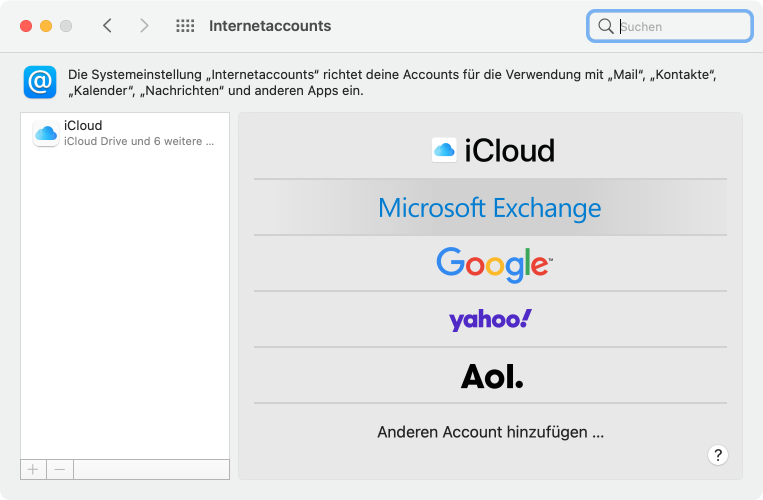
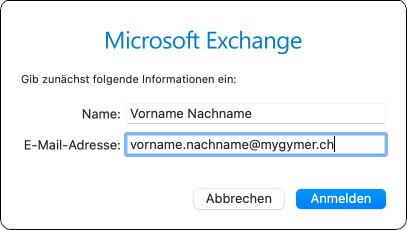
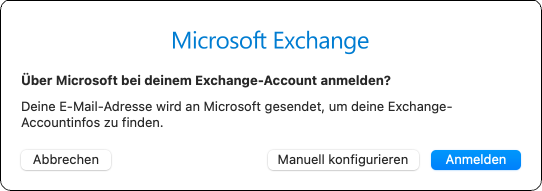
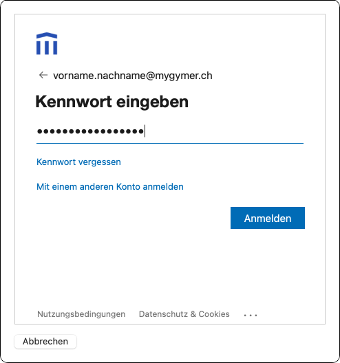
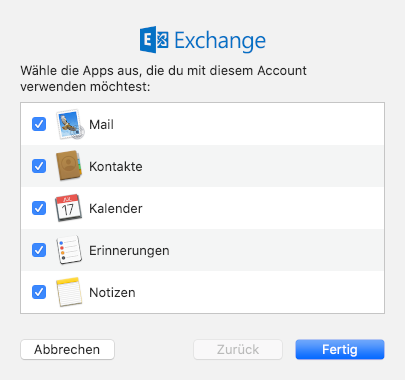

---
systems:
  - macOS
sidebar_position: 30
sidebar_custom_props:
  icon: mdi-email
  source: gym-kirchenfeld
  path: /docs/byod/macos/e-mail/README.md
draft: false
---

# E-Mail einrichten

1. Öffne die __Systemeinstellungen__ und wähle __Internetaccounts__ aus.

2. Wähle __Exchange__ aus.

    

3. Gib deinen Namen und deine Schul-E-Mail-Adresse ein. Klicke anschliessend auf __Anmelden__:

    

4. Klicke auf __Anmelden__:

    

5. Gib dein Passwort ein und klicke auf __Anmelden__:

    

6. Wähle mindestens _Mail_, _Kontakte_ und _Kalender_ aus und klicke auf __Fertig__:

    
