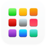

# OneDrive einrichten

## Verbinden von OneDrive

1. Öffne das Launchpad, um OneDrive zu starten. Das Launchpad kann mit der Taste [[F4]] oder mit folgendem Icon geöffnet werden:

    

2. Klicke im Launchpad auf das OneDrive-Icon:

    

3. Gib deine Schul-E-Mail-Adresse ein und klicke auf __Anmelden__:

    

4. Gib dein Kennwort ein und klicke auf __Anmelden__:

    

5. Klicke auf __Weiter__:

    

6. **ACHTUNG GEFAHR:** Falls du die folgende Meldung siehst, musst du unbedingt auf __Neuen&nbsp;Ordner&nbsp;auswählen__ klicken! Grund für die Meldung ist wahrscheinlich, dass du bereits ein anderes OneDrive-Konto mit deinem Computer in den ausgewählten Ordner synchronisierst. Wenn du nicht einen neuen Ordner wählst, kann dies zu Datenverlust führen.

    

    Wenn du diese Meldung nicht siehst, ist alles in Ordnung.

7. Wähle die Ordner, welche du lokal auf deinem Computer synchronisiert haben möchtest. Klicke anschliessend auf __Weiter__:

    

8. Falls die Nachfrage erscheint, ob der _Desktop_ und die Ordner _Dokumente_ und _Bilder_ synchronisiert werden sollen, bei diesen Ordnern **das Häkchen entfernen**. Diese Ordner sollen **nicht** synchronisiert werden. 

9. Jetzt ist die OneDrive-Synchronisation eingerichtet, es folgen nur noch Hinweise und Werbung. Anstatt das anzuschauen kannst du oben links auf das rote X klicken, um das Fenster zu schliessen:

    
