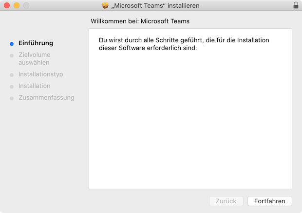
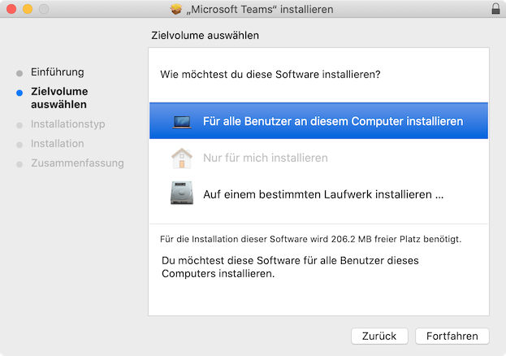
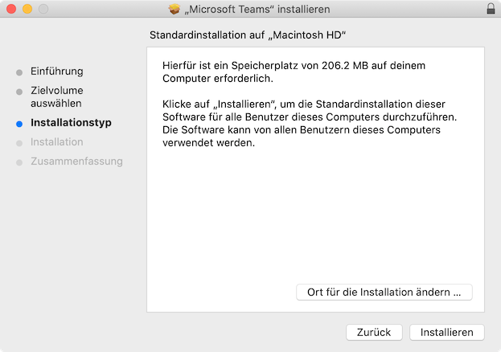
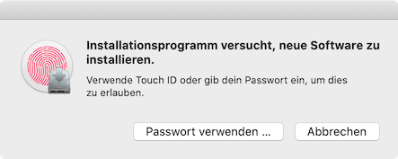
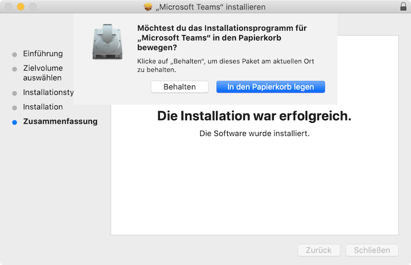

# Teams einrichten

Um Microsoft Teams auf deinem macBook einzurichten, musst du:

1. Microsoft Teams herunterladen und installieren,
2. dich mit Teams an unserer Schul-Cloud anmelden,
3. in Teams in die Listenansicht wechseln.

## Teams installieren

Lade Microsoft Teams von dieser Webseite herunter und installiere es:

[Microsoft Teams Download](https://www.microsoft.com/de-ch/microsoft-365/microsoft-teams/download-app)

:::details Installation Schritt für Schritt

1. Installiere Microsoft Teams. Klicke hier auf __Fortfahren__:

    

2. Wähle _Für alle Benutzer an diesem Computer installieren_ und klicke anschliessend auf __Fortfahren__:

    

3. Klicke auf __Installieren__:

    

4. Bestätige die Installation mit deinem Fingerabdruck oder klicke auf __Passwort verwenden…__:

    

5. Klicke auf __Schließen__, anschliessend auf __In den Papierkorb legen__:

    

:::

## Anmelden

1. Öffne das Launchpad, um Microsoft Teams zu starten. Das Launchpad kann mit der Taste [[F4]] oder mit folgendem Icon geöffnet werden:

    

2. Klicke im Launchpad auf das Teams-Icon:

    

3. Gib deine Schul-E-Mail-Adresse ein und klicke auf __Anmelden__:

    

4. Gib das Kennwort ein und klicke auf __Anmelden__:

    

## Layout ändern

Siehe https://ict.mygymer.ch/verwenden/teams/allgemein/