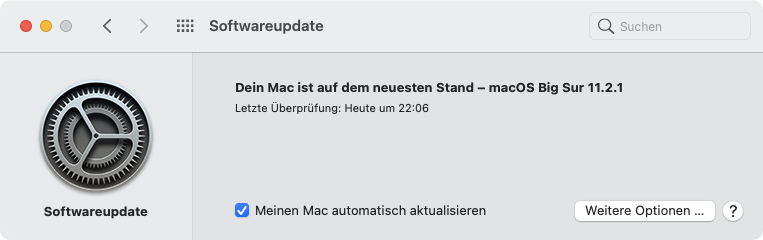
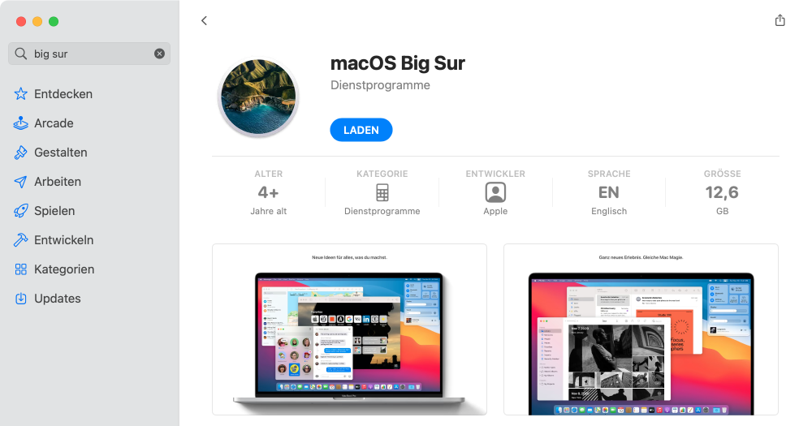

# macOS-Updates

Das Betriebssystem von MacBooks heisst macOS. Das Betriebssystem und wichtige Apps sollte unbedingt auf dem neuesten Stand gehalten werden, um die Sicherheit zu gewährleisten.

## Betriebssystem-Version überprüfen

Öffne die Systemeinstellungen und wähle _Softwareupdate_. Überprüfe folgendes:

- Es steht **«Dein Mac ist auf dem neuesten Stand»**.
- Du hast **macOS Big Sur** installiert.
- Bei _Meinen Mac automatisch aktualisieren_ ist ein Haken gesetzt.

## Betriebssystem aktualisieren

Falls bei dir nicht macOS Big Sur installiert ist, so musst du es via App Store installieren.

Öffne den App Store und suche nach «big sur». Klicke anschliessend bei _macOS Big Sur_ auf __Laden__:

