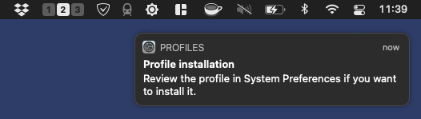
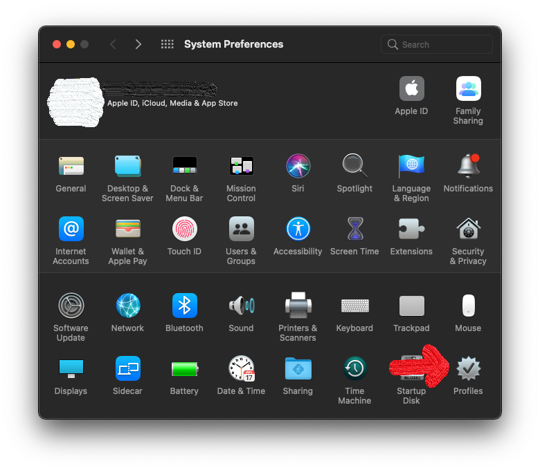
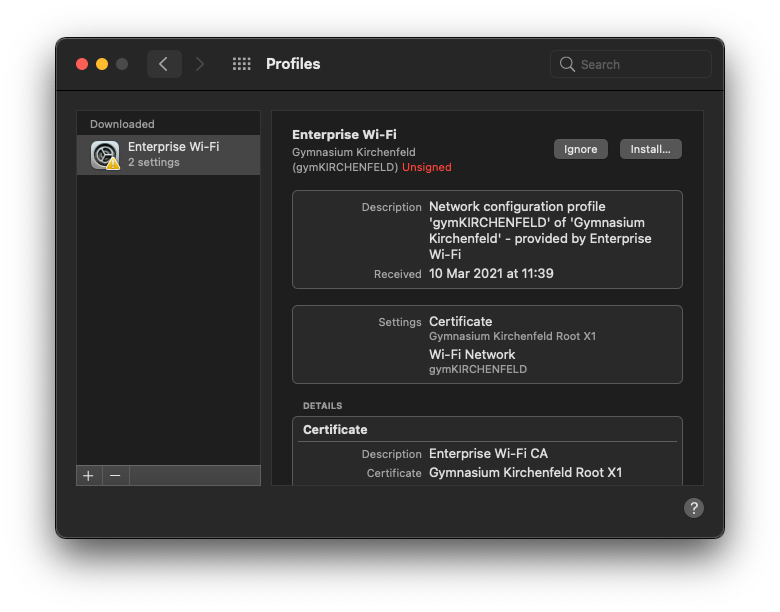
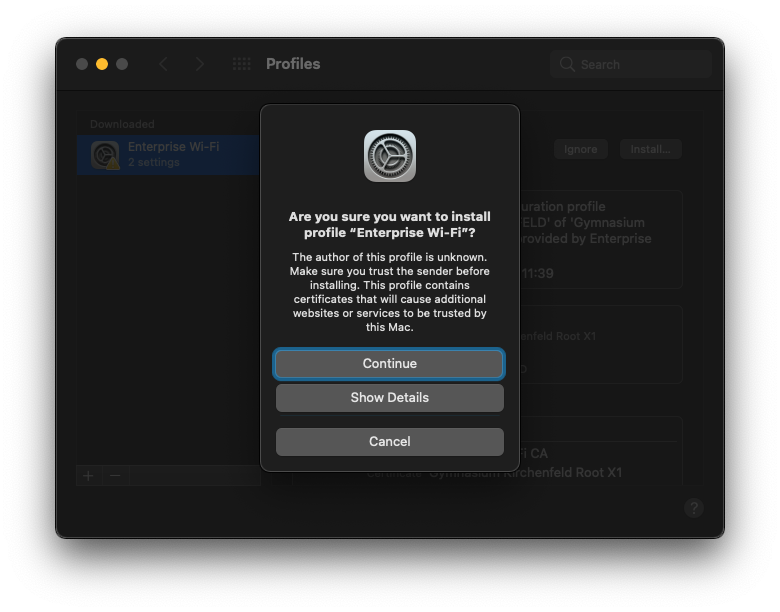
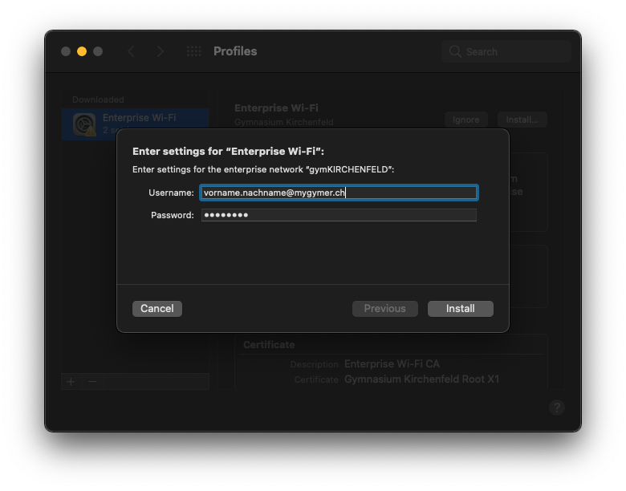
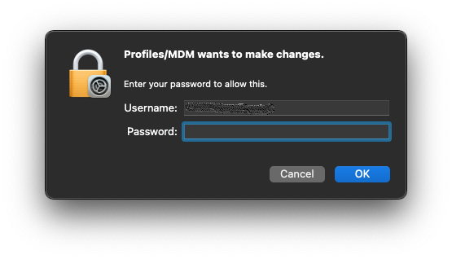
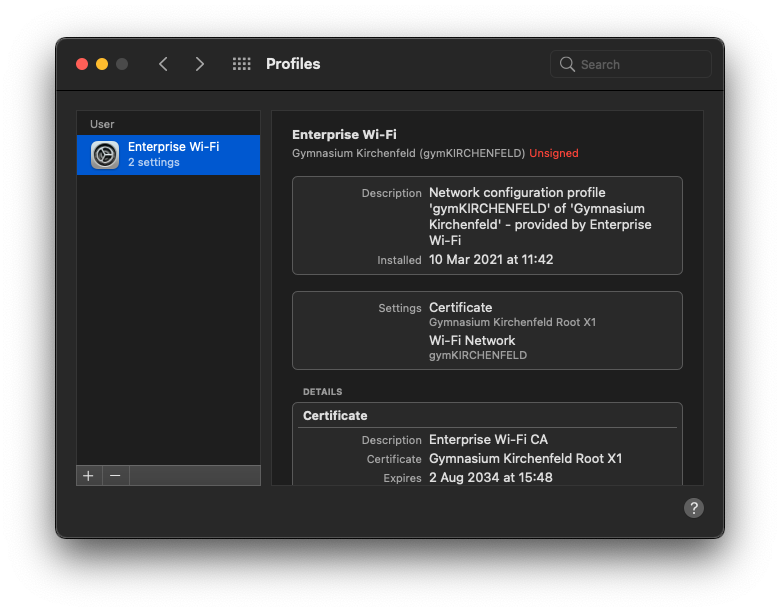

# WLAN einrichten

## Automatische Konfiguration (empfohlen)

Mit der automatischen Installation wird ein allfällig vorhandenes, falsch konfiguriertes Profil mit demselben Namen entfernt. Zudem wird unser Zertifikat installiert (dies muss allerdings bestätigt werden).

[:mdi-download: WLAN-Konfigurationsprogramm (neues WLAN gymKIRCHENFELD)][1]

[1]: https://enterprise-wifi.net/?idp=572&profile=332

:::warning E-Mail-Adresse
Beim neuen Netzwerk __gymKIRCHENFELD__ bitte die **Schul-E-Mail-Adresse** in das Feld __Benutzername__ eintragen!
:::

1. Öffne das heruntergeladene Profil mit einem Doppelklick, dann wird dir angezeigt, dass das neue Profil in den Einstellungen zur Verfügung steht:

   

2. Öffne die Systemeinstellungen und klicke auf das Profilsymbol:

   

3. Klicke auf den Knopf zum Installieren des Profils:

   

4. Bestätige, dass du mit der Installation fortfahren möchtest:

   

5. Gib deine Schul-E-Mail-Adresse (_vorname.nachname@mygymer.ch_ oder _vorname.nachname@gymkirchenfeld.ch_) und dein Passwort ein und klicke auf __Installieren__:

   

6. Nun musst du das Passwort deines Mac-Administratorbenutzers eingeben, um die Installation zu erlauben:

   

7. Zum Abschluss siehst du das installierte Profil:

   

