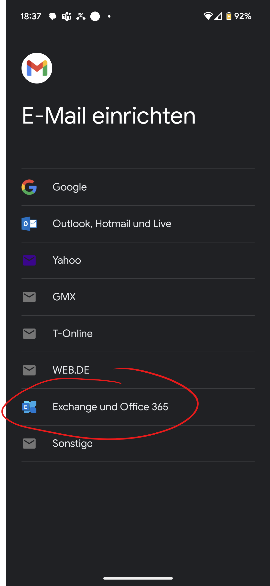

---
apps:
  - Mailprogramme
sidebar_position: 90
sidebar_custom_props:
  icon: mdi-email-box
  path: /docs/byod/mail/mail-programme/README.md
draft: false
---

# Mailprogramme einrichten

<Tabs>
  <TabItem value="win" label="Windows">
Für Windows gibt es viele Mailprogramme, mit _outlook_ lässt sich das Konto einfach einrichten:
Starte _outlook_. Wenn du das das erste Mal tust, wird dich _outlook_ nach einem Konto fragen. Gib deine Mailadresse und das Passwort ein. _outllook_ erkennt automatisch den Typ des Kontos und richtet alles ein.

  </TabItem>
  <TabItem value="osx" label="Mac OS">
Hier findest du die Einstellungen für das Mailprogramm von Apple:
1. Öffne die __Systemeinstellungen__ und wähle __Internetaccounts__ aus.

2. Wähle __Exchange__ aus.

    

3. Gib deinen Namen und deine Schul-E-Mail-Adresse ein. Klicke anschliessend auf __Anmelden_.
4. Kontrolliere die folgenden Einstellungen:

</TabItem>
  <TabItem value="ios" label="iOS">
    Tippe auf dem iPhone oder iPad auf __Einstellungen__ , wähle __Mail__ , danach __Account hinzufügen__ und schliesslich __Microsoft Exchange__. Gib danach deine GBSL-Mailadresse ein und dein Passwort. Es wird alles automatisch eingerichtet.

    Du bist natürlich frei, die Outlook-App zu installieren als Mail-App auf dem iPhone oder iPad.

  </TabItem>
  <TabItem value="android" label="Android">
    Du kannst die Outlook-App installieren als Mailprogramm, damit ist das Einrichten des GBSL-Kontos einfach.

    Immer daran denken, beim Einrichten das Exchange-Konto zu wählen!

    Als Beispiel für eine andere App: Gmail.

    Du öffnest die App und gehst in den __Einstellungen__ zu __Konto hinzufügen__ , wählst danach __Exchange__ und danach läuft die Anmeldung automatisch ab.

    
  </TabItem>
</Tabs>
