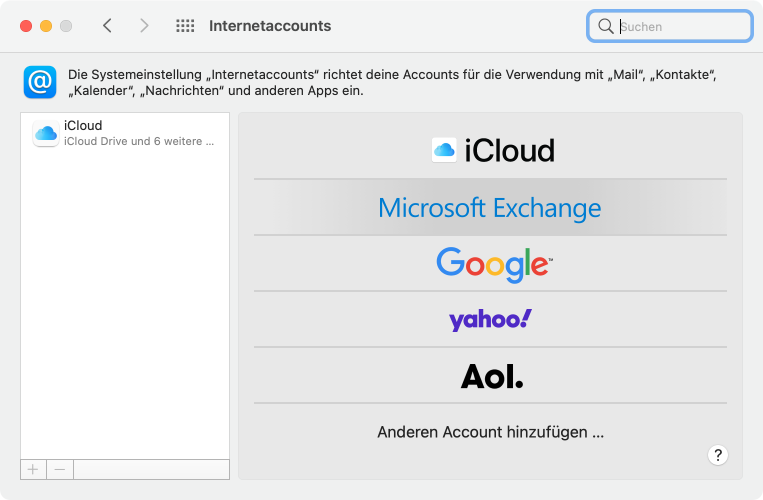

---
apps:
  - Mailprogramme
sidebar_position: 90
sidebar_custom_props:
  icon: mdi-email-box
  path: /docs/byod/mail/mail-programme/README.md
draft: false
---

# Mailprogramme einrichten

<Tabs>
  <TabItem value="win" label="Windows">
Für Windows gibt es viele Mailprogramme, mit _outlook_ lässt sich das Konto einfach einrichten:
Starte _outlook_. Wenn du das das erste Mal tust, wird dich _outlook_ nach einem Konto fragen. Gib deine Mailadresse und das Passwort ein. _outllook_ erkennt automatisch den Typ des Kontos und richtet alles ein.

  </TabItem>
  <TabItem value="osx" label="Mac OS">
Hier findest du die Einstellungen für das Mailprogramm von Apple:
1. Öffne die __Systemeinstellungen__ und wähle __Internetaccounts__ aus.

2. Wähle __Exchange__ aus.

    

3. Gib deinen Namen und deine Schul-E-Mail-Adresse ein. Klicke anschliessend auf __Anmelden_.
4. Kontrolliere die folgenden Einstellungen:

</TabItem>
  <TabItem value="ios" label="iOS">
    Öffne die Einstellungen

  </TabItem>
  <TabItem value="android" label="Android">
    Anleitung Android
  </TabItem>
</Tabs>
