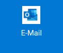
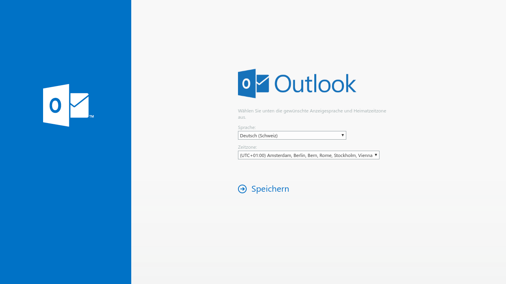
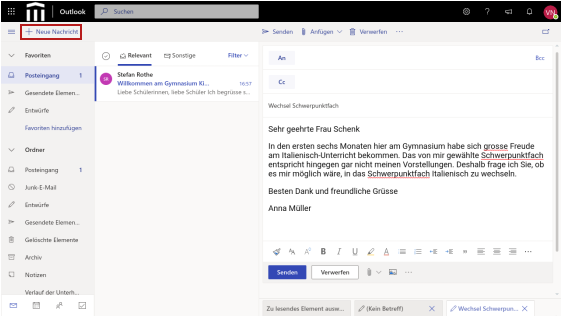
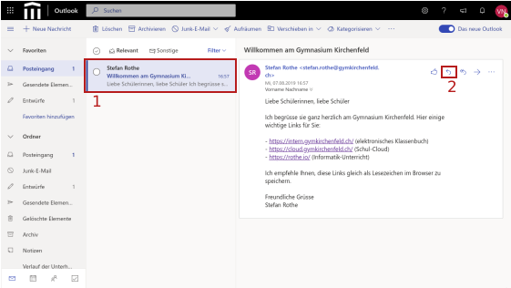
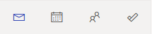

---
apps:
  - outlook
sidebar_position: 30
sidebar_custom_props:
  icon: mdi-microsoft-outlook
  source: gym-kirchenfeld
  path: /docs/byod/mail/outlook-web/README.md
draft: true
---

# Outlook im Browser

:::warning Direkter Link

https://outlook.office365.com/owa/
:::

Auch zu finden über unser Cloud-Portal: https://cloud.gymkirchenfeld.ch

Über die Outlook Web-App kannst du von jedem Gerät einfach auf deine Schul-E-Mails zugreifen.

1. Melde dich an der [Schul-Cloud][1] an.
2. Klicke auf den Link _E-Mail_:

3. Bei der ersten Anmeldung musst du die folgenden Einstellung wählen:

- Sprache: normalerweise _Deutsch (Schweiz)_
- Zeitzone: _(UTC+01:00) Amsterdam, Berlin, Bern, Rom, Stockholm, Wien_

Klicke anschliessend auf _Speichern_.

## E-Mail schreiben

Eine neue E-Mail erstellst du, indem du oben links auf _+ Neue Nachricht_ klickst.

Füge Empfänger, Betreff und Text hinzu. Abschicken kannst du die Nachricht mit einem Klick auf _Senden_.

Alle E-Mail-Adressen von Schülerinnen und Schülern, Lehrpersonen, Mitarbeitenden und sämtliche Verteiler werden beim Tippen automatisch vervollständigt.

Das _BCC_-Feld kannst du einblenden lassen, wenn du rechts aussen im _An_-Feld auf _BCC_ klickst.

## E-Mail beantworten

Gehe so vor, um auf eine Nachricht zu antworten:

1. Öffne die Nachricht durch anklicken.
2. Klicke auf den Pfeil oben rechts in der Nachricht.

[1]: https://cloud.gymkirchenfeld.ch

## Kalender und Kontakte
Outlook bietet neben E-Mail auch eine Kalenderfunktion, Kontakte sowie Aufgaben. Den Zugang zu diesen Bereichen findest du über die kleinen Icons unten links.

