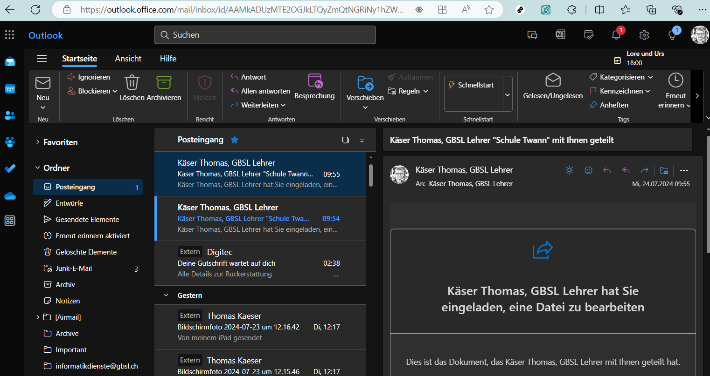

---
apps:
  - outlook
sidebar_position: 30
sidebar_custom_props:
  icon: mdi-microsoft-outlook
  source: gym-kirchenfeld
  path: /docs/byod/mail/outlook-web/README.md
draft: false
---

# Outlook im Browser

:::warning[Direkter Link]

https://outlook.office.com/mail/
:::

Melde dich mit deiner Schulmailadresse und deinem Passwort an.

## E-Mail schreiben

Eine neue E-Mail erstellst du, indem du oben links auf **Neu** klickst.

Füge Empfänger, Betreff und Text hinzu. Abschicken kannst du die Nachricht mit einem Klick auf _Senden_.

Alle E-Mail-Adressen von Schüler:innen, Lehrpersonen, Mitarbeitenden und sämtliche Verteiler werden beim Tippen automatisch vervollständigt.

Das _BCC_-Feld kannst du einblenden lassen, wenn du rechts aussen im _An_-Feld auf _BCC_ klickst.

## Kalender und Kontakte
Outlook bietet neben E-Mail auch eine Kalenderfunktion, Kontakte sowie Aufgaben. Den Zugang zu diesen Bereichen findest du über die kleinen Icons in der Seitenleiste links.

